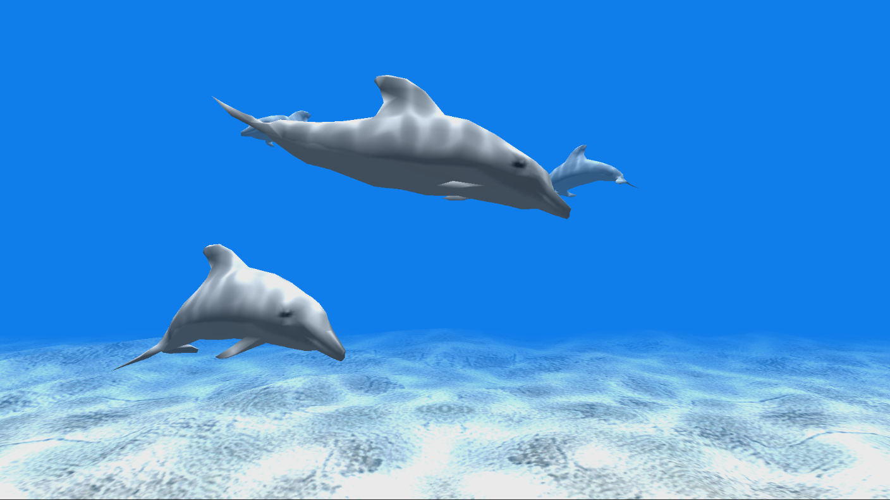

  

#   FrontPanelDolphin サンプル

*このサンプルは、Microsoft ゲーム開発キットのプレビュー (2019 年 11 月)
に対応しています。*

# 説明

FrontPanelDolphin は、GPU を使用してフロント
パネルにレンダリングする方法を示します。ほとんどのゲーム開発者には、GPU
を使用して画面にレンダリングするためのコードがたくさんあると予想されるため、このサンプルの目的は、既存のコードを活用してフロント
パネル ディスプレイをターゲットにすることを容易にすることです。

以下にいくつかの使用例を示します。

-   「ヘッドレス」開発キットのラボ設定でゲームを実行していて、フロント
    パネルを使用して画面に通常表示されるものをレンダリングしたいとします。ゲームが正常かどうかを一目で判断できます。

-   多くのゲーム エンジンには既に「開発用
    HUD」があり、通常、製品版ではアクセスできないゲームの診断機能を利用できます。たとえば、シークレット
    コントローラー ボタンの組み合わせを実行すると、HUD
    が表示されます。次に、HUD
    は、モンスターのスポーン、特定のレベルへのジャンプ、またはキャラクターの無敵化など、テストおよび開発中に役立つ追加オプションを提供します。この
    HUD は通常 GPU によってレンダリングされるため、結果をフロント
    パネルにコピーする機能があれば、既存の HUD
    コードを再利用してフロント
    パネルに適合させることができます。フロント
    パネルに置くことで、画面のスペースを損なうことがありません。さらに、ゲームパッドを使用する代わりに、フロント
    パネルの DPAD とボタンを使用できます。

# サンプルの作成

Xbox One の devkit を使用している場合は、アクティブなソリューション
プラットフォームを Gaming.Xbox.XboxOne.x64 に設定します。

Project Scarlett を使用している場合は、アクティブなソリューション
プラットフォームを Gaming.Xbox.Scarlett.x64 に設定します。

*詳細については、*GDK ドキュメントの
「サンプルの実行」を参照してください。

# サンプルの使用

FrontPanelDolphin サンプルは、フロントパネルを内蔵した Xbox One X Devkit
および Project Scarlett Devkit
を対象としています。サンプルを起動すると、メイン ディスプレイとフロント
パネルの LCD
ディスプレイにイルカのシーンが表示されます。

## FrontPanelDolphin メイン ディスプレイ

## 

## FrontPanelDolphin フロント パネル ディスプレイ

このサンプルは、フロント パネルの \[DPAD 選択\]
ボタン以外の入力を処理しません。選択ボタンを押すと、フロント パネル
ディスプレイからバッファーをキャプチャし、タイトル スクラッチ
フォルダーにある .dds ファイルに結果を保存することもできます。

# 実装に関する注意事項

このサンプルでは、​​FrontPanelRenderTargetというヘルパー
クラスを使用しています。これは、その名前が示すように、フロント パネル
ディスプレイに適したオフ スクリーン レンダー
ターゲットです。FrontPanelRenderTarget は、提供されたレンダー ターゲット
リソースをグレースケールに変換し、クワッドにレンダリングします。これは、非常に単純な頂点シェーダーと非常に単純なピクセル
シェーダーを使用して実現されます。頂点シェーダーはクワッドを生成し、ピクセル
シェーダーは提供されたテクスチャをサンプリングし、ドット積を使用して各ピクセルをグレースケールに変換します。レンダリングの手順は、GPUBlit()
と呼ばれるメソッドで実装されます。

// 渡された renderTarget
リソースを使用してグレースケール画像をレンダリングします。

> // リソースは、このクラスを初期化するために使用されたレンダー
> ターゲットの 1 つである
>
> // 必要があります。
>
> void GPUBlit(
>
> ID3D12GraphicsCommandList \*commandList、
>
> ID3D12Resource \*renderTargetResource、
>
> unsigned int renderTargetIndex);

FrontPanelRenderTarget クラスを初期化するとき、ダブルまたはトリプル
バッファーのレンダー ターゲット リストを指定する必要があります。
GPUBlit() は、現在のフレームを中間のダブル/トリプル バッファー
リソースにレンダリングします。

GPUBlit() を呼び出した後、結果を CPU
のバッファーにコピーして戻し、そのバッファーをフロント パネル
ディスプレイに提示する必要があります。 FrontPanelRenderTarget
クラスは、これを容易にする次の 2
つのメソッドを提供します。CopyToBuffer() および PresentToFrontPanel()
です。 これらの 2 つのメソッドは、前のフレームの GPUBlit()
レンダリング結果を使用して、CPU バッファーにコピーします。

// レンダー ターゲットを前のフレームからステージング
テクスチャにコピーし、

// それを CPU にコピーします。

> // GPU 同期により、CPU
> で読み取る前に、前のフレームからの作業が完了したことを
>
> // 確認します。
>
> void CopyToBuffer(
>
> ID3D12Device \*device、
>
> ID3D12CommandQueue \*commandQueue、
>
> unsigned int \*renderTargetIndex、
>
> ATG::BufferDesc &desc);
>
> // レンダー ターゲットをステージング テクスチャにコピーし、結果を CPU
> にコピーして戻し、
>
> // それをフォント パネル ディスプレイに表示します
>
> // GPU 同期により、CPU
> で読み取る前に、前のフレームからの作業が完了したことを
>
> // 確認します。
>
> void PresentToFrontPanel(
>
> ID3D12Device \*device、
>
> ID3D12CommandQueue \*commandQueue、
>
> unsigned int \*renderTargetIndex);

BufferDesc は、CPU
バッファーの幅と高さを追跡する構造です。FrontPanelRenderTarget::CopyToBuffer
は、メモリ内の任意のアドレスにコピーでき、必要なのは、バッファーのサイズを記述する
BufferDesc だけです。サンプルは、フロント パネルのバッファーを管理する
FrontPanelDisplay
クラスを使用し、FrontPanelDisplay::GetBufferDescriptor()
を使用してフロント パネルの BufferDesc
を取得します。次に、FrontPanelRenderTarget::CopyToBuffer()
を呼び出して、FrontPanelRenderTarget
から画像をコピーします。最後に、FrontPanelDisplay::Present()
を呼び出して、実際に画像をフロント パネル
ディスプレイに提示する必要があります。

FrontPanelRenderTarget::PresentToFrontPanel()
メソッドが両方の手順を処理し、CPU
にコピーしてバッファーを表示することに注意してください。これは、FrontPanelDisplay
クラスをまだ使用していない場合に便利です。

イルカ サンプルをフロント
パネルにレンダリングするように調整することは、実際には
FrontPanelRenderTarget
を使用すると非常に簡単です。最小限の調整では、ほんのわずかな変更を加えるだけです。

**サンプル::Sample:**

// フロント パネルのレンダー ターゲットを作成しする

m_frontPanelRenderTarget = std::make_unique\<FrontPanelRenderTarget\>();

// FrontPanelDisplay オブジェクトを初期化する

m_frontPanelDisplay =
std::make_unique\<FrontPanelDisplay\>(m_frontPanelControl.Get());

**サンプル::CreateDeviceDependentResources:**

// フロント パネルのレンダー ターゲット リソースを作成する

m_frontPanelRenderTarget-\>CreateDeviceDependentResources(frontPanelControl.Get(),

device);

**サンプル::CreateWindowSizeDependentResources:**

// 最大 3 つのレンダー ターゲットを想定する

ID3D12Resource\* pRenderTargets\[3\] = {};

for(unsigned int rtIndex = 0; rtIndex \<
m_deviceResources-\>GetBackBufferCount();

++rtIndex)

{

pRenderTargets\[rtIndex\] =
m_deviceResources-\>GetRenderTarget(rtIndex);

}

auto device = m_deviceResources-\>GetD3DDevice();

m_frontPanelRenderTarget-\>CreateWindowSizeDependentResources(\
device、\
m_deviceResources-\>GetBackBufferCount(),\
pRenderTargets);

**サンプル:: Render:**

// フロント パネルのレンダー ターゲットにブリットし、フロント
パネルに表示する

auto device = m_deviceResources-\>GetD3DDevice();

unsigned int frameIndex = m_deviceResources-\>GetCurrentFrameIndex();

m_frontPanelRenderTarget-\>GPUBlit(commandList, renderTarget,
frameIndex);

auto fpDesc = m_frontPanelDisplay-\>GetBufferDescriptor();

m_frontPanelRenderTarget-\>CopyToBuffer(device, commandQueue,
frameIndex, fpDesc);\
m_frontPanelDisplay-\>Present();

# 更新履歴

2019 年 4 月、サンプルの最初のリリース。

2019 年 11 月、Project Scarlett Devkit のサポート。

# プライバシーに関する声明

サンプルをコンパイルして実行すると、サンプルの使用状況を追跡するため、サンプル実行可能ファイルのファイル名が
Microsoft に送信されます。このデータ収集を無効にするには、「Sample Usage
Telemetry」とラベル付けされた Main.cpp
内のコードのブロックを削除します。

Microsoft のプライバシー ステートメントの詳細については、「[Microsoft
のプライバシー
ステートメント](https://privacy.microsoft.com/en-us/privacystatement/)」を参照してください。
