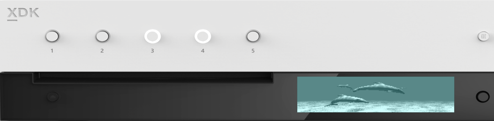

  

#   FrontPanelDolphin 샘플

*이 샘플은 Microsoft 게임 개발 키트 미리 보기(2019년 11월)와
호환됩니다.*

# 설명

FrontPanelDolphin에서는 GPU를 사용하여 전면 패널에 렌더링하는 방법을
보여 줍니다. 대부분의 게임 개발자는 GPU를 사용하여 화면에 렌더링하기
위한 충분한 코드를 보유하고 있으므로 이 샘플의 목적은 기존 코드를
활용하여 전면 패널 디스플레이를 보다 쉽게 타기팅하는 것입니다.

다음은 몇 가지 사용 사례입니다.

-   \"헤드리스\" devkit의 랩 설정에서 게임을 실행 중이며 전면 패널을
    사용하여 화면에 표시되는 내용을 렌더링하려고 합니다. 게임이 정상
    상태인지 여부를 한눈에 확인할 수 있습니다.

-   많은 게임 엔진에는 일반적으로 정품 버전에서 액세스할 수 없는 게임의
    진단 기능을 제공하는 \"개발 HUD\"가 있습니다. 예를 들어, 비밀
    컨트롤러 단추 조합을 수행하면 HUD가 표시될 수 있습니다. 그러면 HUD는
    몬스터 생성, 특정 레벨로 이동, 문자를 읽을 수 없게 표시하는 것과
    같이 테스트 및 개발 중에 유용한 추가 옵션을 제공합니다. 이 HUD는
    일반적으로 GPU에서 렌더링되므로, 결과를 전면 패널에 복사할 수 있는
    경우 기존 HUD 코드를 다시 사용하고 전면 패널에 적용할 수 있습니다.
    전면 패널에 표시하면 화면 공간을 좀 더 넓게 쓸 수 있습니다. 또한
    게임 패드를 사용하는 대신 전면 패널의 D-패드 및 단추를 사용할 수
    있습니다.

# 샘플 빌드

Xbox One 개발 키트를 사용하는 경우 활성 솔루션 플랫폼을
Gaming.Xbox.XboxOne.x64로 설정하세요.

Project Scarlett을 사용하는 경우 활성 솔루션 플랫폼을
Gaming.Xbox.Scarlett.x64로 설정하세요.

*자세한 내용은 GDK 문서에서* 샘플 실행하기*를 참조하세요.*

# 샘플 사용

FrontPanelDolphin 샘플은 전면 패널이 통합된 Xbox One X Devkit 및 Project
Scarlett Devkit에 사용됩니다. 이 샘플을 시작하면 주 디스플레이와 전면
패널 LCD 디스플레이에 에 돌고래 장면이 동시에
렌더링됩니다.

## FrontPanelDolphin 주 디스플레이

## 

## FrontPanelDolphin 전면 패널 디스플레이

이 샘플에서는 전면 패널의 D-패드 선택 단추를 제외한 어떤 입력도 처리하지
않습니다. 선택 단추를 누르면 전면 패널 디스플레이에서 버퍼가 캡처되고,
결과가 Title Scratch 폴더에 있는 .dds 파일에 저장됩니다.

# 구현 참고 사항

이 샘플에서는 FrontPanelRenderTarget이라는 도우미 클래스를 사용합니다.
이 클래스는 이름에서 알 수 있듯이 전면 패널 디스플레이에 적합한 화면 밖
렌더링 대상입니다. FrontPanelRenderTarget은 제공된 렌더링 대상 리소스를
회색조로 변환한 다음, 쿼드로 렌더링합니다. 이 작업은 매우 단순한 정점
셰이더와 픽셀 셰이더를 사용하여 수행합니다. 정점 셰이더는 쿼드를
생성하고 픽셀 셰이더는 제공된 질감을 샘플링한 후 내적을 사용하여 각
픽셀을 회색조로 변환합니다. 렌더 단계는 GPUBlit()라는 메서드에서
구현됩니다.

// 전달된 renderTarget 리소스를 사용하여 회색조 이미지를 렌더링합니다.

> // 리소스는 이 클래스를 초기화했던 렌더 대상 중 하나여야
>
> // 합니다.
>
> void GPUBlit(
>
> ID3D12GraphicsCommandList \*commandList,
>
> ID3D12Resource \*renderTargetResource,
>
> unsigned int renderTargetIndex);

FrontPanelRenderTarget 클래스를 시작할 때 이중 또는 삼중 버퍼링 렌더
대상 목록을 지정해야 합니다. GPUBlit()는 현재 프레임을 중간 이중/삼중
버퍼링 리소스에 렌더링합니다.

GPUBlit()를 호출한 후에 결과를 CPU의 버퍼로 다시 복사한 다음, 전면 패널
디스플레이에 버퍼를 제공해야 합니다. FrontPanelRenderTarget 클래스는 이
작업을 용이하게 해주는 두 가지 메서드인 CopyToBuffer() 및
PresentToFrontPanel()을 제공합니다. 이 두 가지 메서드는 이전 프레임의
GPUBlit() 렌더 결과를 사용하여 CPU 버퍼로 복사합니다.

// 이전 프레임의 렌더 대상을 스테이징 질감으로 복사한 후

// CPU에 다시 복사합니다.

> // GPU 동기화를 수행하여 CPU에서 읽기 전에 이전 프레임의 작업이
>
> // 완료되도록 합니다.
>
> void CopyToBuffer(
>
> ID3D12Device \*device,
>
> ID3D12CommandQueue \*commandQueue,
>
> unsigned int \*renderTargetIndex,
>
> ATG::BufferDesc &desc);
>
> // 렌더 대상을 스테이징 질감으로 복사하고 결과를 다시 CPU에
> 복사합니다.
>
> // 그런 다음, 글꼴 패널 디스플레이에 표시합니다.
>
> // GPU 동기화를 수행하여 CPU에서 읽기 전에 이전 프레임의 작업이
>
> // 완료되도록 합니다.
>
> void PresentToFrontPanel(
>
> ID3D12Device \*device,
>
> ID3D12CommandQueue \*commandQueue,
>
> unsigned int \*renderTargetIndex);

BufferDesc는 CPU 버퍼의 너비와 높이를 추적하는 구조체입니다.
FrontPanelRenderTarget::CopyToBuffer는 메모리의 임의 주소로 복사할 수
있습니다. 이때 버퍼의 크기를 설명하는 BufferDesc만 있으면 됩니다. 이
샘플에서는 전면 패널에 대한 버퍼를 관리하는 FrontPanelDisplay 클래스를
사용하고 FrontPanelDisplay::GetBufferDescriptor()를 사용하여 전면 패널에
대한 BufferDesc을 가져옵니다. 그런 다음,
FrontPanelRenderTarget::CopyToBuffer()를 호출하여
FrontPanelRenderTarget에서 이미지를 복사합니다. 마지막으로
FrontPanelDisplay::Present()를 호출하여 이미지를 실제로 전면 패널
디스플레이에 표시해야 합니다.

FrontPanelRenderTarget::PresentToFrontPanel() 메서드는 CPU에 복사하고
버퍼를 제공하는 두 단계를 관리합니다. 이 메서드는 FrontPanelDisplay
클래스를 아직 사용하지 않은 경우에 유용합니다.

전면 패널에 렌더링할 돌고래 샘플을 조정하는 작업은 실제로
FrontPanelRenderTarget을 사용하면 쉽게 진행할 수 있습니다. 다음 사항을
변경하여 최소한의 조정만 수행하면 됩니다.

**Sample::Sample에서:**

// 전면 패널 렌더 대상 생성

m_frontPanelRenderTarget = std::make_unique\<FrontPanelRenderTarget\>();

// FrontPanelDisplay 개체 초기화

m_frontPanelDisplay =
std::make_unique\<FrontPanelDisplay\>(m_frontPanelControl.Get());

**Sample::CreateDeviceDependentResources에서:**

// 전면 패널 렌더 대상 리소스 만들기

m_frontPanelRenderTarget-\>CreateDeviceDependentResources(frontPanelControl.Get(),

device);

**Sample::CreateWindowSizeDependentResources에서:**

// 최대 3개의 렌더 대상 가정

ID3D12Resource\* pRenderTargets\[3\] = {};

for(unsigned int rtIndex = 0; rtIndex \<
m_deviceResources-\>GetBackBufferCount();

++rtIndex)

{

pRenderTargets\[rtIndex\] =
m_deviceResources-\>GetRenderTarget(rtIndex);

}

auto device = m_deviceResources-\>GetD3DDevice();

m_frontPanelRenderTarget-\>CreateWindowSizeDependentResources(\
device,\
m_deviceResources-\>GetBackBufferCount(),\
pRenderTargets);

**Sample::Render에서:**

// 전면 패널 렌더 대상으로 블록 전송(blit)하고 전면 패널에 표시

auto device = m_deviceResources-\>GetD3DDevice();

unsigned int frameIndex = m_deviceResources-\>GetCurrentFrameIndex();

m_frontPanelRenderTarget-\>GPUBlit(commandList, renderTarget,
frameIndex);

auto fpDesc = m_frontPanelDisplay-\>GetBufferDescriptor();

m_frontPanelRenderTarget-\>CopyToBuffer(device, commandQueue,
frameIndex, fpDesc);\
m_frontPanelDisplay-\>Present();

# 업데이트 기록

2019년 4월, 샘플의 첫 번째 릴리스

2019년 11월, Project Scarlett Devkit 지원

# 개인정보처리방침

샘플을 컴파일하고 실행할 때 샘플의 사용을 추적하는 데 도움이 되도록 샘플
실행 파일의 파일 이름이 Microsoft에 전송됩니다. 이 데이터 수집을
옵트아웃하려면 Main.cpp에서 \"샘플 사용 원격 분석\"이라고 레이블이
지정된 코드 블록을 제거할 수 있습니다.

Microsoft의 일반 개인정보취급방침에 대한 자세한 내용은 [Microsoft
개인정보처리방침](https://privacy.microsoft.com/en-us/privacystatement/)을
참조하세요.
