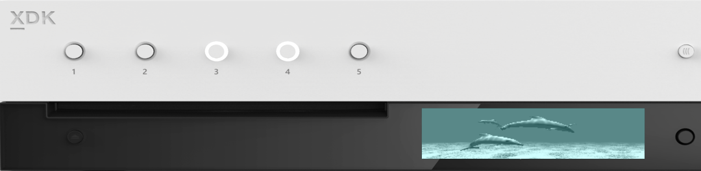
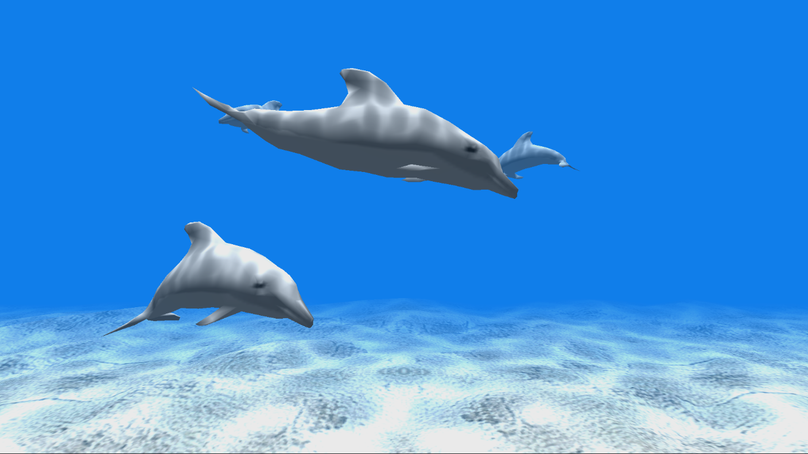

  

#   FrontPanelDolphin 示例

此示例与 Microsoft 游戏开发工具包预览版（2019 年 11 月）兼容

# 说明

FrontPanelDolphin 演示如何使用 GPU
向前面板呈现文本。我们预期大多数游戏开发人员将编写大量代码，以便使用 GPU
向屏幕呈现内容，因此，本示例旨在更简便地利用现有代码来定位到前面板显示屏。

请看下面几个用例：

-   你正在"无外设"Devkit
    的实验室设置中运行游戏，并希望使用前面板呈现通常在屏幕上看到的内容。你一眼就能判断出游戏是否运行正常。

-   许多游戏引擎已有一个"开发
    HUD"，它实现了对零售版中无法正常访问的游戏的诊断功能。例如，执行机密控制器按钮组合可以显示
    HUD。然后，HUD
    提供了一些额外的选项，这些选项在测试和开发过程中非常有用，比如产生怪物、跳转到特定的关卡，或者是让角色无敌。此
    HUD 通常由 GPU
    呈现，因此，如果你能够将结果复制到前面板，就可以重复使用现有 HUD
    代码并将其适配到前面板。将它用于前面板后，不必再牺牲屏幕空间。此外，可以使用前面板上的方向键和按钮来替代游戏手柄。

# 构建示例

如果使用 Xbox One 开发工具包，请将活动解决方案平台设置为
Gaming.Xbox.XboxOne.x64。

如果使用 Project Scarlett，请将活动解决方案平台设置为
Gaming.Xbox.Scarlett.x64。

有关详细信息，请参阅 GDK 文档中的"运行示例"。

# 使用示例

FrontPanelDolphin 示例适用于带有集成前面板的 Xbox One X Devkit 和
Project Scarlett Devkit。启动示例时，它将在主显示屏和前面板 LCD
显示屏上同步呈现海豚场景。

## FrontPanelDolphin 主显示屏

## 

## FrontPanelDolphin 前面板显示屏

除了处理前面板上的"方向键选择"按钮外，此示例不处理任何其他输入。当你按下"选择"按钮时，它将从前面板显示屏中捕获缓冲区，并将结果保存到"标题草稿"文件夹中的
.dds 文件中。

# 实现说明

本示例使用一个名为 FrontPanelRenderTarget
的帮助程序类，从名称可以看出，它是一个适用于前面板显示屏的离屏呈现目标。FrontPanelRenderTarget
将提供的呈现目标资源转换为灰度，然后将其呈现为四边形。使用一个非常简单的顶点着色器和一个非常简单的像素着色器即可实现。顶点着色器生成一个四边形，像素着色器对提供的纹理进行采样，并使用点积将每个像素转换为灰度。在名为
GPUBlit() 的方法中实现了呈现步骤：

// 使用传入 renderTarget 资源呈现灰度图像。

> // 资源必须是用于初始化此类的呈现目标
>
> // 之一。
>
> void GPUBlit(
>
> ID3D12GraphicsCommandList \*commandList,
>
> ID3D12Resource \*renderTargetResource,
>
> unsigned int renderTargetIndex);

在初始化 FrontPanelRenderTarget
类时，需要指定双缓冲或三缓冲的呈现目标列表。 GPUBlit()
将当前帧呈现为适合的双/三缓冲的资源。

调用 GPUBlit() 后，需要将结果复制回 CPU
上的缓冲区，然后将缓冲区呈现到前面板显示屏。 FrontPanelRenderTarget
类提供了两种简化方法：CopyToBuffer() 和 PresentToFrontPanel()。
这两种方法使用上一帧的 GPUBlit() 呈现结果，并将其复制到 CPU 缓冲区。

// 将呈现目标从上一帧复制到过渡纹理，然后

// 将它复制回 CPU。

> // 引发 GPU 同步，以确保先完成上一帧的任务，
>
> // 然后再读取 CPU。
>
> void CopyToBuffer(
>
> ID3D12Device \*device,
>
> ID3D12CommandQueue \*commandQueue,
>
> unsigned int \*renderTargetIndex,
>
> ATG::BufferDesc &desc);
>
> // 将呈现目标复制到暂存纹理，将结果复制回 CPU
>
> // 然后向前面板显示屏呈现结果
>
> // 引发 GPU 同步，以确保先完成上一帧的任务，
>
> // 然后再读取 CPU。
>
> void PresentToFrontPanel(
>
> ID3D12Device \*device,
>
> ID3D12CommandQueue \*commandQueue,
>
> unsigned int \*renderTargetIndex);

BufferDesc 是一个结构，可跟踪 CPU
缓冲区的宽度和高度。FrontPanelRenderTarget::CopyToBuffer
可以复制到内存中的任何地址，只需要一个用于描述缓冲区维度的 BufferDesc
即可。本示例使用 FrontPanelDisplay 类管理前面板的缓冲区，并使用
FrontPanelDisplay::GetBufferDescriptor() 获取前面板的
BufferDesc。然后，它调用 FrontPanelRenderTarget::CopyToBuffer()，从
FrontPanelRenderTarget 中复制图像。最后，它必须调用
FrontPanelDisplay::Present() ，将图像实际呈现到前面板显示屏。

请注意，FrontPanelRenderTarget::PresentToFrontPanel()
方法会执行两个步骤，即复制到 CPU 和显示缓冲区。如果尚未使用
FrontPanelDisplay 类，这种方法非常方便。

实际上，使用 FrontPanelRenderTarget
可以非常直观地采用海豚示例以呈现到前面板。最小的调整只需要进行少许更改：

**在 Sample::Sample 中：**

// 构造前面板呈现目标

m_frontPanelRenderTarget = std::make_unique\<FrontPanelRenderTarget\>();

// 初始化 FrontPanelDisplay 对象

m_frontPanelDisplay =
std::make_unique\<FrontPanelDisplay\>(m_frontPanelControl.Get());

**在 Sample::CreateDeviceDependentResources 中：**

// 创建前面板呈现目标资源

m_frontPanelRenderTarget-\>CreateDeviceDependentResources(frontPanelControl.Get(),

device);

**在 Sample::CreateWindowSizeDependentResources 中：**

// 假设最多有 3 个呈现目标

ID3D12Resource\* pRenderTargets\[3\] = {};

for(unsigned int rtIndex = 0; rtIndex \<
m_deviceResources-\>GetBackBufferCount();

++rtIndex)

{

pRenderTargets\[rtIndex\] =
m_deviceResources-\>GetRenderTarget(rtIndex);

}

auto device = m_deviceResources-\>GetD3DDevice();

m_frontPanelRenderTarget-\>CreateWindowSizeDependentResources(\
device,\
m_deviceResources-\>GetBackBufferCount(),\
pRenderTargets);

**在 Sample::Render 中：**

// 呈现到前面板呈现目标，然后显示到前面板中

auto device = m_deviceResources-\>GetD3DDevice();

unsigned int frameIndex = m_deviceResources-\>GetCurrentFrameIndex();

m_frontPanelRenderTarget-\>GPUBlit(commandList, renderTarget,
frameIndex);

auto fpDesc = m_frontPanelDisplay-\>GetBufferDescriptor();

m_frontPanelRenderTarget-\>CopyToBuffer(device, commandQueue,
frameIndex, fpDesc);\
m_frontPanelDisplay-\>Present();

# 更新历史记录

2019 年 4 月，首次发布此示例。

2019 年 11 月，支持 Project Scarlett Devkit。

# 隐私声明

在编译和运行示例时，示例可执行文件的文件名将发送给
Microsoft，用于帮助跟踪示例使用情况。要选择退出此数据收集，你可以删除
Main.cpp 中标记为"示例使用遥测"的代码块。

有关 Microsoft 的一般隐私政策的详细信息，请参阅《[Microsoft
隐私声明](https://privacy.microsoft.com/en-us/privacystatement/)》。
