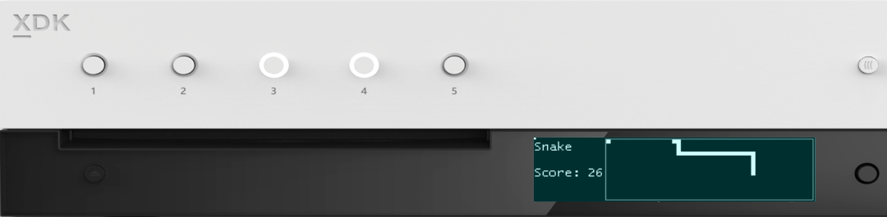

  

#   FrontPanelGame Sample

*This sample is compatible with the Microsoft Game Development Kit (June
2020)*

# 

# Description

FrontPanelGame is the classic "snake game" implemented completely on the
Xbox One X Devkit and Xbox Series X|S Devkit Front Panels. The sample is
mainly provided for fun but nonetheless does demonstrate some important
aspects of the front panel control:

-   The front panel is completely programmable from title code

-   The buttons and DPAD APIs are analogous to the familiar Gamepad APIs

-   The sample showcases some utility code that you can use in your own
    front panel project

    -   Text rendering using RasterFont (see also: the FrontPanelText
        sample)

    -   FrontPanelInput provides a reusable input class much like
        DirectXTK::GamePad

    -   FrontPanelDisplay provides a simple class for managing the front
        panel buffer

    -   Code for drawing basic shapes such as lines and rectangles

# Building the sample

If using an Xbox One devkit, set the active solution platform to `Gaming.Xbox.XboxOne.x64`.

If using an Xbox Series X|S devkit, set the active solution platform to `Gaming.Xbox.Scarlett.x64`.

*For more information, see* __Running samples__, *in the GDK documentation.*

# Using the sample

| Action                                    |  Front Panel              |
|-------------------------------------------|--------------------------|
| Start a new game                          |  Button 1                 |
| Move the snake  |  DPAD (Left, Right, Up, Down)                    |
| Take a screenshot                         |  DPAD Select              |
| Toggle between game mode and system mode  |  Press and hold DPAD Select                   |

# Update history

April 2019, first release of the sample.

November 2019, support for the Xbox Series X|S Devkit.

# Privacy Statement

When compiling and running a sample, the file name of the sample
executable will be sent to Microsoft to help track sample usage. To
opt-out of this data collection, you can remove the block of code in
Main.cpp labeled "Sample Usage Telemetry".

For more information about Microsoft's privacy policies in general, see
the [Microsoft Privacy
Statement](https://privacy.microsoft.com/en-us/privacystatement/).
