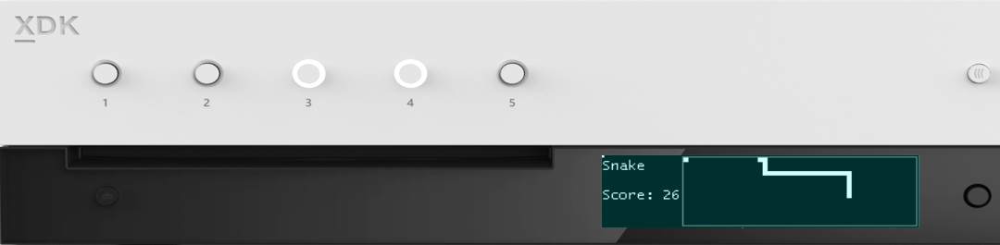

  

#   FrontPanelGame 샘플

*이 샘플은 Microsoft 게임 개발 키트 미리 보기(2019년 11월)와
호환됩니다.*

# 

# 설명

FrontPanelGame은 Xbox 1 X Devkit 및 Project Scarlett Devkit 전면
패널에서 완전히 구현된 클래식 \"스네이크 게임\"입니다. 이 샘플은 주로
재미를 위해 제공되지만, 전면 패널 컨트롤의 몇 가지 중요한 측면을 보여
줍니다.

-   전면 패널을 타이틀 코드에서 완전히 프로그래밍할 수 있습니다.

-   단추 및 D-패드 API는 익숙한 게임 패드 API와 유사합니다.

-   이 샘플에서는 고유한 전면 패널 프로젝트에서 사용할 수 있는 일부
    유틸리티 코드를 보여 줍니다.

    -   RasterFont을 사용하는 텍스트 렌더링(참고 항목: FrontPanelText
        샘플)

    -   FrontPanelInput은 DirectXTK::GamePad와 비슷한 재사용 가능 입력
        클래스를 제공합니다.

    -   FrontPanelDisplay는 전면 패널 버퍼를 관리하기 위한 간단한
        클래스를 제공합니다.

    -   선 및 사각형과 같은 기본적인 셰이프를 그리는 코드입니다.

# 샘플 빌드

Xbox One 개발 키트를 사용하는 경우 활성 솔루션 플랫폼을
Gaming.Xbox.XboxOne.x64로 설정하세요.

Project Scarlett을 사용하는 경우 활성 솔루션 플랫폼을
Gaming.Xbox.Scarlett.x64로 설정하세요.

*자세한 내용은 GDK 문서에서* 샘플 실행하기*를 참조하세요.*

# 샘플 사용

| 작업                                      |  전면 패널                |
|-------------------------------------------|--------------------------|
| 새 게임 시작                              |  단추 1                   |
| 스네이크 이동  |  D-패드(왼쪽, 오른쪽, 위쪽, 아래쪽)            |
| 스크린샷 작성                             |  D-패드 선택              |
| 게임 모드와 시스템 모드 간 토글           |  D-패드 선택 길게 누르기  |

# 업데이트 기록

2019년 4월, 샘플의 첫 번째 릴리스

2019년 11월, Project Scarlett Devkit 지원

# 개인정보처리방침

샘플을 컴파일하고 실행할 때 샘플의 사용을 추적하는 데 도움이 되도록 샘플
실행 파일의 파일 이름이 Microsoft에 전송됩니다. 이 데이터 수집을
옵트아웃하려면 Main.cpp에서 \"샘플 사용 원격 분석\"이라고 레이블이
지정된 코드 블록을 제거할 수 있습니다.

Microsoft의 일반 개인정보취급방침에 대한 자세한 내용은 [Microsoft
개인정보처리방침](https://privacy.microsoft.com/en-us/privacystatement/)을
참조하세요.
