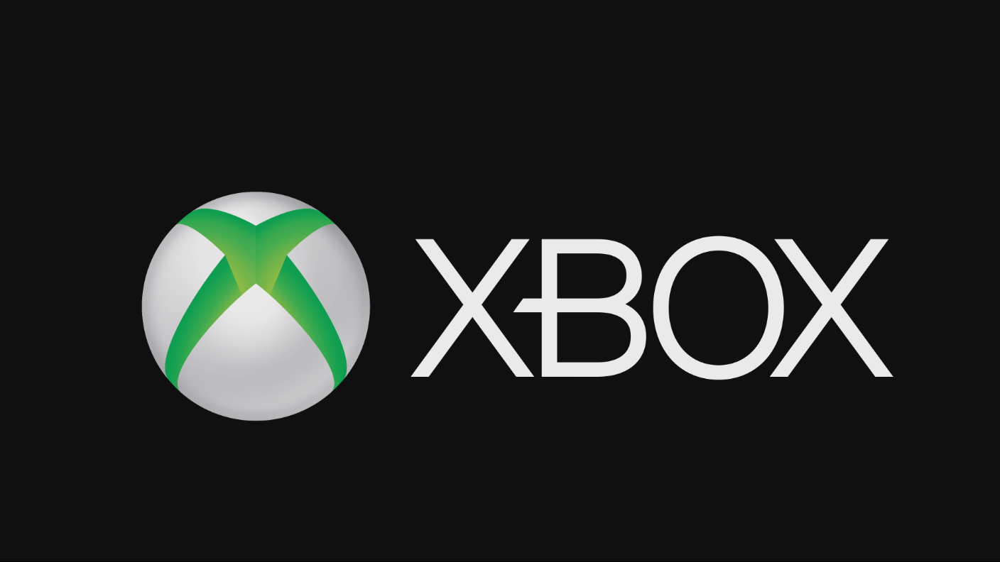

  

#   FrontPanelLogo Sample

*This sample is compatible with the Microsoft Game Development Kit (June
2020)*

# 

# Description

This sample provides some starting code to help you render an image the
Xbox One X Devkit and Project Xbox Series X|S devkit front panel
displays using a standard image format. For example, if you are
demonstrating your game at a tradeshow or a conference, you may want to
have some graphics on the front panel that are consistent with the art
and style of your game. The sample also displays an image on the main
display and so will run on an Xbox One S or Xbox One devkit as well,
however there is limited utility in using the sample this way.

# Building the sample

If using an Xbox One devkit, set the active solution platform to `Gaming.Xbox.XboxOne.x64`.

If using an Xbox Series X|S devkit, set the active solution platform to `Gaming.Xbox.Scarlett.x64`.

*For more information, see* __Running samples__, *in the GDK documentation.*

By default, the sample uses two images to display on the Front Panel and
main display during execution. FrontPanelLogo.png is displayed on the
FrontPanel while FullScreenLogo.png is displayed on the main display.
For a quick and simple customization, you can simply replace
FrontPanelLogo.png and FullScreenLogo.png with your own artwork and
rebuild.

# Using the sample

## Main Display Logo

## Front Panel Display Logo

| Action                                 |  Gamepad                     |
|----------------------------------------|-----------------------------|
| Exit                                   |  View Button                 |

# 

# 

# Implementation notes

The sample uses a helper class, FrontPanelDisplay, which manages a
buffer for the FrontPanel and provides methods for simplifying display
operations. In particular, the sample uses
FrontPanelDisplay::LoadWICFromFile to load a standard .png image file.
The method supports many standard image formats including PNG, JPG, and
BMP. The method will also automatically scale and convert the image to
the required size and pixel format for the front panel. If you are
concerned about image quality on the front panel, you will get the best
results by editing the image beforehand to best fit the size and pixel
format of the panel. (The panel has 256x64 pixels with 16 shades of gray
per pixel.)

To quickly add a custom front panel image to your own game, add the
FrontPanelDisplay class (and supporting code) to your codebase and then
copy only a few lines of code from the sample to initialize the display
and load the image:

if (XFrontPanelIsAvailable())

{

// Initialize the FrontPanelDisplay object

m_frontPanelDisplay = std::make_unique\<FrontPanelDisplay\>();

// Load the logo image

m_frontPanelDisplay-\>LoadWICFromFile(L\"Assets\\\\FrontPanelLogo.png\");

}

Somewhere in your initialization/update code path you will need to make
at least one call to FrontPanelDisplay::Present():

if (XFrontPanelIsAvailable())

{

// wait a few frames and then this only needs to be called once

if (m_timer.GetFrameCount() == 10)

{

m_frontPanelDisplay-\>Present();

}

}

# Update history

First released in April 2019.

Support for the Xbox Series X|S Devkit in November 2019.

# Privacy Statement

When compiling and running a sample, the file name of the sample
executable will be sent to Microsoft to help track sample usage. To
opt-out of this data collection, you can remove the block of code in
Main.cpp labeled "Sample Usage Telemetry".

For more information about Microsoft's privacy policies in general, see
the [Microsoft Privacy
Statement](https://privacy.microsoft.com/en-us/privacystatement/).
