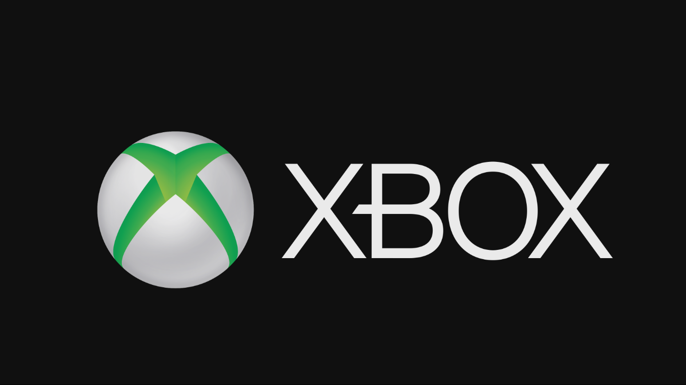

  

#   FrontPanelLogo 샘플

*이 샘플은 Microsoft 게임 개발 키트 미리 보기(2019년 11월)와
호환됩니다.*

# 

# 설명

이 샘플에서는 표준 이미지 형식을 사용하여 Xbox One X Devkit 및 Project
Scarlett devkit 전면 패널 디스플레이의 이미지를 렌더링하는 데 유용한
시작 코드를 제공합니다. 예를 들어, 박람회나 컨퍼런스에서 게임을 예시하는
경우 게임의 아트 및 스타일과 일관된 그래픽을 전면 패널에 표시하려고 할
수 있습니다. 또한 이 샘플은 주 디스플레이에 이미지를 표시하고, Xbox One
S 또는 Xbox One devkit에서도 실행되지만 이러한 방식으로 샘플을 사용하는
경우에는 유틸리티가 제한됩니다.

# 샘플 빌드

Xbox One 개발 키트를 사용하는 경우 활성 솔루션 플랫폼을
Gaming.Xbox.XboxOne.x64로 설정하세요.

Project Scarlett을 사용하는 경우 활성 솔루션 플랫폼을
Gaming.Xbox.Scarlett.x64로 설정하세요.

*자세한 내용은 GDK 문서에서* 샘플 실행하기*를 참조하세요.*

기본적으로 이 샘플은 실행 동안 두 개의 이미지를 사용하여 전면 패널 및 주
디스플레이에 표시합니다. FrontPanelLogo.png는 전면 패널에 표시되지만,
FullScreenLogo.png는 주 디스플레이에 표시됩니다. 빠르고 간편한 사용자
지정을 위해 FrontPanelLogo.png 및 FullScreenLogo.png를 고유한 아트워크로
바꾸고 다시 빌드할 수 있습니다.

# 샘플 사용

## 주 디스플레이 로고

## 전면 패널 디스플레이 로고

| 작업                                   |  게임패드                    |
|----------------------------------------|-----------------------------|
| 종료                                   |  보기 단추                   |

# 

# 

# 구현 참고 사항

이 샘플에서는 FrontPanel 버퍼를 관리하고, 디스플레이 작업을 간소화하는
메서드를 제공하는 도우미 클래스 FrontPanelDisplay를 사용합니다. 특히 이
샘플에서는 FrontPanelDisplay::LoadWICFromFile을 사용하여 표준 .png
이미지 파일을 로드합니다. 이 메서드는 PNG, JPG 및 BMP를 비롯한 여러 표준
이미지 형식을 지원합니다. 또한 이 메서드에서는 이미지를 전면 패널의
필요한 크기 및 픽셀 형식으로 자동으로 조정하고 변환합니다. 전면 패널의
이미지 품질이 염려되면 사전에 패널의 크기 및 픽셀 형식에 가장 잘 맞게
이미지를 편집하여 최상의 결과를 얻을 수 있습니다. (이 패널에는 픽셀당
16개의 회색 음영이 있는 256x64개 픽셀이 있습니다.)

사용자 지정 전면 패널 이미지를 자신의 게임에 빠르게 추가하려면
코드베이스에 FrontPanelDisplay 클래스(및 지원 코드)를 추가한 다음,
샘플에서 몇 개의 코드 줄만 복사하여 디스플레이를 초기화하고 이미지를
로드합니다.

if (XFrontPanelIsAvailable())

{

// FrontPanelDisplay 개체 초기화

m_frontPanelDisplay = std::make_unique\<FrontPanelDisplay\>();

// 로고 이미지를 로드합니다.

m_frontPanelDisplay-\>LoadWICFromFile(L\"Assets\\\\FrontPanelLogo.png\");

}

초기화/업데이트 코드 경로에서 하나 이상의 FrontPanelDisplay::Present()
호출을 수행해야 합니다.

if (XFrontPanelIsAvailable())

{

// 몇 개의 프레임을 기다린 다음, 이 프레임을 한 번만 호출하면 됩니다.

if (m_timer.GetFrameCount() == 10)

{

m_frontPanelDisplay-\>Present();

}

}

# 업데이트 기록

2019년 4월에 최초로 릴리스되었습니다.

2019년 11월, Project Scarlett Devkit을 지원합니다.

# 개인정보처리방침

샘플을 컴파일하고 실행할 때 샘플의 사용을 추적하는 데 도움이 되도록 샘플
실행 파일의 파일 이름이 Microsoft에 전송됩니다. 이 데이터 수집을
옵트아웃하려면 Main.cpp에서 \"샘플 사용 원격 분석\"이라고 레이블이
지정된 코드 블록을 제거할 수 있습니다.

Microsoft의 일반 개인정보취급방침에 대한 자세한 내용은 [Microsoft
개인정보처리방침](https://privacy.microsoft.com/en-us/privacystatement/)을
참조하세요.
