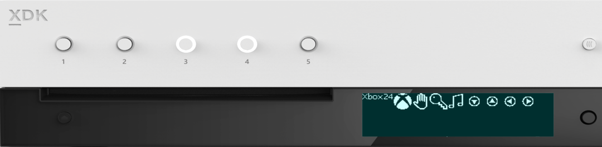
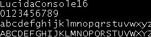
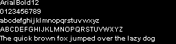

  

#   FrontPanelText 샘플

*이 샘플은 Microsoft 게임 개발 키트 미리 보기(2019년 11월)와
호환됩니다.*

# 

# 설명

FrontPanelText 샘플에서는 이 CPU를 사용하여 Xbox One X Devkit 및 Project
Scarlett Devkit 전면 패널 디스플레이에 텍스트를 그리는 방법을 보여
줍니다. 이 샘플에서는 .rasterfont 파일을 로드할 수 있는 RasterFont라는
클래스를 사용합니다. 이름에서 알 수 있듯이 .rasterfont 파일에는 각 문자
모양이 래스터화된 간단한 픽셀 기반 글꼴이 포함되어 있습니다. 이 형식은
CPU에서 렌더링하는 데 적합합니다. RasterFont 클래스는 텍스트를 쉽게
렌더링할 수 있게 해 주는 printf 스타일 메서드를 제공합니다. PC에 설치된
트루 타입 글꼴에서 고유한 .rasterfont 파일을 만드는 방법에 대한 자세한
내용은 RasterFontGen 샘플도 참조하세요.

# 샘플 빌드

Xbox One 개발 키트를 사용하는 경우 활성 솔루션 플랫폼을
Gaming.Xbox.XboxOne.x64로 설정하세요.

Project Scarlett을 사용하는 경우 활성 솔루션 플랫폼을
Gaming.Xbox.Scarlett.x64로 설정하세요.

*자세한 내용은 GDK 문서에서* 샘플 실행하기*를 참조하세요.*

# 샘플 사용

FrontPanelText 샘플은 전면 패널이 통합된 Xbox One X Devkit 및 Project
Scarlett Devkit에 사용됩니다. 이 샘플을 시작하면 샘플 텍스트가 전면 패널
디스플레이로 렌더링됩니다. 전면 패널 D-패드(왼쪽, 오른쪽)를 사용하여
텍스트의 글꼴 및 글꼴 크기(위쪽, 아래쪽)를 변경합니다. D-패드 위로를
사용하면 글꼴 크기가 증가하는 반면 D-패드 아래로를 사용하면 글꼴 크기가
줄어듭니다.

D-패드 단추를 눌러(선택) 전면 패널 디스플레이에서 버퍼를 캡처한 다음,
결과를 Title Scratch 폴더에 있는 .dds 파일에 저장할 수도 있습니다.

다음 이미지는 다양한 크기로 렌더링된 몇 가지 글꼴 옵션을 보여 주는
샘플의 스크린샷입니다.

Lucida Console은 전면 패널에서 읽을 수
있습니다. 이 텍스트는 예측 가능한 레이아웃 기하 도형으로 표시되며 고정
폭 글꼴이므로 메뉴 및 위젯에 사용하면 좋습니다. 또한 여전히 12픽셀
높이에서 읽을 수 있으며, 이 크기에서는 5줄의 텍스트가 디스플레이에 잘
맞습니다.

여기서는 동일한 글꼴이 16픽셀 크기로
렌더링됩니다. 이 크기일 때는 디스플레이에 4줄의 텍스트가 표시됩니다.

Arial은 알파벳 소문자의 너비와 알파벳
대문자의 너비를 비교하여 구분할 수 있으므로 고정 너비가 아닙니다.
Arial은 12픽셀 높이에서 읽을 수 있으며, 고정 폭 글꼴과 비교할 때 더 많은
텍스트가 디스플레이에 가로로 맞습니다.

RasterFont 도구 체인을 사용하여 컴퓨터에 설치된 TrueType 글꼴로
.rasterfont 파일을 생성할 수 있습니다. 다음은 기호 글꼴의 예입니다. 기호
글꼴의 문자는 간단한 UI 요소를 렌더링하는 데 사용할 수 있습니다(예:
화살표, 단추 등). 

# 구현 참고 사항

전면 패널의 텍스트는 RasterFont 개체를 사용하여 CPU에서 렌더링됩니다.
RasterFont 개체를 만들려면 .rasterfont 파일의 파일 이름을 생성자에게
전달합니다. 예를 들면 다음과 같습니다.

> auto myFont = RasterFont(L\"Assets\\\\LucidaConsole16.rasterfont\");

고유한 프로젝트에 대해 샘플과 함께 제공되는 .rasterfont 파일을
사용하거나 RasterFontGen.exe 도구를 사용하여 직접 만들 수 있습니다.
RasterFontGen을 사용하면 시스템에 설치된 모든 트루 타입 글꼴에서 다양한
크기 및 옵션을 사용하여 .rasterfont 파일을 만들 수 있습니다.

다음 코드 조각은 RasterFont 개체에 대한 가상의 종단간 사용을 보여
줍니다.

> // .rasterfont 파일을 로드합니다.
>
> auto myFont = RasterFont(L\"Assets\\\\LucidaConsole16.rasterfont\");
>
> // 전면 패널 디스플레이에 대한 버퍼 설명자를 가져옵니다.
>
> BufferDesc fpDesc = m_frontPanelDisplay-\>GetBufferDescriptor();
>
> // 서식 있는 문자열을 버퍼로 그립니다.
>
> myFont.DrawStringFmt(fpDesc, 0, 0,
>
> L\"Simple Addition\\n%i + %i = %i\",
>
> 1, 1, (1 + 1));
>
> // 전면 패널에 버퍼를 제공합니다.
>
> m_frontPanelDisplay-\>Present();

BufferDesc는 CPU 버퍼의 너비와 높이를 추적하는 구조체입니다.
RasterFont는 메모리의 주소로 텍스트를 렌더링할 수 있습니다. 이때 버퍼의
크기를 설명하는 BufferDesc만 있으면 됩니다. 전면 패널 디스플레이를 보다
쉽게 대상으로 지정하기 위해 샘플에서는 전면 패널에 대한 버퍼를 관리하는
FrontPanelDisplay 클래스를 사용합니다.
FrontPanelDisplay::GetBufferDescriptor()를 사용하여 RasterFont를 통해
텍스트를 전면 패널로 렌더링하는 데 적절한 BufferDesc를 가져옵니다.

DrawStringFmt는 텍스트를 버퍼로 그리는 데 사용됩니다. 이것은 표준
라이브러리 함수인 printf()와 유사합니다. 여기에는 BufferDesc 뿐만 아니라
텍스트의 x 및 y 좌표가 있어야 합니다. DrawStringFmt는 텍스트를
레이아웃할 때 줄 바꿈을 지원합니다.

다음은 RasterFont에서 제공하는 텍스트 렌더링 메서드의 요약입니다.

> // MeastureString 및 MeasureStringFMt가 컴퓨팅에 유용합니다.
>
> // 레이아웃 목적을 위한 텍스트 경계
>
> RECT MeasureString(const wchar_t \*text) const;
>
> RECT MeasureStringFmt(const wchar_t \*format, \...) const;
>
> // 버퍼에 대한 기본 텍스트 렌더링
>
> void DrawString(const struct BufferDesc &destBuffer, unsigned x,
> unsigned y,
>
> const wchar_t \*text) const;
>
> // 버퍼에 대한 서식 있는 텍스트 렌더링
>
> void DrawStringFmt(const struct BufferDesc &destBuffer, unsigned x,
> unsigned y,
>
> const wchar_t \*format, \...) const;
>
> // 다음 DrawString 변형은 다른 회색
>
> // 음영을 지정할 수 있는 음영
>
> // 매개 변수를 제공합니다.
>
> void DrawString(const struct BufferDesc &destBuffer, unsigned x,
> unsigned y,
>
> uint8_t shade, const wchar_t \*text) const;
>
> void DrawStringFmt(const struct BufferDesc &destBuffer, unsigned x,
> unsigned y,
>
> uint8_t shade, const wchar_t \*format, \...) const;
>
> // 단일 문자 모양을 정확히 배치하기 위해 문자 모양별 메서드가
> 사용됩니다.
>
> RECT MeasureGlyph(wchar_t wch) const;
>
> void DrawGlyph(const struct BufferDesc &destBuffer, unsigned x,
> unsigned y,
>
> wchar_t wch, uint8_t shade = 0xFF) const;

## 

RasterFont 참고:

-   음영 매개 변수가 있는 DrawString() 변형은 흑백 텍스트를 렌더링하는
    데 사용할 수 있습니다. 예를 들어, 메뉴 시스템에서 선택한 줄에 흑백
    텍스트를 사용하려고 할 수 있습니다. DrawString()은 배경 픽셀을
    그리지 않으므로, 흰색 배경에 검은색 텍스트를 표시하려면 먼저 흰색
    직사각형을 그려야 합니다. MeasureString 메서드를 사용하여 필요한
    직사각형의 경계를 확인합니다.

-   MeasureGlyph() 및 DrawGlyph()는 개별 문자 모양을 정확하게 배치하는
    데 유용합니다. 이러한 메서드에서는 문자 모양에 대해 경계 상자만
    사용하고, 인접한 문자 모양 간 공백과 일반 텍스트 흐름을 배치하는 데
    사용되는 세로 오프셋은 고려하지 않습니다. 따라서 문자 모양을
    정확하게 배치할 수 있습니다. 예를 들어, 기호 글꼴의 문자 모양을 UI
    요소 또는 위젯으로 사용할 수 있습니다. (FrontPanelDemo 샘플에서
    MeasureGlyph() 및 DrawGlyph()의 몇 가지 예제를 찾을 수 있습니다.)

-   RasterFont에서 제공하는 기본 텍스트 흐름이 만족스럽지 않은 경우 기본
    RasterGlyphSheet 클래스를 계속 활용하는 것이 좋습니다. 이 클래스는
    사용자 지정 텍스트 흐름 구현을 작성하는 데 사용할 수 있는
    ForEachGlyph() 템플릿을 제공합니다. ForEachGlyph()를 사용하는 방법에
    대한 가장 좋은 예제는 다양한 RasterFont::DrawString\*() 메서드
    구현에 나와 있습니다.

기타 구현 참고 사항:

-   Xbox 1 X Devkit 또는 Project Scarlett Devkit에서
    ::XFrontPanelIsAvailable()은 true를 반환하며 전체 API를 사용할 수
    있게 됩니다. 그렇지 않으면 ::XFrontPanelIsAvailable()은 false를
    반환하고 다른 ::XFrontPanel\*() 함수는 실패한 HRESULT 코드를
    반환합니다(Xbox One, Xbox One S 또는 실제 전면 패널이 없는 정품
    콘솔).

-   모든 프레임(::XFrontPanelPresentBuffer())의 전면 패널을 제공할
    필요는 없습니다. 대신, 하나 이상의 픽셀이 변경되었을 때만 제공하면
    됩니다. 따라서 이 샘플에는 디스플레이 버퍼가 변경될 때마다 설정되는
    m_dirty 멤버가 있습니다.

-   또한 변경이 있는 경우에만 라이트 상태를 설정하는 것이 좋습니다.

-   전면 패널 버퍼에 직접 액세스할 수 없습니다. 대신 자체 버퍼를
    관리하고 버퍼 주소를 ::XFrontPanelPresentBuffer()에 전달해야 합니다.
    Sample::CaptureFrontPanelScreen()은 단순히 m_panelBuffer의 내용을
    DDS 표면의 픽셀 페이로드로 사용합니다.

# 업데이트 기록

2019년 4월, 샘플의 첫 번째 릴리스

2019년 11월, Project Scarlett Devkit 지원

# 개인정보처리방침

샘플을 컴파일하고 실행할 때 샘플의 사용을 추적하는 데 도움이 되도록 샘플
실행 파일의 파일 이름이 Microsoft에 전송됩니다. 이 데이터 수집을
옵트아웃하려면 Main.cpp에서 \"샘플 사용 원격 분석\"이라고 레이블이
지정된 코드 블록을 제거할 수 있습니다.

Microsoft의 일반 개인정보취급방침에 대한 자세한 내용은 [Microsoft
개인정보처리방침](https://privacy.microsoft.com/en-us/privacystatement/)을
참조하세요.
