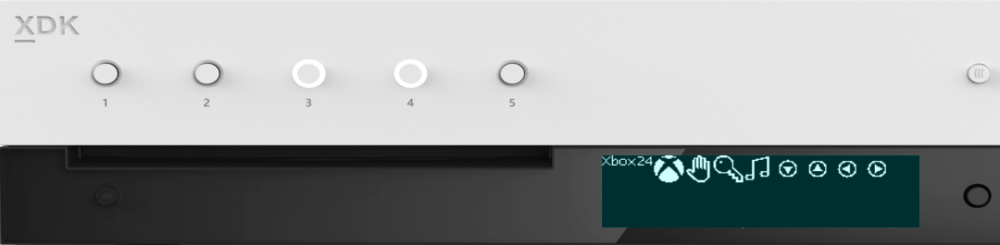
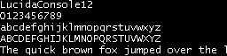
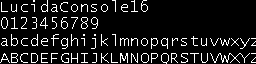

  

#   FrontPanelText 示例

此示例与 Microsoft 游戏开发工具包预览版（2019 年 11 月）兼容

# 

# 说明

FrontPanelText 示例演示如何使用 CPU 在 Xbox One X Devkit 和 Project
Scarlett Devkit 前面板显示屏上绘制文本。该示例使用一个名为 RasterFont
的类，该类可以加载 .rasterfont 文件。顾名思义，.rasterfont
文件包含一个简单的基于像素的字体，其中每个字形都已进行光栅化。此格式适用于在
CPU 上呈现。RasterFont 类提供了 printf
样式的方法，使呈现文本变得更为轻松。有关如何从电脑上安装的任何 True Type
字体创建自己的 .rasterfont 文件的更多信息，另请参见 RasterFontGen 示例。

# 构建示例

如果使用 Xbox One 开发工具包，请将活动解决方案平台设置为
Gaming.Xbox.XboxOne.x64。

如果使用 Project Scarlett，请将活动解决方案平台设置为
Gaming.Xbox.Scarlett.x64。

有关详细信息，请参阅 GDK 文档中的"运行示例"。

# 使用示例

FrontPanelText 示例适用于带有集成前面板的 Xbox One X Devkit 和 Project
Scarlett
Devkit。启动示例后，它将在前面板显示屏上呈现一些示例文本。使用前面板方向键（向左、向右）更改文本的字体和字号（向上、向下）。
使用向上方向键将增加字号，而使用向下方向键将减小字号。

也可以按下（选择）方向键按钮来捕获前面板显示屏中的缓冲区，并将结果保存到"Title
Scratch"文件夹中的 .dds 文件中。

下图是示例的屏幕截图，显示了以不同大小呈现的几个字体选项：

Lucida Console
在前面板上的可读性非常好。它是一种固定宽度的字体，所以对于菜单和小组件来说，这是一个很好的选择，因为文本将具有可预测的几何布局。另外，在
12 像素的高度下，它的可读性还是不错的，在这个大小下，5
行文本可以轻松地适应显示屏。

下面是同一字体，大小为 16
像素。请注意，在这个大小下，显示屏将容纳 4 行文本。

Arial
字体的宽度不固定，可以通过比较小写字母和大写字母的宽度而得出这一结论。与固定宽度的字体相比，Arial
可以在 12 像素的高度保持可读，并且可以在显示屏上水平放置更多文本。

通过使用 RasterFont 工具链，可以使用系统上安装的任何 TrueType 字体生成
.rasterfont 文件。这是一个 symbol 字体示例。Symbol
字体中的字符可用于呈现简单的 UI
元素（例如箭头、按钮等）

# 实现说明

前面板的文本使用 RasterFont 对象在 CPU 上呈现。若要创建 RasterFont
对象，请将 .rasterfont 文件的文件名传递到构造函数。例如：

> auto myFont = RasterFont(L\"Assets\\\\LucidaConsole16.rasterfont\");

对于你自己的项目，可以使用示例随附的 .rasterfont 文件，也可以使用
RasterFontGen.exe 工具创建自己的文件。借助
RasterFontGen，你可以从系统上安装的任何 True Type
字体创建包含各种字号和选项的 .rasterfont 文件。

下面的代码片段显示了 RasterFont 对象的一种假设的端到端使用情况：

> // 加载 .rasterfont 文件
>
> auto myFont = RasterFont(L\"Assets\\\\LucidaConsole16.rasterfont\");
>
> // 获取前面板显示屏的缓冲区描述符
>
> BufferDesc fpDesc = m_frontPanelDisplay-\>GetBufferDescriptor();
>
> // 将格式化的字符串绘制到缓冲区
>
> myFont.DrawStringFmt(fpDesc, 0, 0,
>
> L\"Simple Addition\\n%i + %i = %i\",
>
> 1, 1, (1 + 1));
>
> // 向前面板显示缓冲区
>
> m_frontPanelDisplay-\>Present();

BufferDesc 是一个结构，可跟踪 CPU 缓冲区的宽度和高度。RasterFont
可以将文本呈现到内存中的任何地址，它所需要的只是描述缓冲区尺寸的
BufferDesc。为了能更轻松地定位前面板显示屏，该示例使用可管理前面板缓冲区的
FrontPanelDisplay 类。使用 FrontPanelDisplay::GetBufferDescriptor()
获取适用于使用 RasterFont 向前面板呈现文本的 BufferDesc。

DrawStringFmt 用于将文本绘制到缓冲区。这类似于标准库函数
printf()。请注意，它需要 BufferDesc 以及文本的 x 和 y
坐标。DrawStringFmt 支持在布局文本时使用换行符。

下面是 RasterFont 提供的文本呈现方式的摘要：

> // MeastureString 和 MeasureStringFMt 对计算很有用
>
> // 用于布局目的的文本边界
>
> RECT MeasureString(const wchar_t \*text) const;
>
> RECT MeasureStringFmt(const wchar_t \*format, \...) const;
>
> // 向缓冲区呈现的基本文本
>
> void DrawString(const struct BufferDesc &destBuffer, unsigned x,
> unsigned y,
>
> const wchar_t \*text) const;
>
> // 向缓冲区呈现的格式化文本
>
> void DrawStringFmt(const struct BufferDesc &destBuffer, unsigned x,
> unsigned y,
>
> const wchar_t \*format, \...) const;
>
> // 以下 DrawString 变体提供一种底纹
>
> // 可指定不同底纹的参数
>
> // 灰色
>
> void DrawString(const struct BufferDesc &destBuffer, unsigned x,
> unsigned y,
>
> uint8_t shade, const wchar_t \*text) const;
>
> void DrawStringFmt(const struct BufferDesc &destBuffer, unsigned x,
> unsigned y,
>
> uint8_t shade, const wchar_t \*format, \...) const;
>
> // 特定于字形的方法用于精确定位单个字形
>
> RECT MeasureGlyph(wchar_t wch) const;
>
> void DrawGlyph(const struct BufferDesc &destBuffer, unsigned x,
> unsigned y,
>
> wchar_t wch, uint8_t shade = 0xFF) const;

## 

RasterFont 说明：

-   带底纹参数的 DrawString()
    变体可用于呈现白底黑字文本。例如，如果想要对菜单系统中的所选行使用白底黑字文本。请记住，DrawString()
    不会绘制背景像素，因此要在白色文本上显示黑色，首先必须绘制一个白色矩形。使用
    MeasureString 方法来确定所需矩形的边界。

-   MeasureGlyph() 和 DrawGlyph()
    对于精确定位单个字形很有用。这些方法仅使用字形的边界框，而不考虑相邻字形之间的间距以及用于布置常规文本流的垂直偏移。因此，可以精确定位字形。例如，如果使用
    Symbol 字体的字形作为 UI 元素或小组件。（可以在 FrontPanelDemo
    示例中找到 MeasureGlyph() 和 DrawGlyph() 的一些示例。）

-   如果对 RasterFont 提供的基本文本流不满意，则可以考虑利用基础
    RasterGlyphSheet 类。此类提供了一个 ForEachGlyph()
    模板，可用于编写自定义文本流实现。有关如何使用 ForEachGlyph()
    的最佳示例，可以在各种 RasterFont::DrawString\*() 方法的实现中找到。

杂项实现说明：

-   在 Xbox One X Devkit 或 Project Scarlett Devkit
    上，::XFrontPanelIsAvailable() 将返回 true，并提供完整的 API。
    否则，::XFrontPanelIsAvailable() 将返回 false，其他
    ::XFrontPanel\*() 函数将返回失败的 HRESULT 代码。（例如，在 Xbox
    One、Xbox One S 或任何没有物理前面板的零售控制台上。）

-   不必每帧都向前面板显示
    (::XFrontPanelPresentBuffer())。相反，只需要在更改一个或多个像素时呈现即可。因此，该示例具有一个
    m_dirty 成员，每当显示屏缓冲区发生更改时，都会对该成员进行设置。

-   只有在发生更改时，才有必要设置灯光状态。

-   
    不能直接访问前面板缓冲区。相反，必须管理自己的缓冲区，并将缓冲区的地址传递给
    ::XFrontPanelPresentBuffer()。Sample::CaptureFrontPanelScreen()
    仅使用 m_panelBuffer 的内容作为 DDS 表面的像素有效负载。

# 更新历史记录

2019 年 4 月，首次发布此示例。

2019 年 11 月，支持 Project Scarlett Devkit。

# 隐私声明

在编译和运行示例时，示例可执行文件的文件名将发送给
Microsoft，用于帮助跟踪示例使用情况。要选择退出此数据收集，你可以删除
Main.cpp 中标记为"示例使用遥测"的代码块。

有关 Microsoft 的一般隐私政策的详细信息，请参阅《[Microsoft
隐私声明](https://privacy.microsoft.com/en-us/privacystatement/)》。
