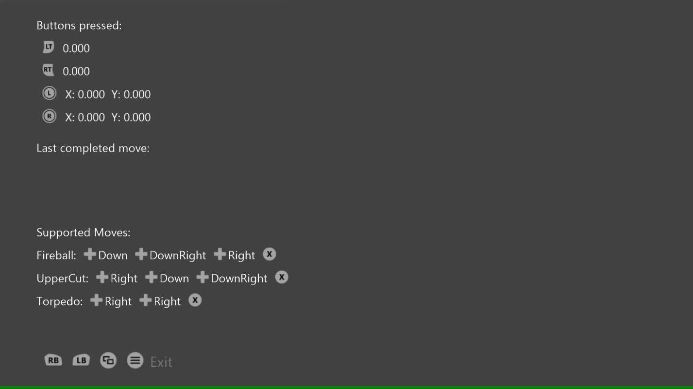

  

#   게임 패드 순차 샘플

*이 샘플은 Microsoft 게임 개발 키트와 호환됩니다(2020년 8월)*

# 설명

이 샘플에서는 GameInput을 사용하여 게임 패드에서 입력을 순차적으로 읽는
방법을 보여 줍니다.

# 샘플 사용

단추를 눌러 표시되는 것을 확인하고 엄지스틱과 트리거를 이동하여 판독값을
확인합니다. 아래쪽에 나열된 입력 시퀀스를 사용하여 전체 "이동"을
확인합니다.

# 구현 참고 사항

이 샘플에서는 GameInput API를 사용하여 게임 패드에서 입력을 순차적으로
읽는 방법을 보여 줍니다. GetCurrentReading을 사용하여 현재 입력 상태를
가져올 수 있지만, 이 샘플에서는 GetNextReading 호출을 사용하여 입력
이벤트의 순차적인 최근 기록을 순서대로 읽습니다.

# 개인정보처리방침

샘플을 컴파일하고 실행하는 경우 샘플 사용량을 추적할 수 있도록 샘플 실행
파일의 파일 이름이 Microsoft에 전송됩니다. 이 데이터 수집을
옵트아웃하려면 \"샘플 사용량 원격 분석\"으로 레이블이 지정된
Main.cpp에서 코드 블록을 제거할 수 있습니다.

Microsoft의 개인정보 정책에 대한 자세한 내용은 [Microsoft
개인정보처리방침](https://privacy.microsoft.com/en-us/privacystatement/)을
참조하세요.
