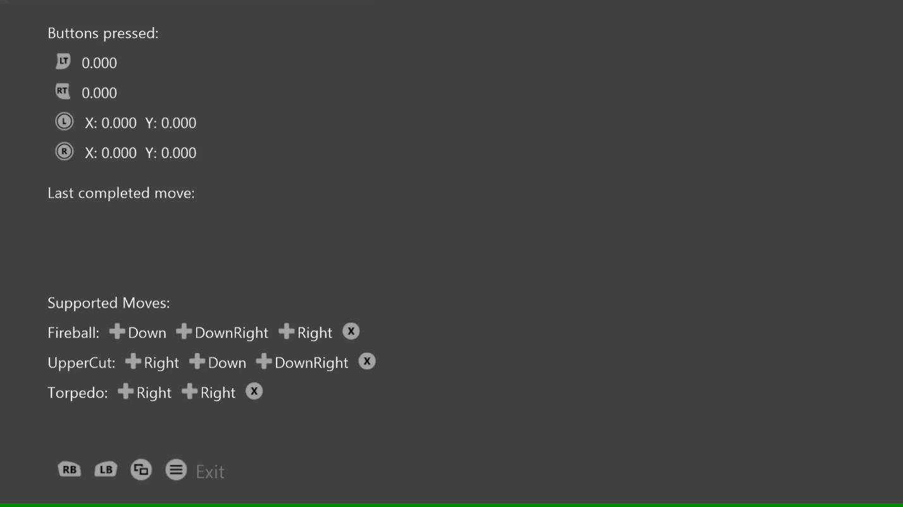

# 游戏手柄序列示例

*此示例与 Microsoft 游戏开发工具包（2020 年 8 月）兼容*

# 说明

此示例演示了如何通过 GameInput 按顺序读取游戏手柄上的输入数据。

# 使用示例

按下按钮可显示内容，移动控制杆和扳机可查看其读数。 使用底部列出的输入序列查看完整的&ldquo;移动操作&rdquo;。

# 实现说明

此示例演示了如何通过 GameInput API 按顺序读取游戏板上的输入数据。 GetCurrentReading 可用于获取输入数据的当前状态，而此示例可使用 GetNextReading 调用来浏览输入事件序列的最近历史记录以按顺序读取它们。

# 隐私声明

在编译和运行示例时，将向 Microsoft 发送示例可执行文件的文件名以帮助跟踪示例使用情况。 若要选择退出此数据收集，你可以删除 Main.cpp 中标记为&ldquo;示例使用遥测&rdquo;的代码块。

有关 Microsoft 的一般隐私策略的详细信息，请参阅 [Microsoft 隐私声明](https://privacy.microsoft.com/en-us/privacystatement/)。

