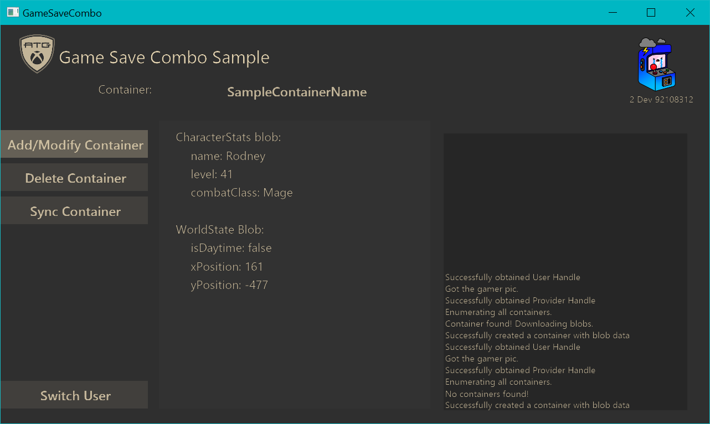

  

#   Game Save Combo Sample (PC, XBOX)

*This sample is compatible with the Microsoft Game Development Kit
(March 2022)*

# 

# Description

A simple sample that implements many of the
[XGameSave](https://docs.microsoft.com/en-us/gaming/gdk/_content/gc/reference/system/xgamesave/xgamesave_members)
api functions. This implementation is done by modifying the data of a
single container with 2 blobs.

Important Methods

## InitializeData

-   Enumerates all containers for the current provider context and
    checks if the container exists.

    -   This is done by calling
        [XGameSaveEnumerateContainerInfoByName](https://docs.microsoft.com/en-us/gaming/gdk/_content/gc/reference/system/xgamesave/functions/xgamesaveenumeratecontainerinfobyname),
        which takes a callback that is called for each container found.

    -   **Note** that for more specific information about the container,
        you can access its
        [XGameSaveContainerInfo](https://docs.microsoft.com/en-us/gaming/gdk/_content/gc/reference/system/xgamesave/structs/xgamesavecontainerinfo)
        from within the callback

## CreateContainer

-   Creates a container or modifies the existing container with random
    data.

    -   Calls
        [XGameSaveCreateContainer](https://docs.microsoft.com/en-us/gaming/gdk/_content/gc/reference/system/xgamesave/functions/xgamesavecreatecontainer)
        which will create a handle for the container. If a container
        already exists, the handle will just reference the existing
        container.

    -   If a container with the same name already exists, we call
        LoadBlobsFromDisk.

    -   Else we generate data to write to the new container and call
        GenerateBlobData.

-   We also create an update handle with
    [XGameSaveCreateUpdate](https://docs.microsoft.com/en-us/gaming/gdk/_content/gc/reference/system/xgamesave/functions/xgamesavecreateupdate)
    that will store our blob modifications we want to apply to the
    container. This update is then sent to the container with an
    [XGameSaveSubmitUpdate](https://docs.microsoft.com/en-us/gaming/gdk/_content/gc/reference/system/xgamesave/functions/xgamesavesubmitupdate).

## GenerateBlobData

-   Generates random blob data for an empty container.

    -   To write blob changes to our update context, we use
        [XGameSaveSubmitBlobWrite](https://docs.microsoft.com/en-us/gaming/gdk/_content/gc/reference/system/xgamesave/functions/xgamesavesubmitblobwrite).

    -   **Note** that each blob can be modified only ONCE per update.
        Whether it's adding, deleting, or modifying a blob.

## LoadBlobsFromDisk

-   Loads blob data from a container.

    -   Calls
        [XGameSaveReadBlobDataAsync](https://docs.microsoft.com/en-us/gaming/gdk/_content/gc/reference/system/xgamesave/functions/xgamesavereadblobdataasync)
        which reads all the blobs for a container. It takes a callback
        that is called when a blob is read.

    -   [XGameSaveReadBlobDataResult](https://docs.microsoft.com/en-us/gaming/gdk/_content/gc/reference/system/xgamesave/functions/xgamesavereadblobdataresult)
        contains the result of the async call. This can be used to parse
        the blob data.

## DeleteContainer

-   Deletes the container.

    -   This is done by calling
        [XGameSaveDeleteContainer](https://docs.microsoft.com/en-us/gaming/gdk/_content/gc/reference/system/xgamesave/functions/xgamesavedeletecontainer).

Privacy:

When compiling and running a sample, the file name of the sample
executable will be sent to Microsoft to help track sample usage. To
opt-out of this data collection, remove ATG_ENABLE_TELEMETRY from the
C/C++ / Preprocessor / Preprocessor Definitions list in the project's
settings.

For more information about Microsoft's privacy policies in general, see
the [Microsoft Privacy
Statement](https://privacy.microsoft.com/en-us/privacystatement/).
