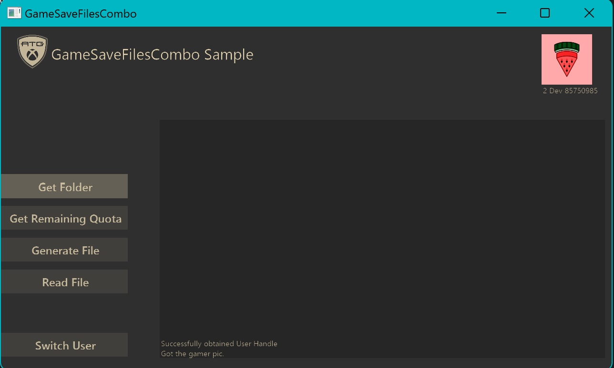

  

#   GameSaveFilesCombo Sample (PC, XBOX)

*This sample is compatible with the Microsoft Game Development Kit
(March 2022)*

# 

# Description

A simple sample that implements the
[XGameSaveFiles](https://learn.microsoft.com/en-us/gaming/gdk/_content/gc/reference/system/xgamesavefiles/xgamesavefiles_members)
api functions. It also demonstrates how to use Win32 FileIO with XGameSaveFiles.

# Important Methods

## GetFolderWithUIAsync

-   Calls the
    [XGameSaveFilesGetFolderWithUiAsync](https://docs.microsoft.com/en-us/gaming/gdk/_content/gc/reference/system/xgamesavefiles/functions/xgamesavefilesgetfolderwithuiasync)
     to get a folder path that can be used to read and write files. Data in the path will also be synced with the cloud.

## GetRemainingQuoata

-   Calls the
    [XGameSaveFilesGetRemainingQuota](https://docs.microsoft.com/en-us/gaming/gdk/_content/gc/reference/system/xgamesavefiles/functions/xgamesavefilesgetremainingquota)
    to get the remaining storage available to save with using the
    XGameSaveFiles API.

# Building the sample

This sample supports both Xbox and Desktop.

Privacy:

When compiling and running a sample, the file name of the sample
executable will be sent to Microsoft to help track sample usage. To
opt-out of this data collection, remove ATG_ENABLE_TELEMETRY from the
C/C++ / Preprocessor / Preprocessor Definitions list in the project's
settings.

For more information about Microsoft's privacy policies in general, see
the [Microsoft Privacy
Statement](https://privacy.microsoft.com/en-us/privacystatement/).
