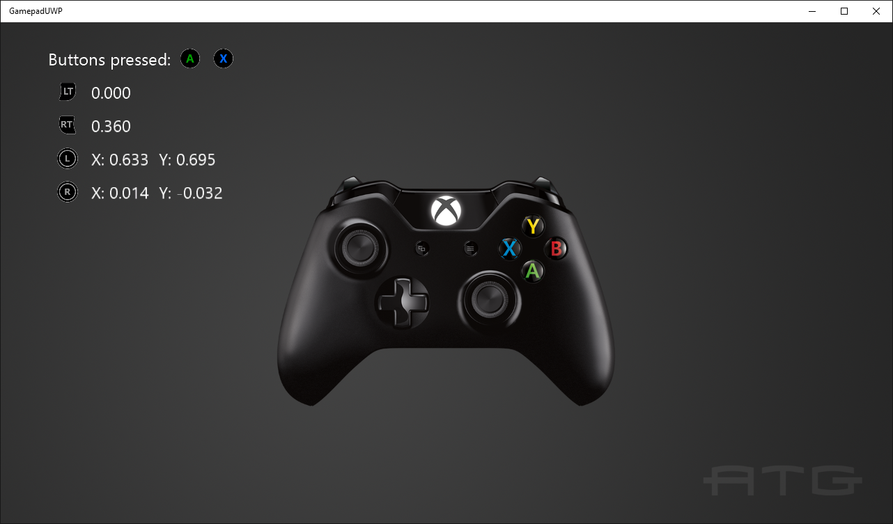

  

#   Gamepad Sample

*This sample is compatible with the Microsoft Game Development Kit (June
2020)*

# Description

This sample demonstrates how to read inputs from a gamepad on the Xbox
One

# Building the sample

If using an Xbox One devkit, set the active solution platform to `Gaming.Xbox.XboxOne.x64`.

If using Xbox Series X|S, set the active solution platform to `Gaming.Xbox.Scarlett.x64`.

For PC, you can set the active solution platform to Gaming.Desktop.x64.
**This requires the June 2022 GDK or later**.

*For more information, see* __Running samples__, *in the GDK documentation.*

# Using the sample

Press buttons to see them displayed and move the thumbsticks and
triggers to see their readings.

# Implementation notes

This sample demonstrates how to use the new GameInput API to read input
from a gamepad, including thumbsticks and triggers.

# Version History

-   October 2018: Initial GDK release

-   February 2020: Updated for changes to GameInput API.

-   June 2022: Added support for GameInput on PC (June 2022 GDK or
    later)

# Privacy statement

When compiling and running a sample, the file name of the sample
executable will be sent to Microsoft to help track sample usage. To
opt-out of this data collection, you can remove the block of code in
Main.cpp labeled "Sample Usage Telemetry".

For more information about Microsoft's privacy policies in general, see
the [Microsoft Privacy
Statement](https://privacy.microsoft.com/en-us/privacystatement/).
