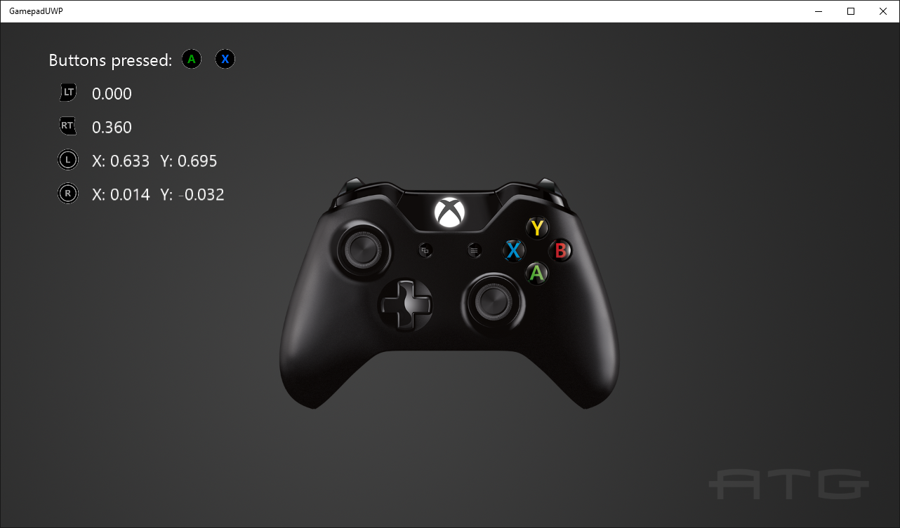

# 게임 패드 샘플

*이 샘플은 Microsoft 게임 개발 키트(2020년 6월)와 호환됩니다.*

# 설명

이 샘플에서는 Xbox One 게임 패드에서 입력된 항목을 읽는 방법을 보여 줍니다.

# 샘플 빌드

Xbox One 개발 키트를 사용하는 경우 활성 솔루션 플랫폼을 `Gaming.Xbox.XboxOne.x64`(으)로 설정합니다.

Xbox Series X|S를 사용하는 경우 활성 솔루션 플랫폼을 `Gaming.Xbox.Scarlett.x64`(으)로 설정합니다.

PC를 사용하는 경우 활성 솔루션 플랫폼을 Gaming.Desktop.x64로 설정합니다. **이를 위해서는 GDK 2022년 6월 버전 이상이**필요합니다.

*GDK 설명서의* __샘플 실행__에서 *자세한 내용을 참고하세요.*&nbsp;

# 샘플 사용

버튼을 눌러 표시되는 것을 확인하고 엄지스틱과 트리거를 이동하여 판독값을 확인합니다.

# 구현 참고 사항

이 샘플에서는 새로운 GameInput API를 사용하여 엄지스틱 및 트리거를 포함한 게임 패드에서 입력을 읽는 방법을 보여 줍니다.

# 버전 기록

- 2018년 10월: 초기 GDK 릴리스

- 2020년 2월: GameInput API의 변경 내용이 업데이트

- 2022년 6월: PC에 GameInput에 대한 지원 추가(GDK 2022년 6월 버전 이상)

# 개인정보처리방침

샘플을 컴파일하고 실행하는 경우 샘플 사용량을 추적할 수 있도록 샘플 실행 파일의 파일 이름이 Microsoft에 전송됩니다. 이 데이터 수집을 옵트아웃하려면 Main.cpp에서 "샘플 사용량 원격 분석"이라는 레이블이 지정된 코드 블록을 제거할 수 있습니다.

일반적인 Microsoft의 개인 정보 정책에 대한 자세한 내용은 [Microsoft 개인정보처리방침](https://privacy.microsoft.com/en-us/privacystatement/)을 참조하세요.

