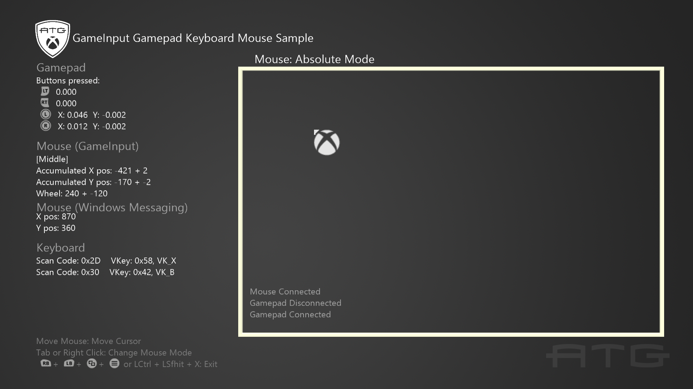

#   GameInput Gamepad Keyboard Mouse

*This sample is compatible with the June 2022 Microsoft Game Development
Kit (10.0.22000.4362)*

# 

# Description

This sample demonstrates how to read and process inputs from gamepad, mouse, and keyboard using GameInput.

# Building the sample

- If building for Xbox One, set the active solution platform to `Gaming.Xbox.XboxOne.x64`.
- If building for Xbox Series X|S, set the active solution platform to `Gaming.Xbox.Scarlett.x64`.
- If building for PC, set the active solution platform to Gaming.Desktop.x64.\
**NOTE: This requires the [GameInput NuGet package](https://www.nuget.org/packages/Microsoft.GameInput) and its 
included redistributable to be installed.  Please see [GameInput on PC](https://learn.microsoft.com/gaming/gdk/_content/gc/input/overviews/input-nuget) for more information.**.

*For more information, see* __Running samples__, *in the GDK documentation.*

# Using the Sample

This sample processes inputs from gamepads, keyboards, as well as two modes of mouse input to move and rotate a cursor about the screen. The two mouse modes are:

_Relative_ - Mouse movement is reported natively as a series of delta values, rather than as an absolute position.

_Absolute_ - Mouse position is reported based on its location in the window. Not native to GameInput and requires alternative.
implementation like Windows Messaging.

In this sample, pressing the [Tab] key on a keyboard will change the mouse mode. The mouse modes have the following controls:

|                       | **Relative Mode**                         | **Absolute Mode**		|
|-----------------------|-------------------------------------------|-----------------------|
| **Change Mouse Mode** | Tab or Right Click                        | Tab or Right Click	|
| **Move Cursor**       | D-Pad or WASD                             | Move Mouse			|
| **Rotate Cursor**     | Right Thumbstick or Move Mouse Left/Right | _N/A_					|

# Implementation Notes

GameInput exposes input devices of all kinds through a single consistent interface.

When looking at the sample code, search for the "\[GameInput\]"
comment to find locations related to using GameInput.

This sample highlights how to:

* Process device information and states from device readings for various device types.
* How to interpret gamepad and keyboard inputs.
* How to use GameInput for relative position of the mouse.
* How to use Windows Messaging for absolute position of the mouse.
* Set up callbacks for device connection and disconnections.

For more information about how to handle multiple users, user
sign-in/out events, gamepad pairing, XR handling, and other more
advanced user topics, please see the UserManagement Sample.

# Update history

**Initial Release:** Microsoft Game Development Kit (March 2023)
- March 2025: Added support for GameInput v1.x on PC via the
  [GameInput NuGet package](https://www.nuget.org/packages/Microsoft.GameInput)

# Privacy Statement

When compiling and running a sample, the file name of the sample
executable will be sent to Microsoft to help track sample usage. To
opt-out of this data collection, you can remove the block of code in
Main.cpp labeled "Sample Usage Telemetry".

For more information about Microsoft's privacy policies in general, see the [Microsoft Privacy Statement](https://privacy.microsoft.com/en-us/privacystatement/).
