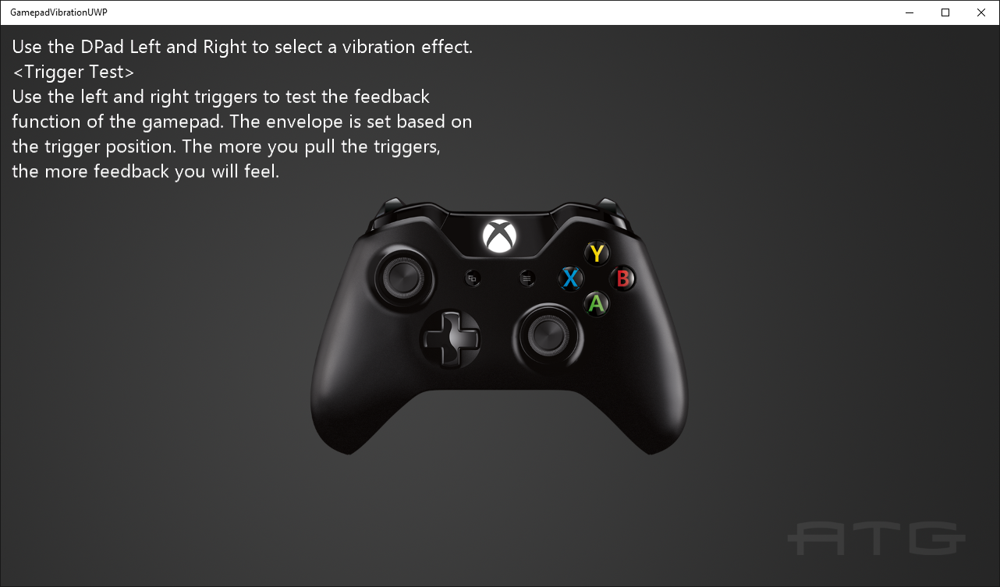

# Gamepad Vibration Sample

*This sample is compatible with the Microsoft Game Development Kit (June 2020)*

# Description

This sample demonstrates how to use vibration with a gamepad on an Xbox
One.

# Building the sample

- If building for Xbox One, set the active solution platform to `Gaming.Xbox.XboxOne.x64`.
- If building for Xbox Series X|S, set the active solution platform to `Gaming.Xbox.Scarlett.x64`.
- If building for PC, set the active solution platform to Gaming.Desktop.x64.\
**NOTE: This requires the [GameInput NuGet package](https://www.nuget.org/packages/Microsoft.GameInput) and its 
included redistributable to be installed.  Please see [GameInput on PC](https://learn.microsoft.com/gaming/gdk/_content/gc/input/overviews/input-nuget) for more information.**.

*For more information, see* __Running samples__, *in the GDK documentation.*

# Using the sample

Use left and right on the DPad to cycle between different vibration
examples. Use the triggers in most of these examples to increase the
amount of vibration.

Please note that there are some 3^rd^ party controllers which do not
have trigger rumble motors, so effects using those motors on these
controllers will not cause vibration.

# Implementation notes

This sample demonstrates how to use the GameInput API to set vibration
levels on an Xbox One gamepad.

# Update history

- Initial release April 2019
- Updated in June 2019 for minor breaking change to
  **SetRumbleState**.
- February 2020: Updated for changes to GameInput API.
- June 2022: Added support for GameInput on PC (June 2022 GDK or
  later)
- March 2025: Added support for GameInput v1.x on PC via the
  [GameInput NuGet package](https://www.nuget.org/packages/Microsoft.GameInput)

# Privacy statement

When compiling and running a sample, the file name of the sample
executable will be sent to Microsoft to help track sample usage. To
opt-out of this data collection, you can remove the block of code in
Main.cpp labeled "Sample Usage Telemetry".

For more information about Microsoft's privacy policies in general, see
the [Microsoft Privacy
Statement](https://privacy.microsoft.com/en-us/privacystatement/).
