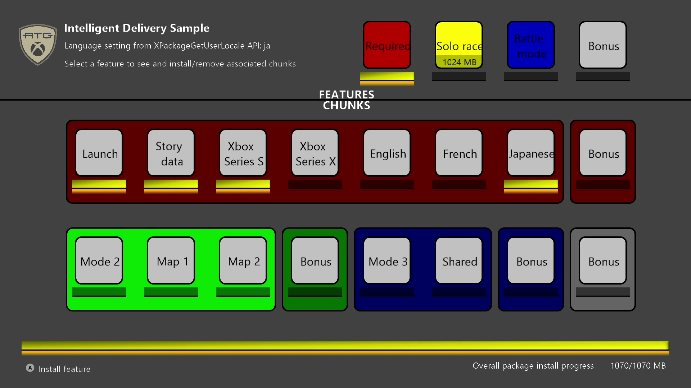
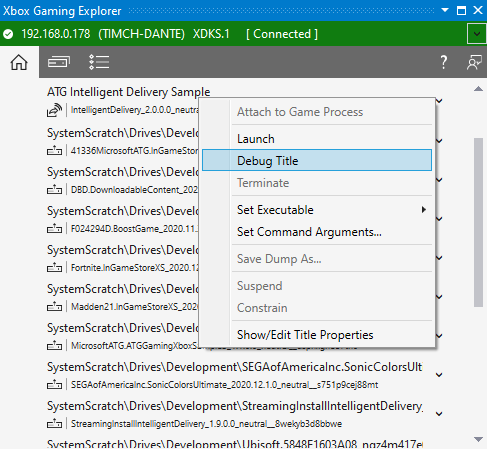
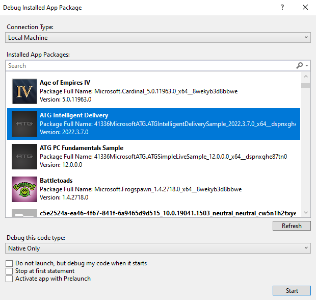

  

#   Intelligent Delivery

*This sample is compatible with the Microsoft Game Development Kit
(March 2022)*

# 

# Description

This sample demonstrates **Intelligent Delivery** APIs. Once the launch
chunk is installed, the sample can be run to visualize the installation
progress of the remaining chunks.

It also demonstrates the intelligent installation features including
features and recipes, localized chunks, and hardware specific chunks.
Different content will be installed depending on the target SKU of the
target hardware (Xbox Series X|S, or the Xbox One Family) and the
language/locale settings of the device. Then users will be able to
select among multiple features to install and remove while the sample is
running and observe the installation and progress as a result.

This sample builds on the earlier *StreamingInstall* sample to
demonstrate the Recipes and Features capability. Referencing the layout
file (Chunks\_\[XboxOne/Scarlett\].xml):

\<Recipes\>

\<Recipe Id=\"default\" IncludedFeatures=\"feature1\" /\>

\</Recipes\>

\<Features\>

\<Feature Id=\"feature1\" Hidden=\"true\" Tags=\"mode1\" /\>

\<Feature Id=\"feature2\" DisplayName=\"Mode 2\" Tags=\"mode2;maps\"/\>

\<Feature Id=\"feature3\" DisplayName=\"Mode 3\" Tags=\"mode3\"/\>

\<Feature Id=\"feature4\" DisplayName=\"Bonus Content\"
Tags=\"bonus\"/\>

\</Features\>

The package will be built with a default active recipe that will only
install feature1. There are four total features that can be installed,
which are generally represented by different colored items in the grid.
Installing each feature will result in their tags being marked active,
and chunks with those tags will be installed. Selecting a feature in the
sample will result in that feature's associated chunks, as tagged by the
feature specification, to be installed or removed.

Some additional complexity is included:

\<Feature Id=\"feature2\" DisplayName=\"Mode 2\" Tags=\"mode2;maps\"/\>

feature2 will install chunks tagged with either mode2 or maps.

\<Chunk Id=\"1007\" Tags=\"mode1#bonus\"\>

\<FileGroup DestinationPath=\"\\\" SourcePath=\".\"
Include=\"filler256mb7.txt\"/\>

\</Chunk\>

This chunk will only be installed if **both** mode1 and bonus tags are
active, meaning feature1 **and** feature4 are installed. These are all
the "Bonus" items shown the sample, as there is one for each feature, as
well as one standalone for feature4.

\<Chunk Id=\"3001\" Tags=\"mode3;mode2\"\>

\<FileGroup DestinationPath=\"\\\" SourcePath=\".\"
Include=\"filler256mb13.txt\"/\>

\</Chunk\>

This chunk will be installed if **either** mode1 or mode2 tags are
active; in other words, this chunk is installed if feature2 or feature3
are installed, whichever is first. Conversely it will only be removeable
if both features are removed. This is represented as the "Shared" item
grouped in the "Battle Mode" feature in the sample.

For **PC**, the features and chunks are slightly modified since there
are no device-specific chunks. Instead, there is a chunk in feature1
that depends on feature4.

# Building the sample

If using an Xbox Series X|S devkit, set the active solution platform to `Gaming.Xbox.Scarlett.x64`.

If using an Xbox One devkit, set the active solution platform to `Gaming.Xbox.XboxOne.x64`.

If using PC, set the active solution platform to x64.

*For more information, see* __Running samples__, *in the GDK documentation.*

# Using the sample

Unlike most GDK samples, the *IntelligentDelivery* sample is not meant
to be built and deployed from Visual Studio. Although you can deploy and
run directly from Visual Studio this circumvents the installation tools
and process this sample is meant to demonstrate. The steps to use this
sample are as follows:

1.  Build the sample from Visual Studio **without** deploying and
    executing it

2.  Generate content for the installation package

3.  Create the installation package

4.  Install the package and run the sample

This sample requires separate packages for each console device family.
Different .bat and .config files are provided to be used to build the
appropriate package for each device. Regardless of the platform, the
XPackage code remains unchanged with GDK. In the *MicrosoftGame.config*
file, the only differentiating attribute is TargetDeviceFamily which is
either XboxOne, Scarlett, or PC.

The first step is simply to build the sample from Visual Studio. This
will create the binaries and directory layout that will eventually be
used in creating the package. Once the sample has been built, run
**CreateInstallPackage\_\[XboxOne/Scarlett/PC\].bat** from the command
line. The batch file will create several large files to act as content
files to monitor installation progress in real time and stage the
appropriate MicrosoftGame.config with the TargetDeviceFamily set.

The next step is to create the installation package using the
**makepkg** tool installed with the GDK. Open an **Xbox Gaming Command
Prompt** and navigate to the directory that contains
*IntelligentDelivery.vcxproj*. You can run
**CreateXVC\_\[XboxOne/Scarlett\].bat** or **CreateMSIXVC_PC.bat** from
the command prompt you opened or run the command directly:

Xbox One Device Family:

> makepkg.exe pack /v /f Chunks_XboxOne.xml /d
> \".\\Gaming.Xbox.x64\\Layout\\Image\\Loose\" /pd
> \".\\Gaming.Xbox.x64\\Layout\\Image\" \[/lk \<filename\>.lekb\]

Xbox Series X|S Device Family:

> makepkg.exe pack /v /f Chunks_Scarlett.xml /d
> \".\\Gaming.Scarlett.x64\\Layout\\Image\\Loose\" /pd
> \".\\Gaming.Scarlett.x64\\Layout\\Image\" \[/lk \<filename\>.lekb\]

PC:

> makepkg.exe pack /pc /v /f Chunks_PC.xml /d
> .\\x64\\Layout\\Image\\Loose /pd
> .\\x64\\Layout\\Image \[/lk \<filename\>.lekb\]

Be aware that if running the command directly, refer to the .bat to
ensure all the files are staged to the right location, especially if
some have been updated.

It's recommended to use /lk signing for packages. /lk signed packages
can be securely transferred as well as locally installed and tested.
This is done by generating a **.lekb** file using **makepkg genkey** and
passing that into the /lk parameter. **The .lekb file should never be
shared or saved to source tree.**

A /lk signed package can be installed onto console devkit so long as
**xbapp install** is run from the output directory. In order to allow
others to be able to install an /lk signed package, distribute and share
the .xvc as well as the **.cekb** file that is also found in the output
location. The .cekb file can be manually installed by using **xbapp
installkey**.

Since the package has been filled with several gigabytes of filler
content it can take up to several minutes to execute. Once it has
finished executing, several files will be created in the location
specified after the **/pd** option,
**".\\Gaming.\[Xbox/Scarlett/PC\].x64\\Layout\\Image"** directory in
this case. The actual installation package file will be given a name
that contains the **Package Family Name** of the package, derived from
the *MicrosoftGame.config.* For console, an **.xvc** file will be
created with a suffix depending on the TargetDeviceFamily: **\_x** for
Xbox One, **\_xs** for Scarlett. For PC, an **.msixvc** file is created.

The final step is to install the package onto your device. For **Xbox**,
there are several options to determine what content you want to install
depending on what scenarios you would like to test. If you want to test
your streaming installation implementation, then the following command
can be used:

> xbapp install \[/l\] \[/w\] \[/i\] \<package name\>

| Option         |  Details                                             |
|----------------|-----------------------------------------------------|
| \<package name\> |  The installation package created from the MakePkg command.                                            |
| /l  |  Specifies that only the launch chunk should be installed. Once the launch chunk is installed the game can be run, but only the content enumerated in the chunk marked "Launch" in the layout file will be available.                                       |
| /w  |  Specifies that the install will keep the pipe open. This allows for testing dynamic installation of features and extra Language chunks which are not initially installed.                                |
| /i  |  Specifies interactive mode. This brings up the Manage installation system UI that shows the available features defined in the package for interactive installation and removal.               |
| \<full package name\>  |  The name of the game after it has been installed on the console. This should not be confused with the package family name. You can get a list of installed packages on your console by running the **xbapp list** command from the command prompt.     |

Using /l and /w, you can test different scenarios of installing the
game. Using just /l, the system will only install the initial chunk.
Using /l and /w, the initial chunk will be installed by the system and
the rest will be installed after launching the application. Using just
/w, the game will install the entire base package based on the active
recipes defined in the layout file, and keep the pipe open. Using none
of these parameters will simply install the base package and it will not
be possible to perform additional installation with the sample.

/w is the most similar to retail behaviour, with the open pipe mimicking
the availability of the package source normally hosted on CDN.

Some chunks are installed based on the user's system and language
automatically. For example, if you deploy to a Xbox Series X|S console
with the Scarlett family package with the language set to "en-US", then
chunks tagged with other languages or device "Xbox-Lockhart" will not be
installed. With the Durango family package, either the Durango or the
Scorpio content will be installed based on the target device (or debug
setting on a devkit).

You can force installation of other chunks using xbapp install with some
of the optional arguments that can be passed to the command.

| Option   |  Details                                                   |
|----------|-----------------------------------------------------------|
| /L anguages  |  Specifies which languages will be installed in a semi-colon delineated list of languages. This can be used to test localized content for multiple languages without the need to rerun the installation command after changing the console settings.                                     |
| /Devices  |  Specifies which hardware specific chunks should be installed. This is a semi-colon delineated list of the different hardware SKUs to include.                       |
| /Recipes  |  Specifies which recipes should be installed. This is a semi-colon delineated list of recipe specifiers that are defined in the layout file.                               |
| / Features  |  Specifies which features should be installed. This is a semi-colon delineated list of feature specifiers that are defined in the layout file.                               |
| /A llChunks |  Specifies that all chunks should be installed regardless of console hardware or settings.                          |

This is not an exhaustive list of the options that can be used with the
**xbapp install** command. Refer to the GDK documentation for a
comprehensive list of options.

For **PC**, the wdapp command will be used instead. Only the /l flag is
available to install the launch chunks. Since the sample is running on
the same device that hosts the package source, the sample will be able
to conduct intelligent delivery operations without needing a process to
be active:

wdapp install \[/l\] \<package name\>

# Debugging the sample

Since this sample cannot normally be run in debugger simply by launching
from Visual Studio, other methods must be used to debug the packaged
builds.

On **Xbox** use the Xbox Gaming Explorer to initiate debugging session
of the sample, which should be in the list of registered titles:

On **PC**, use Debug \> Other Debug Targets \> Debug Installed App
Package:

This sample uses the following controls:

| Action                 |  Gamepad Control      |  Mouse/Keyboard       |    |
|------------------------|----------------------|----------------------|---|
| Navigating the grid menu |  D-Pad  |  Arrow keys  |  |
| Selecting an item from the grid menu. Installs feature if available to install. Installs language chunk if available to install. Makes the item install first if multiple are pending. Uninstalls current item if installed and possible to be removed. |  A  |  Left click / enter  |  |
| Enumerate all features and chunks and display their XPa ckageChunkAvailability value (in debug text) |  Y  |  Y key  |  |
| Toggle onscreen debug text |  Menu  |  Tilde ( \` )  |  |
| Exiting the sample     |  View                 |  Esc                  |    |

# Package Uploader

In the PackageUploader directory are some .json files that are example
configuration files to be used by the PackageUploader tool, found at

<https://github.com/microsoft/PackageUploader>

PackageUploader is a utility that allows command line package upload and
related operations. The configuration files are passed in to the
utility, which is to be built separately from source. The scripts won't
be able to be used as is as the Azure app secret that is required is
missing, but it should give you an example of the minimal requirements
of each operation. An example output for each operation is also included
in an accompanying text file.

Adapt this feature to incorporate automated package upload to your build
pipelines.

# Update history

April 2019 First release of the sample.

March 2020 Update sample to separate configurations for XboxOne and
Scarlett device families.

February 2021 Rename sample to IntelligentDelivery, revamp for recipe
and feature support

March 2021 Add PC as supported platform

March 2022 Update to use /lk; added example PackageUploader
configuration scripts

# Privacy Statement

When compiling and running a sample, the file name of the sample
executable will be sent to Microsoft to help track sample usage. To
opt-out of this data collection, you can remove the block of code in
Main.cpp labeled "Sample Usage Telemetry".

For more information about Microsoft's privacy policies in general, see
the [Microsoft Privacy
Statement](https://privacy.microsoft.com/en-us/privacystatement/).

# 
