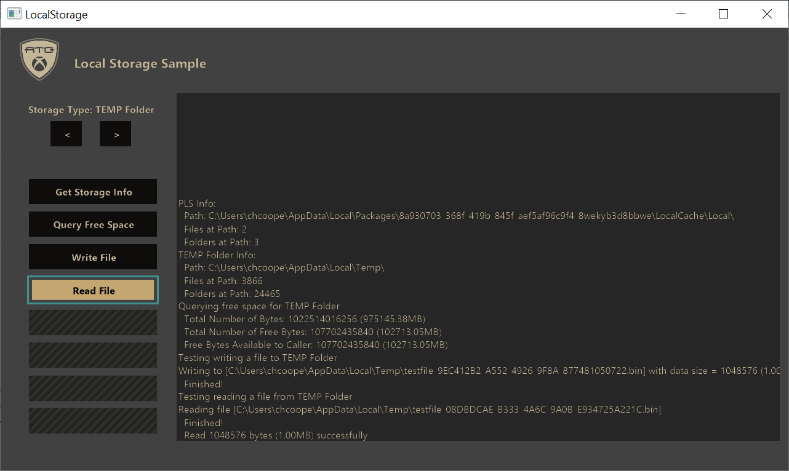

  

#   Local Storage Sample

*This sample is compatible with the Microsoft Game Development Kit
(March 2022)*

# 

# Description

This sample shows how to use different local storage locations in a
title for both console and PC platforms. In addition, the sample also
shows how some extra behavior related to local storage works for
consoles.

# Building the sample

If using an Xbox One devkit, set the active solution platform to `Gaming.Xbox.XboxOne.x64`.

If using an Xbox Series X|S devkit, set the active solution platform to `Gaming.Xbox.Scarlett.x64`.

If using Windows 10, set the active solution platform to `Gaming.Desktop.x64`.

*For more information, see* __Running samples__, *in the GDK documentation.*

# Using the Sample

Launch the sample from Visual Studio and use the sample's interactive
buttons to run different test cases. Switch the current storage location
using the left and right arrow buttons in the sample. Available test
cases change depending on platform and selected storage type.

PC:

Console:

# Implementation Notes

The sample allows for testing different storage behaviors with the
different local storage options.

## Local Storage Options

There are several different local storage options on console and
numerous options on PC. All console options are covered in this sample.
However, the PC coverage is limited to the most common usages.

Storage Options by Platform:

| Storage Option       |  Console Availability  |  PC Availability       |
|----------------------|-----------------------|-----------------------|
| Persistent Local Storage (PLS) |  **Yes**  |  **Yes\*** |
| Temp Drive (T:\\)    |  **Yes**               |  No                    |
| Installed Game Data (G:\\) |  **Yes**  |  No |
| System Scratch Drive (D:\\) |  **Yes**  |  No |
| TEMP Folder          |  No                    |  **Yes**               |
| LocalAppData Folder  |  No                    |  **Yes**               |

*\*PLS storage space on PC is not specifically provisioned or managed
for a title beyond deletion when the title is uninstalled.*

*Note: For a more complete listing of built-in local storage locations
on PC, see [SHGetKnownFolderPath function (shlobj_core.h) - Win32 apps |
Microsoft
Docs](https://docs.microsoft.com/windows/win32/api/shlobj_core/nf-shlobj_core-shgetknownfolderpath).
A list of known folders can be found here: [KNOWNFOLDERID
(Knownfolders.h) - Win32 apps | Microsoft
Docs](https://docs.microsoft.com/windows/win32/shell/knownfolderid).*

**Persistent Local Storage (PLS)**

PLS is a long-term storage location for storing non-game-save data.
Common usages might include generated cache data, replay storage, or
User-Generated Content (UGC) storage.

PLS on console platforms have the following characteristics:

-   Title specific: This storage space can be accessed by the title that
    requested it only.

-   Console-specific: This storage space is always created in an XVD
    which is specific to the console (even if the title is installed on
    an external drive) and cannot be used on another console.

-   Guaranteed allocation: The system ensures that the space is
    allocated prior to the title being allowed to launch. If
    insufficient hard drive space is available, the user is prompted to
    free up space to allow the title to run.

-   User-controlled: The storage space can be deleted by users from the
    system shell. The system never automatically deletes any items in
    the space.

-   Tied to title install lifetime: When a title is uninstalled, the
    associated local storage space is removed too. If the title is
    re-installed, none of the previous existing data is restored.

-   Resilient and tamper resistant: The storage space is encrypted and
    integrity checked so that the data saved by the title cannot be
    tampered with.

PLS on PC however does not provide the above guarantees. The location
returned by PLS is a normal storage location on the device and will be
deleted if the title is uninstalled.

To use PLS, it must be enabled in the MicrosoftGame.config file:

\<?xml version=**\"1.0\"** encoding=**\"utf-8\"**?\>

\<Game configVersion=**\"0\"**\>

\<PersistentLocalStorage\>

\<SizeMB\>**1024**\</SizeMB\> \<!\-- Required Minimum Allocation Size
\--\>

\<GrowableToMB\>**20480**\</GrowableToMB\> \<!\-- Max Growable Size
\--\>

\</PersistentLocalStorage\>

\</Game\>

The *SizeMB* parameter specifies the minimum allocation size that
console platforms will ensure is always available for the title's
install. Remember than PC does not specifically manage the PLS storage
space, so size availability is not guaranteed there.

The *GrowableToMB* parameter is optional and allows specifying a max
growable size. PLS supports growing its allocation on consoles up to the
max specified size. While the *SizeMB* is a minimum guarantee, the
growable max size might not always be available. A title can grow its
current PLS size if needed using
*XPersistentLocalStoragePromptUserForSpaceAsync.* This action will
prompt the user to free up hard drive space to make space available to
grow PLS.

**Temp Drive (T:\\)**

Consoles have access to a special temp drive access with the drive
letter 'T'. This drive has the following specifics:

-   Maximum 2GB storage

-   Guaranteed to be accessible and persistent while the title is
    running and across suspend/resume boundaries

-   Deleted once the title is terminated

*Note: Previous Xbox Development Kit (XDK) behavior allowed the temp
drive to persist often across launches. However, it still wasn't
guaranteed to persist. With the Microsoft Game Development Kit (GDK),
PLS is offered as the persistent storage solution and the Temp Drive
does not persist.*

**Installed Game Data (G:\\)**

A special drive letter 'G' is offered on console builds to access the
installed game data. This drive is read-only for packaged builds.

*Note: For development purposes, a title can write to the installed game
data for loose builds only. However, it's not recommended to do so as
the other local storage options will likely be more suitable.*

**System Scratch Drive (D:\\)**

Devkits have special access to a system scratch drive with the drive
letter 'D'. This development-only storage location allows writing
anything needed for development purposes. A common usage might be
developer logs, crash dumps, or other non-retail-purpose data.

The system scratch drive is persistent, has no limit on writing, and can
be accessed by any title. It writes directly to the hard drive, so it
can take up space needed for package installation.

This drive can also be accessed directly by a development PC via a
network path "\\\\\[DevkitIP\]\\SystemScratch" or by using "Browse
Console Files" when right-clicking on a devkit in the Xbox One Manager
tool.

**TEMP Folder**

On Windows PCs, the TEMP folder is used by many applications to store
temporary data. This location is determined by the current user's
TMP/TEMP environment variables.

To get the TEMP folder, use the
[GetTempPath](https://docs.microsoft.com/windows/win32/api/fileapi/nf-fileapi-gettemppatha)
method.

**LocalAppData Folder**

The LocalAppData folder on Windows PCs is commonly used by applications
to store per-user persistent application data that's not included with
an application installation.

To get the LocalAppData folder, use the
[SHGetKnownFolderPath](https://docs.microsoft.com/windows/win32/api/shlobj_core/nf-shlobj_core-shgetknownfolderpath)
method and with the FOLDERID_LocalAppData parameter. Information on
available known folders is documented at [KNOWNFOLDERID
(Knownfolders.h) - Win32 apps | Microsoft
Docs](https://docs.microsoft.com/windows/win32/shell/knownfolderid).

## Test Cases

There are several different test cases that can be run for each storage
type. The available tests changes depending on platform and storage
type.

Tests cases:

| Test Case        |  Description                                       |
|------------------|---------------------------------------------------|
| Get Write Stats  |  *Console-only*: Reports on the title's writing behavior to a tracked drive (PLS or Temp Drive).  |
| Get Storage Info  |  Reports some basic information about the currently selected storage type, such as the path to use or how many files/folders are at the root location.                                         |
| Query Free Space  |  Queries and reports how much free space is available on the currently selected storage type. |
| Write File  |  Attempts to write a file using the currently selected storage type.                            |
| Read File  |  Attempts to read a file using the currently selected storage type.                            |
| Get PLS Info  |  *Console-only*: Returns information about the PLS storage partition, including space used, available, max, and more.                         |
| Fill Available PLS |  *Console-only*: A stress test to fill-up PLS at the maximum rate allowed via [XR-133](#XR133).    |
| Stress Write Stats  |  Console-only: A stress test to write 2GB of data to the currently selected storage type at the maximum rate allowed via [XR-133](#XR133).        |

**Get Write Stats Test Case**

This console-only test uses *XPackageGetWriteStats* to report on the
writing behavior of the title. *XPackageGetWriteStats* returns the
following information:

| Stat       |  Description                                             |
|------------|---------------------------------------------------------|
| Interval   |  Total amount of milliseconds for the current interval.  |
| Budget  |  The total amount of bytes that is allowed to be written in the current interval without causing an exceeded event and a failure of [XR-133](#XR133).                |
| Bytes Written |  How many total bytes have been written in the current interval.                                               |
| Time Elapsed |  How many milliseconds have elapsed in the current interval.                                               |

Write stats are only tracked for writes made to the Temp Drive (T:\\) or
to PLS. In retail, this are the only writable local storage locations
for consoles.

*Note: The first 1GB of written data is not tracked to a timed interval.
This is by design and allows for a title to burst writes up-front more
easily if needed. Once the first 1GB has been written, a new interval
begins, and all future intervals are timed.*

**Get Storage Info Test Case**

This simple test case reports the root path of the current storage
location and how many files and folders exist at the root path.

**Query Free Space Test Case**

This test uses
[GetDiskFreeSpaceEx](https://docs.microsoft.com/windows/win32/api/fileapi/nf-fileapi-getdiskfreespaceexa)
to calculate how much space is available at the storage location. The
report will include how many bytes are available to be used, the total
size of the drive, and the total amount of free bytes on the disk.

**Write File Test Case**

This test attempts to write a file to the currently selected local
storage location. In most cases, this will succeed. However, it can fail
in some cases:

-   Attempting to write to PLS if PLS is full

    -   For console only, if PLS is full but there is growable space
        available, a prompt to free space will be invoked.

-   Attempting to write to installed game data on a package build

-   Attempting to write if there is no free space available

**Read File Test Case**

This test attempts to read a file previously written with the write test
above.

**Get PLS Info Test Case**

This console-only test uses *XPersistentLocalStorageGetSpaceInfo* to get
information about the current PLS allocation. While this can be called
on PC, space isn't explicitly managed there. As a result, the
recommendation on PC is to use
[GetDiskFreeSpaceEx](https://docs.microsoft.com/windows/win32/api/fileapi/nf-fileapi-getdiskfreespaceexa).

The data returned by *XPersistentLocalStorageGetSpaceInfo* is as
follows:

| Data          |  Description                                          |
|---------------|------------------------------------------------------|
| Available Free Bytes |  How many bytes is available to be written to PLS immediately.                                         |
| Total Free Bytes  |  The total amount of space remaining that could be written to PLS based on the max size specified in MicrosoftGame.config. This data might have to be made available with *XPersistentLocalStoragePromptUserForSpaceAsync*.    |
| Used Bytes    |  How many bytes are currently used in PLS.            |
| Total Bytes   |  The total size of the PLS configuration.             |

**Fill Available PLS Test Case**

This console-only test checks how much available data remains in PLS and
writes data until it fills up. The rate of writing is at a constant
speed equal to the max allowed by [XR-133](#XR133).

The intended usage of this test is to allow testing of growable PLS by
easily filling up the available free bytes. However, the available free
bytes will typically match the total free bytes making it difficult to
test *XPersistentLocalStoragePromptUserForSpaceAsync*. To properly test
the prompt to free space, the hard drive of the devkit should be filled
up with applications or other data. Then, the available free bytes
should report a value less than the total free bytes. At this point, the
available data can be filled up and
*XPersistentLocalStoragePromptUserForSpaceAsync* can be tested.

**Stress Write Stats Test Case**

This console-only test writes 2GB of data the currently selected local
storage location. Every several seconds, the write stats are queried and
reported to the on-screen log.

The purpose of this test is to show how the write stats are tracked to
give a better understanding of the limitation behavior.

[]{#XR133 .anchor}**XR-133: Local Storage Write Limitations**

XR-133 requires that no more than 1GB is written to the console's hard
drive over a sliding 5-minute window. This includes writes with both PLS
and the Temp Storage Drive (T:\\).

The two stress tests above write at a constant rate of about 3.41MB/s.
However, the 5-minute window allows for bursting IO at high speeds as
well so long as the total data written in the interval is managed.

In addition, the first 1GB of data written in a title's lifetime is not
tracked to a 5-minute window. Once that first 1GB has been written, all
future intervals tracked with *XPackageGetWriteStats* shows the timing
interval information.

# Update history

**Initial Release:** Microsoft Game Development Kit (October 2021)

# Privacy Statement

When compiling and running a sample, the file name of the sample
executable will be sent to Microsoft to help track sample usage. To
opt-out of this data collection, you can remove the block of code in
Main.cpp labeled "Sample Usage Telemetry".

For more information about Microsoft's privacy policies in general, see
the [Microsoft Privacy
Statement](https://privacy.microsoft.com/en-us/privacystatement/).
