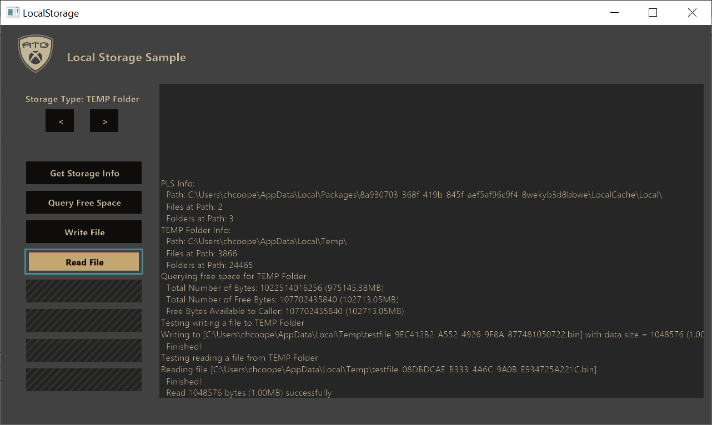
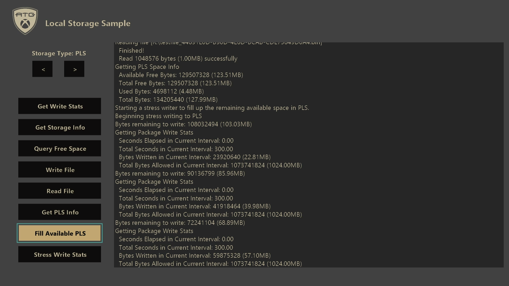

  

#   ローカルストレージのサンプル

*このサンプルは Microsoft Game Development Kit (2020 年 6 月)
と互換性があります*

# 

# 説明

このサンプルでは、コンソールと P
Cプラットフォームの両方のタイトルで異なるローカル
ストレージの場所を使用する方法を示します。さらに、このサンプルでは、ローカル
ストレージに関連する追加の動作がコンソールでどのように機能するかも示します。

# サンプルのビルド

Xbox One 開発キットを使用している場合、アクティブ ソリューション
プラットフォームを Gaming.Xbox.XboxOne.x64 に設定します。

Xbox Series X|S 開発キットを使用している場合、アクティブ ソリューション
プラットフォームを Gaming.Xbox.Scarlett.x64 に設定します。

Windows 10 を使用している場合には、アクティブ ソリューション
プラットフォームを Gaming.Desktop.x64 に設定します。

*詳細については、GDK
のドキュメントの*「サンプルの実行」*を参照してください。*

# サンプルの使用

Visual
Studioからサンプルを起動し、サンプルの対話型ボタンを使用してさまざまなテスト
ケースを実行します。サンプルの左右の矢印ボタンを使用して、現在の保存場所を切り替えます。使用可能なテスト
ケースは、プラットフォームと選択したストレージの種類によって変わります。

PC:

コンソール：

# 実装上の注意

このサンプルでは、さまざまなローカル ストレージ
オプションを使用して、さまざまなストレージ動作をテストできます。

## ローカルストレージのオプション

コンソールにはいくつかの異なるローカル ストレージ オプションがあり、PC
には多数のオプションがあります。このサンプルでは、すべてのコンソール
オプションについて説明します。ただし、PC
カバレッジは最も一般的な使用に制限されます。

プラットフォーム別のストレージ オプション:

| ストレージオプション |  コンソールの可用性    |  PCの可用性            |
|----------------------|-----------------------|-----------------------|
| 永続ローカル ストレージ (PLS) |  **はい**  |  **○\*** |
| Temp ドライブ (T:\\) |  **はい**              |  いいえ                |
| イ ンストール済みゲーム データ (G:\\) |  **はい**  |  いいえ |
| システム スクラッチ ドライブ (D:\\) |  **はい**  |  いいえ |
| TEMP フォルダー      |  いいえ                |  **はい**              |
| LocalAppData Folder  |  いいえ                |  **はい**              |

*\*PC 上の PLS
ストレージスペースは、タイトルのアンインストール時に、削除以外のタイトル用に特別なプロビジョニングまたは管理されていません。*

*注意:PC 上の組み込まれているローカル
ストレージの場所の詳細なリストについては、「 [SHGetKnownFolderPath 関数
(shlobj_core.h) - Win32 アプリ | Microsoft
Docs](https://docs.microsoft.com/windows/win32/api/shlobj_core/nf-shlobj_core-shgetknownfolderpath)を参照してください。既知のフォルダーのリストは、次のとおりです。[KNOWNFOLDERID
(Knownfolders.h) - Win32 アプリ |Microsoft
Docs](https://docs.microsoft.com/windows/win32/shell/knownfolderid)。*

**永続ローカル ストレージ (PLS)**

PLS は、セーブ
データ以外のデータを格納するための長期的な保存場所です。一般的な使用法としては、生成されたキャッシュ
データ、再生ストレージ、またはユーザー生成コンテンツ (UGC)
ストレージが含まれます。

コンソール プラットフォーム上の PLS には、次の特性があります。

-   タイトル固有:
    このストレージスペースには、それを要求したタイトルだけがアクセスできます。

-   コンソール固有:
    このストレージスペースは、コンソールに固有のXVDで常に作成され（タイトルが外部ドライブにインストールされている場合でも）、別のコンソールで使用することはできません。

-   保証された割り当て:
    システムは、タイトルに起動を許可する前に確実にスペースが割り当てられることを確認します。ハード
    ドライブの空き領域が不足している場合は、ユーザーは、タイトルを実行できるように領域を解放するように求められます。

-   ユーザーによる制御: ストレージスペースは、ユーザーによってシステム
    シェルから削除できます。システムでは、このスペースの項目は自動的に削除されません。

-   タイトルのインストール有効期間と連携:
    タイトルがアンインストールされると、関連付けられているローカル
    ストレージスペースも削除されます。タイトルが再インストールされても、以前に存在していたデータは復元されません。

-   耐障害性と改ざん防止:
    ストレージスペースは暗号化され、整合性がチェックされるので、タイトルによって保存されたデータを改ざんすることはできません。

ただし、PC 上の PLS では、上記の保証は提供されません。PLS
によって返される場所はデバイス上の通常の保存場所であり、タイトルがアンインストールされると削除されます。

PLS を使用するには、MicrosoftGame.config
ファイルで有効にする必要があります。

\<?xml バージョン=**\"1.0\"** エンコード=**\"utf-8\"**?\>

\<Game configVersion=**\"0\"**\>

\<PersistentLocalStorage\>

\<SizeMB\>**1024**\</SizeMB\> \<!\-- 必要な最小割り当てサイズ \--\>

\<GrowableToMB\>**20480**\</GrowableToMB\> \<!\-- Max Growable Size
\--\>

\</PersistentLocalStorage\>

\</Game\>

*SizeMB*
パラメーターは、コンソールプラットフォームがタイトルのインストールに常に使用できるようにするための最小割り当てサイズを指定します。PC
では PLS
ストレージスペースが特に管理されないため、サイズの可用性は保証されないことを忘れないでください。

*GrowableToMB*
パラメーターはオプションであり、最大拡張可能サイズを指定できます。PLS
では、コンソールでの割り当てを指定された最大サイズまで増やします。*SizeMB*
は最小限の保証ですが、拡張可能な最大サイズが常に使用できるとは限りません。*XPersistentLocalStoragePromptUserForSpaceAsync*を使用して、必要に応じてタイトルは現在のPLSサイズを拡大することができます。このアクションにより、PLS
の拡張に使用できるスペースを確保するために、ハード
ドライブの空き領域を増やすようユーザーに求められます。

**Temp ドライブ (T:\\)**

コンソールじゃ、ドライブ文字 'T' を使用して特別な一時ドライブ
アクセスにアクセスできます。このドライブには、次の詳細があります。

-   最大 2 GB のストレージ

-   タイトルの実行中および一時停止/再開の境界を越えてアクセス可能で永続的であることが保証されます

-   タイトルが終了すると削除されます

*注意:以前の Xbox 開発キット (XDK)
の動作により、一時ドライブは起動時に頻繁に保持されるようになりました。ただし、永続化は保証されていませんでした。Microsoft
Game Development Kit (GDK) では、PLS は永続ストレージ
ソリューションとして提供され、一時ドライブは保持されません。*

**インストール済みゲーム データ (G:\\)**

コンソールビルドには、インストールされているゲーム
データにアクセスするための特別なドライブ文字 'G'
が用意されています。このドライブは、パッケージ
ビルドの場合は読み取り専用です。

*注意:開発目的では、タイトルは、ルース
ビルドの場合にのみ、インストールされているゲーム
データに書き込むことができます。ただし、他のローカル ストレージ
オプションの方が適している可能性があるため、お勧めしません。*

**システム スクラッチ ドライブ (D:\\)**

開発キットは、ドライブ文字 'D を持つシステム スクラッチ
ドライブに特別にアクセスできます。この開発専用ストレージの場所では、開発目的で必要なものはすべて書き込めます。一般的な使用法は、開発者ログ、クラッシュ
ダンプ、またはその他のリテール目的以外のデータです。

システム スクラッチ
ドライブは永続的であり、書き込みに制限はなく、任意のタイトルからアクセスできます。ハード
ドライブに直接書き込まれるため、パッケージのインストールに必要なスペースを占有できます。

このドライブには、ネットワーク パス "\\\\\[DevkitIP\]\\SystemScratch"
を介して開発用 PC から直接アクセスすることも、Xbox One Manager
ツールで開発キットを右クリックするときに "Browseコンソール
ファイル"の参照を使用することもできます。

**TEMP フォルダー**

Windows PC では、TEMP
フォルダーは、一時データを格納するために多くのアプリケーションで使用されます。この場所は、現在のユーザーの
TMP/TEMP 環境変数によって決まります。

TEMPフォルダーを取得するには、[GetTempPath](https://docs.microsoft.com/windows/win32/api/fileapi/nf-fileapi-gettemppatha)メソッドを使用します。

**LocalAppData Folder**

Windows PC 上の LocalAppData
フォルダーは、アプリケーションのインストールに含まれていないユーザーごとの永続的なアプリケーション
データを格納するために、アプリケーションによって一般的に使用されます。

LocalAppData フォルダーを取得するには、
[SHGetKnownFolderPath](https://docs.microsoft.com/windows/win32/api/shlobj_core/nf-shlobj_core-shgetknownfolderpath)
メソッドと FOLDERID_LocalAppData
パラメーターを使用します。使用可能な既知のフォルダーに関する情報は、[KNOWNFOLDERID
(Knownfolders.h) - Win32 アプリ | Microsoft
Docs](https://docs.microsoft.com/windows/win32/shell/knownfolderid)に記載されています。

## テスト ケース

ストレージタイプごとに実行できるテスト
ケースがいくつかあります。使用可能なテストは、プラットフォームとストレージのタイプによって変わります。

テスト ケース:

| テスト ケース    |  説明                                              |
|------------------|---------------------------------------------------|
| 書 き込み統計の取得  |  *コンソール のみ：*追跡対象ドライブ (PLS または一時ドライブ) へのタイトルの書き込み動作について報告します。    |
| スト レージ情報の取得  |  使用するパスやルートの場所にあ るファイル/フォルダーの数など、現在選択されている ストレージのタイプに関する基本情報を報告します。  |
| クエリの空き容量  |  現在選択されているストレージのタイプで使用 可能な空き領域の量をクエリおよびレポートします。  |
| フ ァイルの書き込み |  現在選択されているストレージ のタイプを使用してファイルの書き込みを試みます。  |
| 読み取りファイル  |  現在選択されているストレージ のタイプを使用してファイルの読み取りを試みます。  |
| PLS 情報の取得  |  *コンソール のみ：*PLS ストレージ パーティションに関する情報 を、使用スペース、使用可能スペース 、最大およびそれ以上のなどのスペースを返します。  |
| 使用可能な PLS を塗りつぶす  |  *コンソール のみ：*[XR-133](#XR133) で許容される最大速度で PLS を満たすストレス テスト。                                          |
| スト レス書き込み統計  |  コンソール のみ： [XR-133](#XR133) を介して許可 された最大速度で、現在選択されているストレージタ イプに2GBのデータを書き込むためのストレステスト。 |

**書き込み統計テスト ケースの取得**

このコンソールのみのテストでは、*XPackageGetWriteStats*
を使用して、タイトルの書き込み動作を報告します。*XPackageGetWriteStats*
は、次の情報を返します。

| 統計       |  説明                                                    |
|------------|---------------------------------------------------------|
| 間隔       |  現在の間隔の合計時間 (ミリ秒)。                         |
| 予算  |  イベントの超過や [XR-133](#XR133) の失敗を引き起こさずに、 現在の間隔で書き込むことが許可されている合計バイト数。  |
| 書き込まれ たバイト数 |  現在の間隔で書き込まれた合計バイト数。 |
| 経過時間   |  現在の間隔で経過したミリ秒数。                          |

書き込み統計は、一時ドライブ (T:\\) または PLS
に対して行われた書き込みについてのみ追跡されます。リテールでは、これはコンソールの唯一の書き込み可能なローカル
ストレージの場所です。

*注意:書き込まれた最初の 1 GB
のデータは、時間間隔で追跡されません。これは仕様であり、タイトルが必要に応じてより簡単に事前に書き込みをバーストできるようにします。最初の
1 GB
が書き込まれると、新しい間隔が開始され、今後のすべての間隔が計測されます。*

**ストレージ情報の取得テストケース**

この簡単なテスト ケースでは、現在の保存場所のルート パスと、ルート
パスに存在するファイルとフォルダーの数が報告されます。

**クエリの空き容量テストケース**

このテストでは、[GetDiskFreeSpaceEx](https://docs.microsoft.com/windows/win32/api/fileapi/nf-fileapi-getdiskfreespaceexa)
を使用して、保存場所で使用できるスペースの量を計算します。レポートには、使用できるバイト数、ドライブの合計サイズ、ディスク上の空きバイトの合計量が含まれます。

**ファイルの書き込みテスト ケース**

このテストでは、現在選択されているローカル保存場所にファイルを書き込もうとします。ほとんどの場合、これは成功します。ただし、場合によっては失敗することがあります。

-   PLS がいっぱいの場合に PLS に書き込もうとしています

    -   コンソールの場合のみ、PLS
        がいっぱいで、使用可能なスペースが拡張可能である場合は、空き領域を解放するようプロンプトが呼び出されます。

-   パッケージ ビルドにインストールされているゲーム
    データに書き込もうとしています

-   空き領域がないのに書き込みを行おうとしています

**ファイルの読み込みテスト ケース**

このテストは、上記の書き込みテストで以前に書き込まれたファイルの読み取りを試みます。

**PLS 情報テスト ケースの取得**

このコンソールのみのテストでは、 *XPersistentLocalStorageGetSpaceInfo*
を使用して、現在の PLS 割り当てに関する情報を取得します。これは PC
で呼び出すことができますが、スペースは明示的に管理されません。そのため、PC
では
[GetDiskFreeSpaceEx](https://docs.microsoft.com/windows/win32/api/fileapi/nf-fileapi-getdiskfreespaceexa)
を使用することが推奨されます。

*XPersistentLocalStorageGetSpaceInfo*
によって返されるデータは次のとおりです。

| データ        |  説明                                                 |
|---------------|------------------------------------------------------|
| 使用可能な 空きバイト数 |  PLS にすぐに書き込めるバイト数。 |
| 合計 空きバイト数  |  MicrosoftGame.config で指定された最大サイズに基づいて PLS に書 き込むことができる残りのスペースの合計量。このデータ は、*XPersistentLocalStoragePromptUserForSpaceAsync* で使用できるようにする必要がある場合があります。     |
| 使用バイト数  |  PLS で現在使用されているバイト数。                   |
| 合計バイト数  |  PLS 構成の合計サイズ。                               |

**使用可能な PLS テストケースを埋める**

このコンソールのみのテストでは、PLS
に残っている使用可能なデータの量を確認し、いっぱいになるまでデータを書き込みます。書き込みの速度は、[XR-133](#XR133)
で許容される最大速度と等しい一定の速度です。

このテストの目的は、使用可能な空きバイト数を簡単に埋めることで、拡張可能な
PLS
のテストを許可することです。ただし、使用可能な空きバイト数は通常、合計空きバイト数と一致するため、
*XPersistentLocalStoragePromptUserForSpaceAsync*
のテストが困難になります。空き領域を確保するためのプロンプトを適切にテストするには、開発キットのハード
ドライブにアプリケーションまたはその他のデータを入力する必要があります。次に、使用可能な空きバイト数は、合計空きバイト数より小さい値を報告する必要があります。この時点で、使用可能なデータがいっぱいになり、
*XPersistentLocalStoragePromptUserForSpaceAsync* をテストできます。

**ストレス書き込み統計テスト ケース**

このコンソールのみのテストでは、現在選択されているローカル 保存場所に 2
GB
のデータが書き込まれます。数秒ごとに、書き込み統計がクエリされ、画面上のログに報告されます。

このテストの目的は、書き込み統計がどのように追跡されるかを示し、制限の動作をより深く理解することです。

[]{#XR133 .anchor}**XR-133:ローカル ストレージの書き込み制限**

XR-133 では、5 分間のスライディング ウィンドウでコンソールのハード
ドライブに書き込まれる GB が 1 GB
以下である必要があります。これには、PLS と一時ストレージ ドライブ (T:\\)
の両方を使用した書き込みが含まれます。

上記の 2 つのストレス テストでは、約 3.41
MB/秒の一定の速度で書き込まれます。ただし、5
分のウィンドウでは、間隔で書き込まれた合計データが管理されている限り、高速で
IO をバーストできます。

さらに、タイトルの有効期間で書き込まれた最初の 1 GB のデータは、5
分のウィンドウには追跡されません。最初の 1 GB が書き込まれると、
*XPackageGetWriteStats*
で追跡されるすべての将来の間隔に、タイミング間隔の情報が表示されます。

# 更新履歴

**初回リリース:**Microsoft Game Development Kit (2021年10月)

# プライバシーに関する声明

サンプルをコンパイルして実行する場合、サンプルの使用状況を追跡するために、サンプル実行ファイルのファイル名が
Microsoft に送信されます。このデータ
コレクションからオプトアウトするには、Main.cpp の「Sample Usage
Telemetry」というラベルの付いたコードのブロックを削除します。

全般的な Microsoft のプライバシー ポリシーの詳細については、「[Microsoft
プライバシー
ステートメント](https://privacy.microsoft.com/en-us/privacystatement/)」を参照してください。
