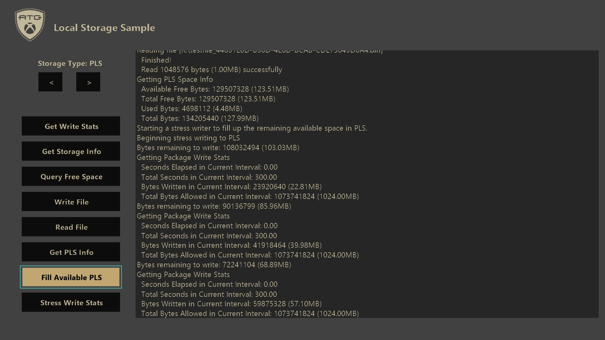

  

#   로컬 저장소 샘플

*이 샘플은 Microsoft 게임 개발 키트와 호환 가능합니다(2020년 6월).*

# 

# 설명

이 샘플은 콘솔 및 PC 플랫폼 모두에 대해 타이틀에서 서로 다른 로컬 저장소
위치를 사용하는 방법을 보여줍니다. 또한 샘플은 로컬 저장소와 관련된 몇
가지 추가 동작이 콘솔에서 어떻게 작동하는지 보여줍니다.

# 샘플 빌드

Xbox One 개발 키트를 사용하는 경우 활성 솔루션 플랫폼을
Gaming.Xbox.XboxOne.x64로 설정합니다.

Xbox Series X|S 개발 키트를 사용하는 경우 활성 솔루션 플랫폼을
Gaming.Xbox.Scarlett.x64로 설정합니다.

Windows 10을 사용하는 경우 활성 솔루션 플랫폼을 Gaming.Desktop.x64로
설정합니다.

자세한 내용은 GDK 설명서의 샘플 실행을 참조하세요.

# 샘플 사용

Visual Studio 샘플을 시작하고 샘플의 대화형 단추를 사용하여 다른 테스트
사례를 실행합니다. 샘플에서 왼쪽 및 오른쪽 화살표 단추를 사용하여 현재
저장소 위치를 전환합니다. 사용 가능한 테스트 사례는 플랫폼 및 선택한
저장소 유형에 따라 변경됩니다.

PC:

콘솔:

# 구현 노트

샘플에서는 다른 로컬 저장소 옵션을 사용하여 다양한 저장소 동작을
테스트할 수 있습니다.

## 로컬 저장소 옵션

콘솔에는 여러 가지 로컬 저장소 옵션과 PC의 다양한 옵션이 있습니다. 이
샘플에서는 모든 콘솔 옵션을 다룹니다. 그러나 PC 적용 범위는 가장
일반적인 사용으로 제한됩니다.

플랫폼별 저장소 옵션:

| 저장소 옵션          |  콘솔 가용성           |  PC 가용성             |
|----------------------|-----------------------|-----------------------|
| 영구 로컬 저장소(PLS) |  **예**  |  **예\*** |
| 임시 드라이브(T:\\)  |  **예**                |  아니요                |
| 설치된 게임 데이터(G:\\) |  **예**  |  아니요 |
| 시스템 스크래치 드라이브(D:\\) |  **예**  |  아니요 |
| 임시 폴더            |  아니요                |  **예**                |
| LocalAppData 폴더    |  아니요                |  **예**                |

*\*PC의 PLS 저장소 공간은 타이틀이 제거될 때 삭제를 넘어 타이틀에 대해
특별히 프로비전되거나 관리되지 않습니다.*

*참고: PC에서 기본 제공 로컬 저장소 위치의 전체 목록은
[SHGetKnownFolderPath 함수(shlobj_core.h) - Win32 앱 | Microsoft
Docs](https://docs.microsoft.com/windows/win32/api/shlobj_core/nf-shlobj_core-shgetknownfolderpath)를
확인하세요. 알려진 폴더 목록은 다음에서 찾을 수 있습니다. [KNOWNFOLDERID
(Knownfolders.h) - Win32 앱 | Microsoft
Docs](https://docs.microsoft.com/windows/win32/shell/knownfolderid).*

**영구 로컬 저장소(PLS)**

PLS는 비게임 저장 데이터를 저장하기 위한 장기 저장소 위치입니다.
일반적인 용도로는 생성된 캐시 데이터, 재생 저장소 또는 UGC(사용자 생성
콘텐츠) 저장소가 포함될 수 있습니다.

콘솔 플랫폼의 PLS에는 다음과 같은 특징이 있습니다.

-   타이틀 관련: 이 저장소 공간은 요청한 타이틀에서만 액세스할 수
    있습니다.

-   콘솔 관련: 이 저장소 공간은 항상 콘솔에 고유한 XVD에서
    만들어지며(타이틀이 외장형 드라이브에 설치된 경우에도) 다른 콘솔에서
    사용할 수 없습니다.

-   보장된 할당: 시스템은 타이틀 시작이 허용되기 전에 공간이 할당되도록
    합니다. 하드 드라이브 공간이 부족한 경우 사용자에게 타이틀이 실행될
    수 있도록 공간을 확보하라는 메시지가 표시됩니다.

-   사용자 제어: 시스템 셸에서 사용자가 저장소 공간을 삭제할 수
    있습니다. 시스템은 공간에서 어떤 항목도 자동으로 삭제할 수 없습니다.

-   타이틀 설치 수명에 관련: 타이틀이 제거되면 관련된 로컬 저장 공간도
    제거됩니다. 타이틀을 다시 설치하는 경우 이전의 기존 데이터는 전혀
    복구되지 않습니다.

-   복원력 및 변조 방지: 저장소 공간은 타이틀이 저장한 데이터가 변조될
    수 없도록 암호화되어 있고 무결성 검사를 받습니다.

그러나 PC의 PLS는 위의 보장을 제공하지 않습니다. PLS에서 반환되는 위치는
장치의 일반 저장소 위치이며 타이틀이 제거되면 삭제됩니다.

PLS를 사용하려면 MicrosoftGame.config 파일에서 사용하도록 설정해야
합니다.

\<?xml version=**\"1.0\"** encoding=**\"utf-8\"**?\>

\<Game configVersion=**\"0\"**\>

\<PersistentLocalStorage\>

\<SizeMB\>**1024**\</SizeMB\> \<!\-- 필요한 최소 할당 크기 \--\>

\<GrowableToMB\>**20480**\</GrowableToMB\> \<!\-- 최대 확장 가능 크기
\--\>

\</PersistentLocalStorage\>

\</Game\>

*SizeMB* 매개 변수는 콘솔 플랫폼에서 타이틀 설치에 항상 사용할 수 있도록
하는 최소 할당 크기를 지정합니다. PC는 PLS 저장소 공간을 구체적으로
관리하지 않으므로 크기 가용성이 보장되지 않습니다.

*GrowableToMB* 매개 변수는 선택 사항이며 최대 확장 가능한 크기를 지정할
수 있습니다. PLS는 최대 지정된 크기까지 콘솔에서 할당 증가를 지원합니다.
*SizeMB*는 최소 보증이지만 확장 가능한 최대 크기를 항상 사용할 수 있는
것은 아닙니다. 타이틀은
*XPersistentLocalStoragePromptUserForSpaceAsync*를 사용하여 필요한 경우
현재 PLS 크기를 늘릴 수 있습니다. 이 작업을 수행하면 사용자에게 하드
드라이브 공간을 확보하여 PLS를 늘릴 수 있는 공간을 확보하라는 메시지가
표시됩니다.

**임시 드라이브(T:\\)**

콘솔은 드라이브 문자 'T'를 사용하여 특별한 임시 드라이브 액세스에
액세스할 수 있습니다. 이 드라이브에는 다음과 같은 세부 사항이 있습니다.

-   최대 2GB 저장소

-   타이틀이 실행되는 동안 일시 중단/다시 시작 경계를 넘어 액세스
    가능하고 영구적임을 보장

-   타이틀이 종료되면 삭제됨

*참고: 이전의 XDK(Xbox 개발 키트) 동작으로 인해 임시 드라이브가 시작 시
자주 지속되었습니다. 그러나 여전히 지속되는 것은 보장되지 않았습니다.
Microsoft GDK(게임 개발 키트)를 사용하면 PLS가 영구 저장소 솔루션으로
제공되며 임시 드라이브는 영구적이지 않습니다.*

**설치된 게임 데이터(G:\\)**

설치된 게임 데이터에 액세스하기 위해 콘솔 빌드에 특수 드라이브 문자 'G'
가 제공됩니다. 이 드라이브는 패키지된 빌드에 대해 읽기 전용입니다.

*참고: 개발 목적으로 타이틀은 루스 빌드에 대해서만 설치된 게임 데이터에
쓸 수 있습니다. 그러나 다른 로컬 저장소 옵션이 더 적합할 수 있으므로
권장되지 않습니다.*

**시스템 스크래치 드라이브(D:\\)**

Devkits는 드라이브 문자 'D'를 사용하여 시스템 스크래치 드라이브에 특별히
액세스할 수 있습니다. 이 개발 전용 저장소 위치를 사용하면 개발 목적에
필요한 모든 항목을 작성할 수 있습니다. 일반적인 사용법은 개발자 로그,
크래시 덤프 또는 기타 소매 목적이 아닌 데이터일 수 있습니다.

시스템 스크래치 드라이브는 영구적이며 쓰기에 제한이 없으며 모든
타이틀에서 액세스할 수 있습니다. 하드 드라이브에 직접 기록되므로 패키지
설치에 필요한 공간을 사용할 수 있습니다.

이 드라이브는 네트워크 경로 "\\\\\[DevkitIP\]\\SystemScratch"를 통해
개발 PC에서 직접 액세스하거나 Xbox One Manager 도구에서 devkit를 마우스
오른쪽 단추로 클릭할 때 "콘솔 파일 찾아보기"를 사용하여 액세스할 수도
있습니다.

**임시 폴더**

Windows PC에서 임시 폴더는 많은 응용 프로그램에서 임시 데이터를 저장하는
데 사용됩니다. 이 위치는 현재 사용자 TMP/TEMP 환경 변수에 의해
결정됩니다.

임시 폴더를 가져오려면
[GetTempPath](https://docs.microsoft.com/windows/win32/api/fileapi/nf-fileapi-gettemppatha)
메서드를 사용합니다.

**LocalAppData 폴더**

Windows PC의 LocalAppData 폴더는 애플리케이션 설치에 포함되지 않은
사용자별 영구 애플리케이션 데이터를 저장하는 데 일반적으로 사용됩니다.

LocalAppData 폴더를 가져오려면
[SHGetKnownFolderPath](https://docs.microsoft.com/windows/win32/api/shlobj_core/nf-shlobj_core-shgetknownfolderpath)
메서드와 FOLDERID_LocalAppData 매개 변수를 사용합니다. 사용 가능한
알려진 폴더에 대한 정보는 [KNOWNFOLDERID(Knownfolders.h) - Win32 앱 |
Microsoft
Docs](https://docs.microsoft.com/windows/win32/shell/knownfolderid)에
문서로 작성되어 있습니다.

## 테스트 사례

각 저장소 유형에 대해 실행할 수 있는 여러 가지 테스트 사례가 있습니다.
사용 가능한 테스트는 플랫폼 및 저장소 유형에 따라 변경됩니다.

테스트 사례:

| 테스트 사례      |  설명                                              |
|------------------|---------------------------------------------------|
| 쓰기 통계 가져오기 |  *콘솔 전용*: 추적된 드라이브(PLS 또는 임시 드라이브)에 타이틀 쓰기 동작에 대해 보고합니다.   |
| 저장소 정보 가져오기  |  사용할 경로 또는 루트 위치에 있는 파일/폴더 수와 같이 현재 선택된 저장소 유형에 대한 몇 가지 기본 정보를 보고합니다.                                |
| 사용 가능한 공간 쿼리 |  현재 선택한 저장소 유형에서 사용 가능한 공간의 양을 쿼리하고 보고합니다.                         |
| 파일 쓰기  |  현재 선택한 저장소 유형을 사용하여 파일을 쓰려고 시도합니다.                                       |
| 파일 읽기  |  현재 선택한 저장소 유형을 사용하여 파일을 읽으려고 시도합니다.                              |
| PLS 정보 가져오기  |  *콘솔 전용*: 사용된 공간, 사용 가능한 공간, 최대값 등 PLS 저장소 파티션에 대한 정보를 반환합니다.                                       |
| 사용 가능한 PLS 채우기  |  *콘솔 전용*: [XR-133](#XR133)을 통해 허용되는 최대 속도로 PLS를 채우기 위한 스트레스 테스트입니다.                                     |
| 스트레스 쓰기 통계  |  콘솔 전용: [XR-133](#XR133)을 통해 허용되는 최대 속도로 현재 선택된 저장소 유형에 2GB의 데이터를 쓰는 스트레스 테스트입니다.                       |

**쓰기 통계 테스트 사례 가져오기**

이 콘솔 전용 테스트는 *XPackageGetWriteStats*를 사용하여 타이틀의 쓰기
동작을 보고합니다. *XPackageGetWriteStats*는 다음 정보를 반환합니다.

| 상태       |  설명                                                    |
|------------|---------------------------------------------------------|
| 간격       |  현재 간격의 총 시간(밀리초)입니다.                      |
| 예산  |  초과된 이벤트 및 [XR-133](#XR133) 오류를 일으키지 않고 현재 간격으로 쓸 수 있는 총 바이트 양입니다.            |
| 쓰여진 바이트 |  현재 간격으로 작성된 총 바이트 수입니다. |
| 경과된 시간 |  현재 간격에서 경과된 시간(밀리초)입니다. |

쓰기 통계는 임시 드라이브(T:\\) 또는 PLS에 대한 쓰기에 대해서만
추적됩니다. 소매점에서 이 위치는 콘솔에 대한 쓰기 가능한 유일한 로컬
저장소 위치입니다.

*참고: 처음 1GB의 기록된 데이터는 시간 제한 간격으로 추적되지 않습니다.
이는 의도된 것이며, 필요한 경우 타이틀이 더 쉽게 쓰기를 미리 버스트할 수
있습니다. 처음 1GB가 작성되면 새 간격이 시작되고 이후의 모든 간격이
시간이 지정됩니다.*

**저장소 정보 테스트 사례 가져오기**

이 간단한 테스트 사례는 현재 저장소 위치의 루트 경로와 루트 경로에 있는
파일 및 폴더 수를 보고합니다.

**사용 가능한 공간 테스트 사례 쿼리**

이 테스트는
[GetDiskFreeSpaceEx](https://docs.microsoft.com/windows/win32/api/fileapi/nf-fileapi-getdiskfreespaceexa)를
사용하여 저장소 위치에서 사용 가능한 공간의 양을 계산합니다. 보고서에는
사용할 수 있는 바이트 수, 드라이브의 총 크기 및 디스크의 사용 가능한 총
바이트 수가 포함됩니다.

**파일 쓰기 테스트 사례**

이 테스트는 현재 선택된 로컬 저장소 위치에 파일을 쓰려고 시도합니다.
대부분의 경우 이 작업은 성공합니다. 그러나 경우에 따라 실패할 수
있습니다.

-   PLS가 가득 찬 경우 PLS에 쓰기 시도

    -   콘솔의 경우 PLS가 꽉 찼지만 사용 가능한 확장 가능한 공간이 있는
        경우 공간을 확보하라는 메시지가 호출됩니다.

-   패키지 빌드에 설치된 게임 데이터에 쓰려고 시도 중

-   사용 가능한 공간이 없는 경우 쓰기 시도

**파일 읽기 테스트 사례**

이 테스트는 위의 쓰기 테스트로 이전에 작성된 파일을 읽으려고 시도합니다.

**PLS 정보 테스트 사례 가져오기**

이 콘솔 전용 테스트는 *XPersistentLocalStorageGetSpaceInfo*를 사용하여
현재 PLS 할당에 대한 정보를 가져옵니다. PC에서 호출할 수 있지만 공간은
명시적으로 관리되지 않습니다. 따라서 PC에서
[GetDiskFreeSpaceEx](https://docs.microsoft.com/windows/win32/api/fileapi/nf-fileapi-getdiskfreespaceexa)를
사용하는 것이 좋습니다.

*XPersistentLocalStorageGetSpaceInfo에서* 반환된 데이터는 다음과
같습니다.

| 데이터        |  설명                                                 |
|---------------|------------------------------------------------------|
| 사용 가능한 무료 바이트 |  PLS에 즉시 쓸 수 있는 바이트 수입니다. |
| 사용 가능한 총 바이트 수  |  MicrosoftGame.config에 지정된 최대 크기에 따라 PLS에 쓸 수 있는 남은 총 공간입니다. 이 데이터는 *XPersistentLocalStoragePromptUserForSpaceAsync*에서 사용할 수 있어야 할 수 있습니다.                     |
| 사용된 바이트 |  PLS에서 현재 사용되는 바이트 수입니다.               |
| 총 바이트 수  |  PLS 구성의 총 크기입니다.                            |

**사용 가능한 PLS 테스트 사례 채우기**

이 콘솔 전용 테스트는 PLS에 남아 있는 사용 가능한 데이터의 양을 확인하고
채워지도록 데이터를 씁니다. 쓰기 속도는 [XR-133](#XR133)에서 허용하는
최대 속도와 같은 일정한 속도입니다.

이 테스트의 용도는 사용 가능한 무료 바이트를 쉽게 채워 확장 가능한 PLS
테스트를 허용하는 것입니다. 그러나 사용 가능한 바이트는 일반적으로 사용
가능한 총 바이트와 일치하므로
*XPersistentLocalStoragePromptUserForSpaceAsync*를 테스트하기가
어렵습니다. 프롬프트를 제대로 테스트하여 공간을 확보하려면 devkit의 하드
드라이브가 애플리케이션 또는 기타 데이터로 채워져야 합니다. 그런 다음
사용 가능한 바이트는 사용 가능한 총 바이트보다 작은 값을 보고해야
합니다. 이 시점에서 사용 가능한 데이터를 채울 수 있으며
*XPersistentLocalStoragePromptUserForSpaceAsync*를 테스트할 수 있습니다.

**스트레스 쓰기 통계 테스트 사례**

이 콘솔 전용 테스트는 현재 선택한 로컬 저장소 위치에 2GB의 데이터를
씁니다. 몇 초마다 쓰기 통계가 쿼리되고 화면 로그에 보고됩니다.

이 테스트의 목적은 제한 동작을 더 잘 이해할 수 있도록 쓰기 통계를
추적하는 방법을 보여 주기 위한 것입니다.

[]{#XR133 .anchor}**XR-133: 로컬 저장소 쓰기 제한 사항**

XR-133을 사용하려면 슬라이딩 5분 동안 콘솔 하드 드라이브에 1GB를 넘지
않도록 해야 합니다. 여기에는 PLS 및 임시 스토리지 드라이브(T:\\)가 모두
포함된 쓰기가 포함됩니다.

위의 두 스트레스 테스트는 약 3.41MB/s의 일정한 속도로 작성합니다. 그러나
5분 창을 사용하면 간격으로 작성된 총 데이터가 관리되는 한 고속으로 IO를
버스트할 수 있습니다.

또한 타이틀 수명에 기록된 처음 1GB 데이터는 5분 단위로 추적되지
않습니다. 처음 1GB가 작성되면 *XPackageGetWriteStats*로 추적된 모든 이후
간격은 타이밍 간격 정보를 표시합니다.

# 업데이트 기록

**초기 릴리스:** Microsoft Game Development Kit(2021년 10월)

# 개인정보처리방침

샘플을 컴파일하고 실행하는 경우 샘플 사용량을 추적할 수 있도록 샘플 실행
파일의 파일 이름이 Microsoft에 전송됩니다. 이 데이터 수집을
옵트아웃하려면 \"샘플 사용량 원격 분석\"으로 레이블이 지정된
Main.cpp에서 코드 블록을 제거할 수 있습니다.

Microsoft의 개인정보 정책에 대한 자세한 내용은 [Microsoft
개인정보처리방침](https://privacy.microsoft.com/en-us/privacystatement/)을
참조하세요.
