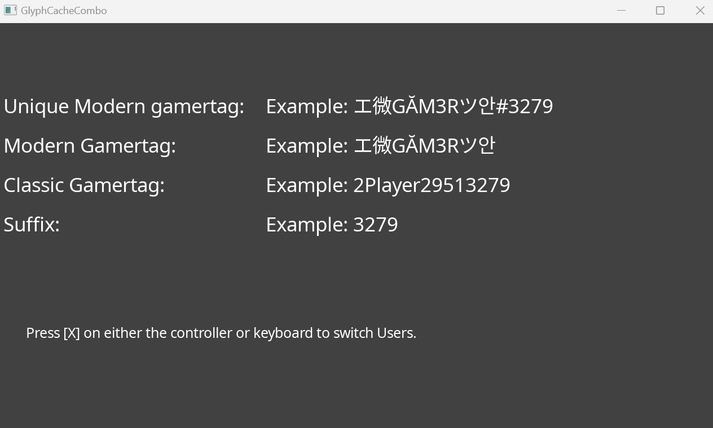

  

#   Modern Gamertag

*This sample is compatible with the Microsoft Game Development Kit
(March 2022)*

# Description

This code sample illustrates the process of creating and utilizing a
texture atlas to store Strings made up of 1 or more fonts, such as user
gamertags, for rendering on the screen. The implementation relies on
three primary classes to handle the bulk of the functionality.

1.  StringRenderer: Responsible for drawing strings to the screen. This
    class retrieves the strings from the texture atlas.

2.  StringTextureAtlas: Manages and caches the strings to a texture
    atlas.

3.  StringShaper: Responsible for rasterizing a string. It converts the
    string into a bitmap image so that it can be rendered and stored in
    the texture atlas.

This sample does NOT have an eviction policy; however it does support
the removal of Strings from the texture atlas. Implementation of an
eviction policy is left up to the reader.

# Building the sample

If using an Xbox Series X|S devkit, set the active solution platform to `Gaming.Xbox.Scarlett.x64`.

If using an Xbox One devkit, set the active solution platform to `Gaming.Xbox.XboxOne.x64`.

If using PC, set the active solution platform to `x64`.

*For more information, see* __Running samples__, *in the GDK documentation.*

# Using the sample

Simply select the active solution platform to run it on. If no user is
used, the default value is set to what a modern gamertag would look
like.

# Update history

February 2023 Initial release

# Privacy Statement

For more information about Microsoft's privacy policies in general, see
the [Microsoft Privacy
Statement](https://privacy.microsoft.com/en-us/privacystatement/).

# 
