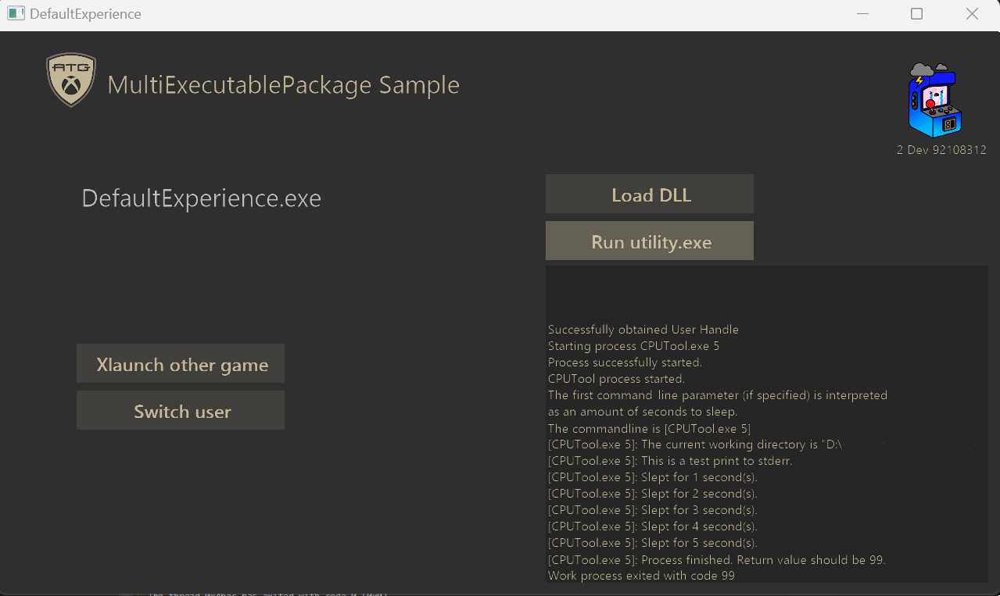

# MultiExecutable Package Sample

_This sample is compatible with the Microsoft Game Development Kit (March 2022)_



# Description

A sample that demonstrates how to set up a solution with multiple executables. This implementation is done by creating multiple projects, and setting them up in a way that allows them to be packaged and run together.

# Project setup

This sample has many projects, and in order to work properly, is set up in the following way:

- **DefaultExperience** represents the startup project, and is also what is initially launched.

- **AlternateExperience** represents another game, that can be Xlaunched from DefaultExperience.

- **ComboDLL** is a DLL that can be loaded into the sample during runtime.
	- Note that when creating a DLL for use with non-managed languages, the exported functions typically use 'C' linkage to ensure maximum compatibility. This means that the function signatures, or any structures you expose in your DLL, should be compatible with the C language. However, this doesn't preclude the use of C++ within the DLL's internal implementation; it only affects the interface exposed to the users of the DLL.

- **CPUTool** is a project that produces a separate executable in a new process that can be run from the sample.

- **SharedAssetsProject** contains shared code across all the projects. It contains code for managing user logins, logging, and running an external process (CPUTool).

# Project build

- DirectX12 is built first. This is just a staple for MSFT samples.

- DefaultExperience depends on CPUTool. We want to make sure all our utility executables are built before our startup program.

- AlternateExperience depends on DefaultExperience.

- All required files to run on console will end up in .\\DefaultExperience\\%TARGET%\\Layout\\Image\\Loose

- All required files to run on desktop will end up in either:
    -  **x64**:  .\\x64\\%CONFIG%
	-  **ARM64**: .\\ARM64\\%CONFIG%


# Running the sample

## Method 1: Run from Visual Studio

In order for the sample to run, it has to be fully built. This is done by going to the build menu and clicking build. When you run the sample, the default experience will be the first to run as it's the startup project.

## Method 2: Run from package creation

1. Build the project.

2. **Create the package** by running the corresponding script from an
   **Xbox Gaming Command Prompt**:

   | Platform | Script |
   |---|---|
   | Xbox One | `GenXboxOneXVCPackage.bat` |
   | Xbox Series X\|S | `GenScarlettXVCPackage.bat` |
   | PC (x64) | `GenDesktopMSIXVCPackage_x64.bat` |
   | PC (ARM64) | `GenDesktopMSIXVCPackage_ARM64.bat` |

   Console packages produce **.xvc** files in .\\DefaultExperience\\%Target%\\Layout\\Image

   Desktop packages produce **.msixvc** files in .\\x64\\Layout\\Image or .\\ARM64\\Layout\\Image

3. **Install and run** the package:

   - **Xbox**: Copy the .xvc file into your devkit through Xbox Manager, or install with xbapp install:

     ```
     xbapp install 41336MicrosoftATG.MultiExecutablePackage_1.0.0.0_neutral__dspnxghe87tn0_<XBOX PLATFORM>.xvc
     ```

   - **PC**: Install the .msixvc file with wdapp install:

     ```
     wdapp install 41336MicrosoftATG.MultiExecutablePackage_1.0.0.0_<ARCHITECTURE>__dspnxghe87tn0.msixvc
     ```

# Update history

**Initial Release:** Microsoft Game Development Kit (June 2023)

June 2023: Initial release

April 2026: Add ARM64 support for PC packaging scripts; rename Desktop
bat files to distinguish x64 and ARM64 architectures

# Privacy Statement

When compiling and running a sample, the file name of the sample
executable will be sent to Microsoft to help track sample usage. To
opt-out of this data collection, you can remove the block of code in
Main.cpp labeled "Sample Usage Telemetry".

For more information about Microsoft's privacy policies in general, see
the [Microsoft Privacy
Statement](https://privacy.microsoft.com/en-us/privacystatement/).
