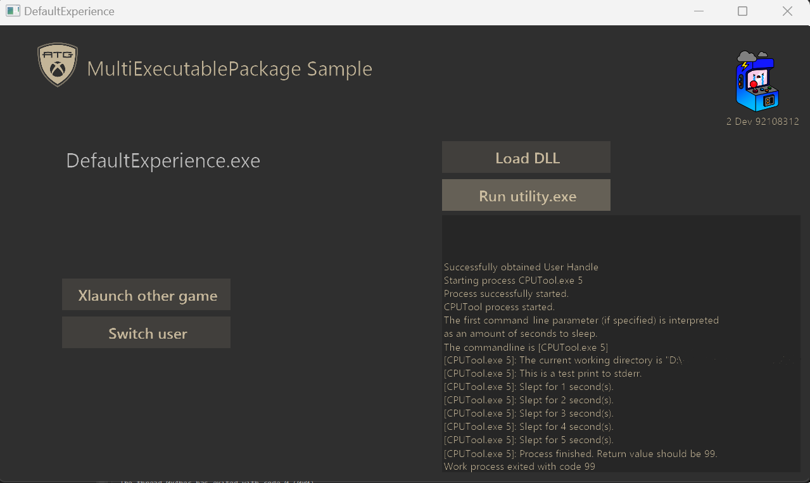

# MultiExecutable 包示例

_此示例可用于 Microsoft 游戏开发工具包 (2022 年 3 月)_




### 说明

演示如何设置具有多个可执行文件的解决方案的示例。 此实现是通过创建多个项目，并按允许将它们打包并一起运行的方式进行设置来完成的。


### 项目设置

此示例包含许多项目，为了正常工作，此示例采用以下方式进行设置：

- DefaultExperience 表示启动项目，也是初始启动的项目。

- AlternateExperience 表示可从 DefaultExperience 进行 Xlaunch 的其他游戏。

- ComboDLL 是一个 DLL，可在运行时加载到示例中。
   - 请注意，创建用于非托管语言的 DLL 时，导出的函数通常使用&ldquo;C&rdquo;链接来确保最大兼容性。 这意味着函数签名或在 DLL 中公开的任何结构应与 C 语言兼容。 但是，这不会阻止在 DLL 的内部实现中使用 C++，它仅影响向 DLL 用户公开的接口。
- CPUTool 是一个项目，可在新进程中生成可从示例运行的单独的可执行文件。

- SharedAssetsProject 包含所有项目的共享代码。 它包含用于管理用户登录名、日志记录和运行外部进程 (CPUTool) 的代码。


### 项目生成

- 会首先生成 Directx12。 这只是 MSFT 示例的主要内容。

- DefaultExperience 依赖于 CPUTool。 我们希望确保在启动计划之前生成所有实用工具可执行文件。

- AlternateExperience 依赖于 DefaultExperience。

- 在控制台上运行的所有必需文件都将以 .\\DefaultExperience\\%TARGET%\\Layout\\Image\\Loose 结尾

- 在桌面上运行的所有必需文件都将以 .\\Gaming.Desktop.x64\\%CONFIG% 结尾


### 运行示例。


#### 方法 1：从 Visual Studio 运行

- 为了运行示例，必须完全生成该示例。 这是通过转到生成菜单并单击生成来完成的。 运行示例时，默认体验将是第一个作为启动项目运行的体验。


#### 方法 2：从包创建运行

� � 1. 生成项目。

� � 2. 在支持 Makepkg 的终端中运行 GenScarlettXVCPackage.bat、GenXboxOneXVCPackage 或 GenDesktopMSIXVCPackage.bat。 有 3 个批处理文件，每个平台一个。

� � � � 控制台包文件可以在 .\\DefaultExperience\\$Target\\Layout\\Image\\ 中找到。

� � � � 桌面包文件可以在 .\\Gaming.Desktop.x64\\Layout\\Image 中找到

##### 安装并运行包。

� � 1. 如果在 Xbox 上运行，请通过 Xbox 管理器将 .xvc 文件从包含控制台包文件的目录复制到 devkit 中。 你还可以使用 xbapp 安装来安装包。 安装命令将类似于：� �
```xbapp install 41336MicrosoftATG.MultiExecutablePackage_1.0.0.0_neutral__dspnxghe87tn0_xs.xvc```

� � 2. 如果在桌面上运行，请使用 WDAPP 安装从包含桌面包文件的目录中安装 .MSIXVC 文件。 安装命令将类似于：
� �
```


## Update history

**Initial Release:** Microsoft Game Development Kit (June 2023)

June 2023: Initial release

## Privacy Statement

When compiling and running a sample, the file name of the sample executable will be sent to Microsoft to help track sample usage. To opt-out of this data collection, you can remove the block of code in Main.cpp labeled "Sample Usage Telemetry".

For more information about Microsoft's privacy policies in general, see the [Microsoft Privacy Statement](https://privacy.microsoft.com/en-us/privacystatement/).


