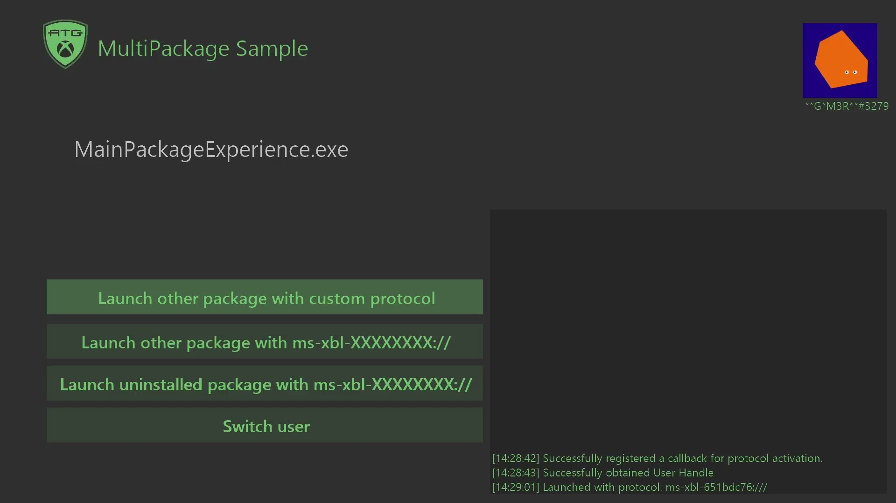

# 多程序包示例

_此示例可用于 Microsoft 游戏开发工具包（2023 年 3 月）_




### 说明

此示例演示如何使用 XlaunchURI 和自定义协议管理多个程序包。 项目 MainPackageExperience 和 AlternatePackageExperience 通过 XLaunchURI API 与其他项进行交互。

### 项目设置
特定项目/程序包的 Microsoft 游戏配置文件 (.mgc) 包含用于启动该程序包的自定义协议定义。

此示例有两个项目。 项目必须作为程序包安装并运行，才能使此示例正常工作。 这是通过以下方法完成的：
1. 生成项目。
2. 通过 makepkg 为每个项目创建和安装程序包。

### 安装和运行程序包。

因为有 2 个程序包，因此需要为每个程序包重复以下步骤。 应在 ```MainPackageExperience``` 和 ```AlternatePacakgeExperience``` 目录中运行以下命令。

1. 首先需要为程序包生成映射文件。 可以通过在生成 dir 中运行 makepkg genmap 来完成。
   ```makepkg genmap /f genChunk.xml /d Gaming.Xbox.Scarlett.x64\Debug```

2. 然后生成程序包。
```


3. Install the .xvc package file that was placed in your \<PACKAGE OUTPUT DIRECTORY\>. Depending on the package, it will either be
    ```xbapp install 41336MicrosoftATG.MultiPackageMainExperience_1.0.0.0_neutral__dspnxghe87tn0_xs.xvc```   
	or   
```


上述命令可以通用化为其他平台和配置。

> 如果是为桌面设备生成程序包，则请安装包含 WDAPP 安装的 .MSIXVC 程序包。 安装命令将类似于：

