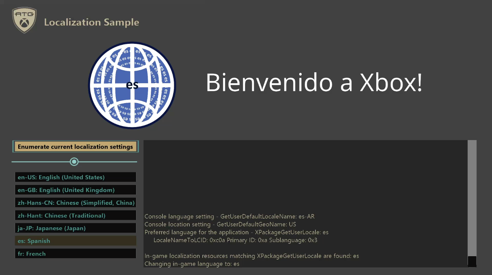

# NLS およびローカリゼーション サンプル

*このサンプルは Microsoft Game Development Kit (2020 年 6 月) と互換性があります*

# 説明

このサンプルでは、MicrosoftGame.Config で参照されている文字列とアセットをローカライズする方法と、ローカライズされたゲーム内リソースに適切にアクセスする方法を示します。 一般的な NLS (各国語サポート) API も示されています。

## メイン画面

*この画像では、コンソール ユーザーの言語設定は es-AR です*

| 操作 | ゲームパッド | キーボード |
|---|---|---|
| 実行するボタンを選択します | 方向パッド (上/下) | 矢印キー/マウス |
| ボタンを押します | A ボタン | Enter/左クリック |
| Exit | ビュー ボタン | Esc |

# サンプルのビルド

Xbox One 開発キットを使用している場合は、アクティブなソリューション プラットフォームを `Gaming.Xbox.XboxOne.x64` に設定します。

Xbox Series X|S 開発キットを使用している場合は、アクティブなソリューション プラットフォームを `Gaming.Xbox.Scarlett.x64` に設定します。

Windows 10 を使用している場合は、アクティブなソリューション プラットフォームを `Gaming.Desktop.x64` に設定します。

*詳細については、* *GDK ドキュメント*の「__サンプルの実行__」を参照してください。

# 実装メモ

# このサンプルでは、タイトルのローカライズの基本を示します。 サンプルで使用されるリソース パーサーは非常に基本的であり、エラー チェックを提供しません。 ゲームがこの設定に従う場合は、このリソース パーサーを直接コピーするのではなく、このコンテキストでより完全に機能するリソース パーサーが機能する方法の例としてこれを参照してください。 サンプルの目的は、開発者がリソースをローカライズする手順を理解できるようにすることです。

**現在のローカライズ設定を列挙する**

# アプリケーションが起動されると、一般的な NLS API の出力が表示されます。 [現在のローカライズ設定を列挙する] ボタンを押すと、手動で再度表示できます。

GetUserDefaultLocaleName API は、コンソールが設定されているロケールを取得し、GetUserDefaultGeoName API はコンソールが設定されている場所を取得します。 XPackageGetUserLocale API は、パッケージ ロケールに最も近いユーザー ロケールを取得します。 結果は LCID に変換できます。

**システム設定に基づく言語の選択**

サンプルでは、アプリケーション言語の設定に基づいて、ゲーム内のイメージとテキストを変更します。 サンプルの既定の言語は、XPackageGetUserLocale API によって決定されます。 XPackageGetUserLocale API は、ユーザーのシステム上のタイトルに最も一致するロケールが決定されるため、ロケールの選択に関するゲームの真実のソースである必要があります。 ロケールは、コンソールとユーザー設定を含むすべての使用可能なデータと、タイトルでサポートされているものに基づいています。 結果は常に、ゲームの構成で宣言されている言語、または言語が宣言されていない場合はユーザーの言語になります。 このロケールは、実行時にサンプルによって使用され、表示する適切なローカライズされた画像とテキストを選択します。

サンプルでは、MicrosoftGame.config で 7 つのロケールが定義されています。

- 

- en-US

- en-GB

- zh-Hans-CN

- zh-Hant

- ja-JP

- es

- fr

これらのロケールは、一般的なフォールバック シナリオを示すために選択されています。 フォールバックは、コンソールの言語と場所の設定がゲームでサポートされている言語に正確に対応していないため、使用可能なオプションから選択する必要がある場合に発生します。

たとえば、コンソール言語が "en-CA" の場合、"en-GB" にフォールバックします。 もう 1 つのシナリオは "fr" です。このサンプルでは、リージョンのない "fr" のみが定義されています。 この場合、コンソール言語がフランス語の場合、コンソール言語領域が何であっても "fr" にフォールバックします。

注: コンソール設定は、ローカライズ設定を言語、言語リージョン、場所の間で分割します。 Xbox One Manager では、優先言語によって最初の 2 つの言語がマージされ、地理的リージョンが [場所] に対応します。 このサンプルでは、言語設定のみが言語選択に影響します。場所/地理的リージョンは GetUserDefaultGeoName にのみ影響します。

**MicrosoftGame.Config 文字列のローカライズ**

サンプルの表示名と説明も、コンソール言語に基づいてローカライズされます。 ローカライズをサポートするには、MicrosoftGame.Config のこれらのフィールドを次のような ms-resource 参照に設定します:

OverrideDisplayName=\"ms-resource:ApplicationDisplayName\"

これらの値は、それぞれのロケールの下にある Resources.resw ファイルに存在する値に基づいて入力されます。 たとえば、コンソール言語が日本語 (ja) に設定され、地域が日本 (JP) に設定されている場合、表示名はプロジェクトの ja-JP フォルダーの Resources.resw ファイルからプルされます。このサンプルでは文字列 "NLS and Localization (ja-JP)" になります。 既定では、Resources.resw ファイルと各言語フォルダーはルート プロジェクト フォルダーにあると予想されます。 Resources.resw ファイルが、このサンプルで使用される "String" ディレクトリなどの別の場所にある場合 (例: ProjectFolder\\Strings\\Resources.resw、ProjectFolder\\Strings\\ja-JP\\Resources.resw など。 ) では、プロジェクト プロパティ ページの "Package Localization Dir" プロパティでフォルダーを指定してください。

**MicrosoftGame.Config パッケージ イメージのローカライズ**

サンプルのパッケージ イメージは、コンソール言語に基づいてローカライズすることもできます。 最初に、既定のイメージのパスは、MicrosoftGame.config で通常どおりに指定されます。 次のスニペットは、既定のイメージがサンプル内の "Images" ディレクトリの下にある場所を示しています:

StoreLogo=\"Images\\StoreLogo.png\"

Square480x480Logo=\"Images\\Square480x480Logo.png\"

Square150x150Logo=\"Images\\Square150x150Logo.png\"

Square44x44Logo=\"Images\\Square44x44Logo.png\"

SplashScreenImage=\"Images\\SplashScreen.png\"

次に、既定のイメージと同じディレクトリ内で、MicrosoftGame.config で定義されている各言語のサブディレクトリはローカライズされたバリアントを含みます (例: ProjectFolder\\Images\\ja-JP\\StoreLogo.png、ProjectFolder\\Images\\ja-JP\\Square480x480Logo.png など)。 すべての言語について、最初にその特定の言語フォルダーで画像ファイルがチェックされ、使用可能な場合はそのファイルが使用されます。 それ以外の場合で、画像が言語フォルダーに見つからない場合または言語がサポートされていない場合 (つまり、言語フォルダーが存在しない場合) は、既定のロゴに戻ります。 サンプルのビルド時に、各ロゴが Loose フォルダーに正しくコピーされていることを確認してください。

MicrosoftGame.config 設定に対応する製品が実際に発行され、そのサンドボックス (またはリテール) 内のアカウントがサインインしている場合、パートナー センターの製品ページで構成されている同等のフィールドによって文字列とイメージをオーバーライドできることに注意してください。 また、ゲームでサポートされている言語とパートナー センターのストア登録情報を 1 対 1 で対応させる必要はありませんが、非常に役立ちます。

# 更新履歴

2020 年 4 月初期リリース

2021 年 5 月 UX の更新を含む追加の NLS 機能をサポートするためにサンプルが更新されました

2021 年 7 月 MicrosoftGame.config が更新されました

# プライバシーにかんするせいめい

サンプルをコンパイルして実行する場合、サンプルの使用状況を追跡するために、サンプルの実行可能ファイルのファイル名が Microsoft に送信されます。 このデータ コレクションからオプトアウトするには、Main.cpp の "サンプル使用状況テレメトリ" というラベルの付いたコードのブロックを削除します。

Microsoft のプライバシー ポリシー全般の詳細については、「[Microsoft のプライバシーに関する声明](https://privacy.microsoft.com/en-us/privacystatement/)」を参照してください。

