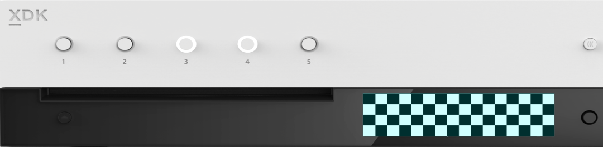

  

#   SimpleFrontPanel のサンプル

*このサンプルは、Microsoft ゲーム開発キットのプレビュー (2019 年 11 月)
に対応しています。*

# 

# 説明

SimpleFrontPanel のサンプルでは、Xbox One X Devkit とProject Scarlett
Devkit フロント パネル
ディスプレイのプログラミングを開始するのに必要な基本的な機能を含む
XFrontPanelDisplay API について紹介します。このサンプルでは、フロント
パネルを操作する方法と、Xbox One または Xbox One S devkit
など、フロントパネルがないケースの処理方法について説明します。また、このサンプルでは、フロントパネルのボタンの状態のポーリング、フロント
パネルのライトの状態の取得または設定、フロント パネルの LED
ディスプレイへのシンプルなビットパターンの描画などの基本的な機能についても説明します。また、フロント
パネルのディスプレイ バッファーを .dds テクスチャ
ファイルに保存する方法も示します。

# サンプルの作成

Xbox One の devkit を使用している場合は、アクティブなソリューション
プラットフォームを Gaming.Xbox.XboxOne.x64 に設定します。

Project Scarlett を使用している場合は、アクティブなソリューション
プラットフォームを Gaming.Xbox.Scarlett.x64 に設定します。

*詳細については、GDK ドキュメントの*
「サンプルの実行」*を参照してください。*

# サンプルの使用

このサンプルは、フロントパネルが統合された Xbox One X devkit および
Project Scarlett Devkit
を対象としています。このサンプルを開始すると、チェックボード
パターンがフロント パネル ディスプレイにレンダリングされます。フロント
パネルの方向パッド (左、右) を使用して、ディスプレイのビット
パターンとピクセル (上、下) の輝度を変更します。方向パッド ボタンを押す
(選択する) してフロント パネル
ディスプレイのバッファーをキャプチャすることもできます。フロントパネルの
5 個のボタンにはそれぞれ関連付けられた統合 LED
があります。ボタンを押すと、ライトのオンとオフが切り替わります。

このサンプルは、統合されたフロント
パネルを使用してすべての入出力を実行し、ゲームパッドまたは接続されているディスプレイとは通信しません。
このサンプルは、Xbox One または Xbox One S で実行されますが、これらの
devkits にはフロント パネル
ディスプレイがないため、関連する機能はありません。

## チェッカーボード スクリーン

| 動作                                |  フロント パネル                |
|-------------------------------------|--------------------------------|
| 前の画面                            |  方向パッドの左                 |
| 次の画面                            |  方向パッドの右                 |
| 輝度を上げる                        |  方向パッドの上                 |
| 輝度を下げる                        |  方向パッドの下                 |
| フロント パネルをキャプチャする     |  方向パッド + 選択              |
| ボタンのライトを切り替える          |  フロントパネルのボタン         |

## 

## 

## 

## 

## 

## グラデーション スクリーン

実装に関する注意事項

-   Xbox One X Devkit または Project Scarlett Devkit
    では、::XFrontPanelIsAvailable() は true を返し、完全な API
    が使用できるようになります。
    それ以外の場合、::XFrontPanelIsAvailable() は false を返し、その他の
    ::XFrontPanel\*() 関数は失敗した HRESULT コードを返します (Xbox
    One、Xbox One S、物理的なフロント
    パネルのないすべてのメーカーのコンソールなど)。

-   すべてのフレームでフロント パネルに指示する必要はありません
    (::XFrontPanelPresentBuffer())。そうではなく、1
    つ以上のピクセルが変更されたときだけ指示する必要があります。したがって、このサンプルには、ディスプレイ
    バッファーに変更があるたびに設定される m_dirty メンバーがあります。

-   また、変更があったときだけ光の状態を設定する必要があります。

-   :: Xfrontscreengetscreenpixel FORMAT () は
    DXGI_FORMAT_R8_UNORMを返しますが、スクリーン自体がサポートしているのは16
    のグレー シェードのみです。慣例的には、各 8 ビット ピクセルに 4
    つの上位ビットのみを使用してグレースケール値をエンコードする必要があります。低ビットは無視されます。この例については、Sample::
    CheckerboardFillPanelBuffer () と Sample::GradientFillPanelBuffer()
    を参照してください。

-   API
    はディスプレイの輝度の変更をサポートしていません。このサンプルでは、値
    0x10
    により各ピクセルをインクリメント/デクリメントするだけで対応しています。この例については、Sample::
    BrightenPanelBuffer () と Sample::DimPanelBuffer()
    を参照してください。

-   フロント パネル
    バッファーに直接アクセスすることはできません。代わりに、独自のバッファーを管理して、バッファーのアドレスを
    ::XFrontPanelPresentBuffer()
    に渡す必要があります。Sample::CaptureFrontPanelScreen()
    では、m_panelBuffer の内容が単に DDS サーフェスのピクセル
    ペイロードとして使用されています。

# 更新履歴

2019 年 4 月、サンプルの最初のリリース。

2019 年 11 月、Project Scarlett Devkit のサポート。

# プライバシーに関する声明

サンプルをコンパイルして実行すると、サンプルの使用状況を追跡するため、サンプル実行可能ファイルのファイル名が
Microsoft に送信されます。このデータ収集を無効にするには、「Sample Usage
Telemetry」とラベル付けされた Main.cpp
内のコードのブロックを削除します。

Microsoft のプライバシー方針の詳細については、「[Microsoft プライバシー
ステートメント](https://privacy.microsoft.com/en-us/privacystatement/)」を参照してください。
