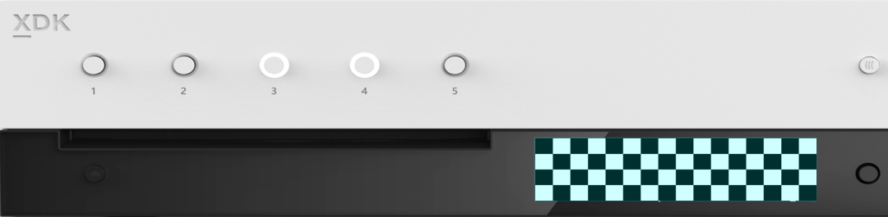

  

#   SimpleFrontPanel 示例

此示例与 Microsoft 游戏开发工具包预览版（2019 年 11 月）兼容

# 

# 说明

SimpleFrontPanel 示例演示了 XFrontPanelDisplay API，其中包含 Xbox One X
Devkit 和 Project Scarlett Devkit
前面板显示器入门编程所需的基本功能。此示例演示了如何操作前面板，并处理没有前面板的情况（这就是
Xbox One 或 Xbox One S
开发工具包的情况）。此示例还介绍了一些基本功能，如轮询前面板按钮状态、获取/设置前面板灯光状态，以及将简单的位模式绘制到前面板
LCD 显示器中。此示例还介绍了如何将前面板显示器缓冲区保存到一个 .dds
纹理文件。

# 构建示例

如果使用 Xbox One 开发工具包，请将活动解决方案平台设置为
Gaming.Xbox.XboxOne.x64。

如果使用 Project Scarlett，请将活动解决方案平台设置为
Gaming.Xbox.Scarlett.x64。

有关详细信息，请参阅 GDK 文档中的"运行示例"。

# 使用示例

此示例适用于带有集成前面板的 Xbox One X Devkit 和 Project Scarlett
Devkit。启动示例后，它将在前面板显示器上呈现一种棋盘式图案。使用前面板方向键（向左，向右）来更改显示位模式并更改像素亮度（向上、向下）。也可以按下（选择）方向键按钮来捕获前面板显示器的缓冲区。五个前面板按钮都有与其关联的集成
LED。按下某个按钮时，将打开或关闭该灯。

示例使用集成前面板执行所有输入和输出，并且不与游戏手柄或连接的显示器交互。
此示例将在 Xbox One 或 Xbox One S
中运行，但在这些开发工具包上没有有趣的功能，因为它们没有前面板显示器。

## 棋盘式屏幕

| 操作                                |  前面板                         |
|-------------------------------------|--------------------------------|
| 上一个屏幕                          |  向左方向键                     |
| 下一个屏幕                          |  向右方向键                     |
| 增加亮度                            |  向上方向键                     |
| 降低亮度                            |  向下方向键                     |
| 捕获前面板                          |  方向键选择                     |
| 切换按钮灯                          |  前面板按钮                     |

## 

## 

## 

## 

## 

## 渐变屏幕

实现说明

-   在 Xbox One X Devkit 或 Project Scarlett Devkit
    上，::XFrontPanelIsAvailable() 将返回 true，并提供完整的 API。
    否则，::XFrontPanelIsAvailable() 将返回 false，其他
    ::XFrontPanel\*() 函数将返回失败的 HRESULT 代码。（例如，在 Xbox
    One、Xbox One S 或任何没有物理前面板的零售控制台上。）

-   不必每帧都向前面板显示
    (::XFrontPanelPresentBuffer())。相反，只需要在更改一个或多个像素时呈现即可。因此，该示例具有一个
    m_dirty 成员，每当显示屏缓冲区发生更改时，都会对该成员进行设置。

-   只有在发生更改时，才有必要设置灯光状态。

-   ::XFrontPanelGetScreenPixelFormat() 返回
    DXGI_FORMAT_R8_UNORM，但屏幕本身仅支持 16
    种灰度。按照惯例，应仅使用每 8
    位像素的四个高位对灰度值进行编码。将忽略低位。有关示例，请参见
    Sample::CheckerboardFillPanelBuffer() 和
    Sample::GradientFillPanelBuffer()。

-   API 不支持更改显示亮度。本示例支持此操作，只需按 0x10
    递增/递减每个像素。有关示例，请参见 Sample::BrightenPanelBuffer() 和
    Sample::DimPanelBuffer()。

-   不能直接访问前面板缓冲区。相反，必须管理自己的缓冲区，并将缓冲区的地址传递给
    ::XFrontPanelPresentBuffer()。Sample::CaptureFrontPanelScreen()
    仅使用 m_panelBuffer 的内容作为 DDS 表面的像素有效负载。

# 更新历史记录

2019 年 4 月，首次发布此示例。

2019 年 11 月，支持 Project Scarlett Devkit。

# 隐私声明

在编译和运行示例时，示例可执行文件的文件名将发送给
Microsoft，用于帮助跟踪示例使用情况。要选择退出此数据收集，你可以删除
Main.cpp 中标记为"示例使用遥测"的代码块。

有关 Microsoft 的一般隐私策略的详细信息，请参阅《[Microsoft
隐私声明](https://privacy.microsoft.com/en-us/privacystatement/)》。
