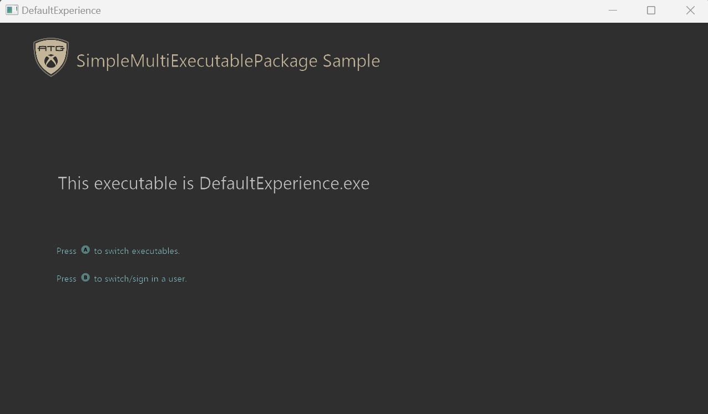

# Simple MultiExecutable Package Sample

_This sample is compatible with the Microsoft Game Development Kit (March 2022)_

# Description

A sample that demonstrates how to set up a solution with multiple executables. This implementation is done by creating multiple projects, and setting them up in a way that allows them to be packaged and run together.

# Running the sample

## Method 1: Run from Visual Studio

Build the solution and press F5. The default experience will be the first to load.

## Method 2: Run from package creation

1. Build the project.

2. **Create the package** by running the corresponding script from an
   **Xbox Gaming Command Prompt**:

   | Platform | Script |
   |---|---|
   | Xbox One | `GenXboxOneXVCPackage.bat` |
   | Xbox Series X\|S | `GenScarlettXVCPackage.bat` |
   | PC (x64) | `GenDesktopMSIXVCPackage_x64.bat` |
   | PC (ARM64) | `GenDesktopMSIXVCPackage_ARM64.bat` |

   Console packages produce **.xvc** files in .\\DefaultExperience\\$Target\\Layout\\Image

   Desktop packages produce **.msixvc** files in .\\x64\\Layout\\Image (x64) or .\\ARM64\\Layout\\Image (ARM64)

3. **Install and run** the package:
   - **Xbox**: Copy the .xvc file into your devkit through Xbox Manager, or install with xbapp install.
   - **PC**: Install the .msixvc file with wdapp install.

# Update history

**Initial Release:** Microsoft Game Development Kit (June 2023)

June 2023: Initial release

October 2025: Fixed a bug that broke the XLaunchNewGame when running with F5.

April 2026: Add ARM64 support for PC packaging scripts; rename Desktop
bat files to distinguish x64 and ARM64 architectures

# Privacy Statement

When compiling and running a sample, the file name of the sample
executable will be sent to Microsoft to help track sample usage. To
opt-out of this data collection, you can remove the block of code in
Main.cpp labeled "Sample Usage Telemetry".

For more information about Microsoft's privacy policies in general, see
the [Microsoft Privacy
Statement](https://privacy.microsoft.com/en-us/privacystatement/).
