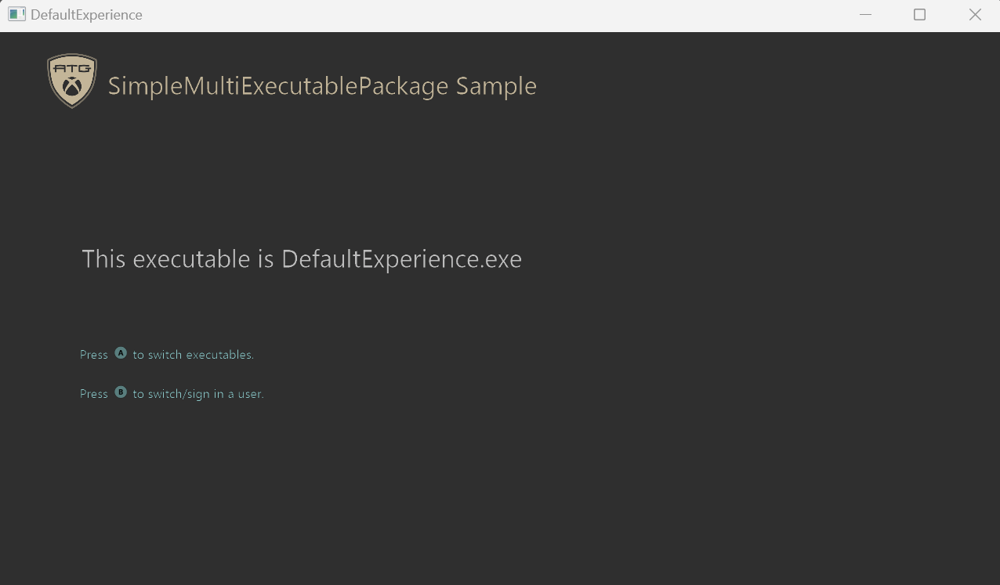

# Simple MultiExecutable パッケージ サンプル
_このサンプルは、Microsoft Game Development Kit と互換性があります (2022 年 3 月)_

### 説明
複数の実行可能ファイルを使用してソリューションを設定する方法を示すサンプル。 この実装は、複数のプロジェクトを作成し、それらをパッケージ化して一緒に実行できるように設定することによって行われます。

# サンプルのビルド

Xbox One 開発キットを使用している場合は、アクティブなソリューション プラットフォームを `Gaming.Xbox.XboxOne.x64` に設定します。

Xbox Series X|Sを使用している場合は、アクティブなソリューション プラットフォームを `Gaming.Xbox.Scarlett.x64` に設定します。

PC で実行している場合は、アクティブなソリューション プラットフォームを `Gaming.Xbox.Desktop.x64` に設定します。

### サンプルを実行します。

#### 方法 1、Visual Studio から実行する
- F5 キーを押すだけでサンプルを実行できます。 既定のエクスペリエンスが最初に読み込まれます。

#### 方法 2、 パッケージの作成から実行する
- このサンプルのパッケージを生成し、そこから実行することもできます。
- パッケージを生成する。
   1. プロジェクトをビルドします。
   2. Makepkg をサポートするターミナル内で GenConsoleXVCPackage.bat または GenDesktopMSIXVCPackage.bat を実行します。
      1. コンソール パッケージ ファイルは、.\\DefaultExperience\\$Target\\Layout\\Image\\ にあります。
      2. デスクトップ パッケージ ファイルは、.\\Gaming.Desktop.x64\\Layout\\Image にあります。
- パッケージのインストールと実行。
   1. Xbox で実行している場合は、Xbox Manager を使用して .xvc ファイルを開発キットにコピーします。 xbapp インストールを使用してパッケージをインストールすることもできます。
   2. デスクトップで実行している場合は、 WDAPP インストールを使用して MSIXVC ファイルをインストールします。

## 更新履歴

**初期リリース:** Microsoft Game Development Kit (2023 年 6 月)

2023 年 6 月: 初期リリース

## プライバシーに関する声明

サンプルをコンパイルして実行する場合、サンプルの使用状況を追跡するために、サンプルの実行可能ファイルのファイル名が Microsoft に送信されます。 このデータ コレクションからオプトアウトするには、Main.cpp の "サンプル使用状況テレメトリ" というラベルの付いたコードのブロックを削除します。

Microsoft のプライバシー ポリシー全般の詳細については、「[Microsoft のプライバシーに関する声明](https://privacy.microsoft.com/en-us/privacystatement/)」を参照してください。

