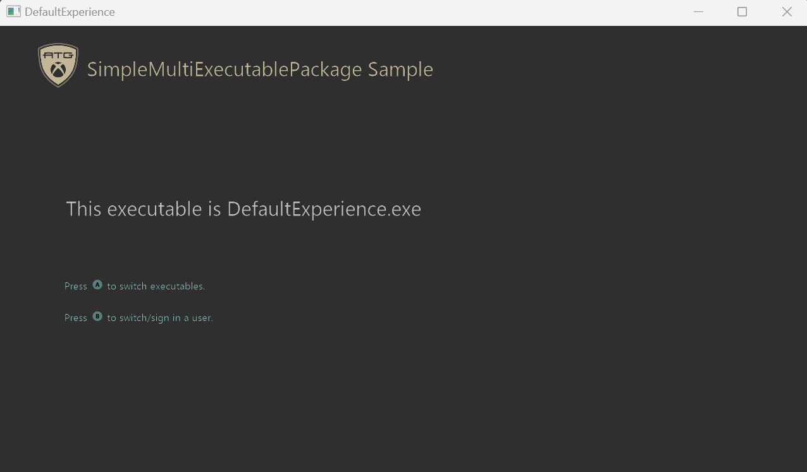

# 단순 MultiExecutable 패키지 샘플
_이 샘플은 Microsoft 게임 개발 키트(2022년 3월)와 호환됩니다._ 

### 설명
여러 실행 파일을 사용하여 솔루션을 설정하는 방법을 보여주는 샘플입니다. 이 구현은 여러 프로젝트를 만들고, 이를 패키지로 묶어 함께 실행할 수 있도록 설정하는 방식으로 이루어집니다.

# 샘플 빌드

Xbox One 개발 키트를 사용하는 경우 활성 솔루션 플랫폼을 `Gaming.Xbox.XboxOne.x64`(으)로 설정합니다.

Xbox Series X|S를 사용하는 경우 활성 솔루션 플랫폼을 `Gaming.Xbox.Scarlett.x64`(으)로 설정합니다.

PC에서 실행 중인 경우 활성 솔루션 플랫폼을 `Gaming.Xbox.Desktop.x64`(으)로 설정합니다.

### 샘플을 실행합니다.

#### 방법 1, Visual Studio에서 실행
- F5 키를 클릭만 하면 샘플을 실행할 수 있습니다. 맨 처음에는 기본 환경이 로드됩니다.

#### 방법 2, 패키지 만들기에서 실행
- 이 샘플에 대한 패키지를 생성하고, 그 위치에서 실행할 수도 있습니다.
- 패키지를 생성하는 방법.
   1. 프로젝트를 빌드합니다.
   2. Makepkg를 지원하는 터미널 내에서 GenConsoleXVCPackage.bat 또는 GenDesktopMSIXVCPackage.bat을 실행합니다.
      1. \\DefaultExperience\\$Target\\Layout\\Image에서 콘솔 패키지 파일을 찾을 수 있습니다.
      2. \\Gaming.Desktop.x64\\Layout\\Image에서 데스크톱 패키지 파일을 찾을 수 있습니다.
- 패키지 설치 및 실행.
   1. Xbox에서 실행되는 경우 Xbox 관리자를 통해 개발 키트로 .xvc 파일을 복사합니다. xbapp 설치를 통해 패키지를 설치할 수도 있습니다.
   2. 데스크톱에서 실행 중인 경우 WDAPP 설치를 통해 .MSIXVC 파일을 설치합니다.

## 업데이트 기록

**초기 릴리스:** Microsoft 게임 개발 키트(2023년 6월)

2023년 6월: 초기 릴리스

## 개인정보처리방침

샘플을 컴파일하고 실행하는 경우 샘플 사용량을 추적할 수 있도록 샘플 실행 파일의 파일 이름이 Microsoft에 전송됩니다. 이 데이터 수집을 옵트아웃하려면 Main.cpp에서 "샘플 사용량 원격 분석"이라는 레이블이 지정된 코드 블록을 제거할 수 있습니다.

일반적인 Microsoft의 개인 정보 정책에 대한 자세한 내용은 [Microsoft 개인정보처리방침](https://privacy.microsoft.com/en-us/privacystatement/)을 참조하세요.

