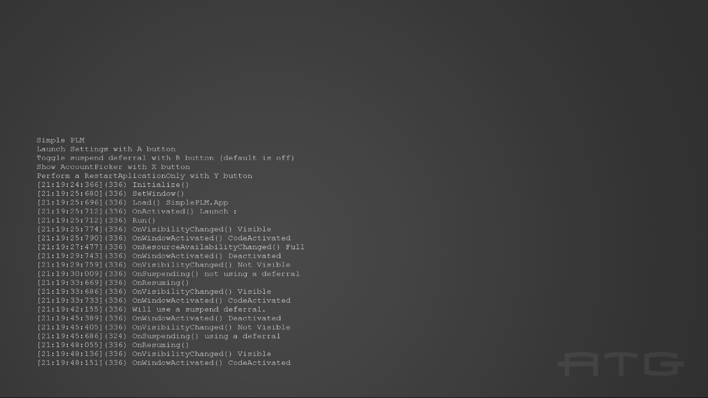

  

#   SimplePLM Sample

*This sample is compatible with the Microsoft Game Development Kit (June
2020)*

# Description

This sample shows the behavior of the PLM events and the events that are
related to PLM. The sample will print to the screen and to debug output
a timestamp, thread ID, function name, and any additional data relevant
to that function for events related to PLM. This sample can be used to
understand the behavior of PLM events.

The sample can also perform operations that cause PLM-related
transitions to demonstrate what events and states are affected. These
include launching into a fullscreen SystemOS experience (Settings) and
Showing the AccountPicker TCUI.

# Using the sample

##  Main Screen

| Action                                |  Xbox One Controller          |
|---------------------------------------|------------------------------|
| Launch the Settings App               |  A                            |
| Show the AccountPicker                |  X                            |
| Exit                                  |  View                         |

When running in Visual Studio to test suspend and resume operations, the
user can use the Lifecycle Events menu to cause the app to suspend and
resume shown below.

When not running under the Visual Studio debugger the user can cause an
application to suspend by making the app not visible (launching settings
will do this), the app will suspend after 10 minutes. To resume a
suspended application, the user simply needs to make the application
visible again. Alternately, the user can use the Xbox One Manager to
perform Suspend and Resume operations.

Another option is to use the Xbapp.exe tool that is installed with the
XDK Tools which will allow you to suspend and resume an app with the
following commands:

Xbapp.exe suspend SimplePLM_1.0.0.0_x64\_\_zjr0dfhgjwvde

Xbapp.exe resume SimplePLM_1.0.0.0_x64\_\_zjr0dfhgjwvde

# Implementation notes

Logging of events occurs in Main.cpp in the associated functions and
event handlers, not in SimplePLM.cpp. There are also logs for when
different operations are chosen and an initial log to remind the user of
the controls.

# Privacy statement

When compiling and running a sample, the file name of the sample
executable will be sent to Microsoft to help track sample usage. To
opt-out of this data collection, you can remove the block of code in
Main.cpp labeled "Sample Usage Telemetry".

For more information about Microsoft's privacy policies in general, see
the [Microsoft Privacy
Statement](https://privacy.microsoft.com/en-us/privacystatement/).
