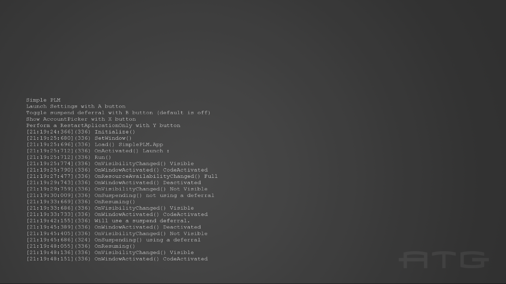
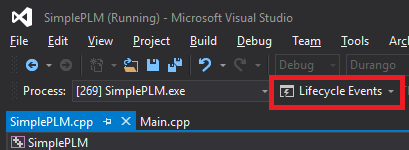

  

#   SimplePLM 샘플

*이 샘플은 Microsoft 게임 개발 키트 미리 보기(2019년 11월)와
호환됩니다.*

# 설명

이 샘플에서는 PLM 이벤트 및 PLM과 관련된 이벤트의 동작을 보여 줍니다. 이
샘플은 화면에 출력하고, 디버그하기 위해 타임스탬프, 스레드 ID, 함수 이름
및 PLM와 관련된 이벤트의 해당 함수에 대한 추가 데이터를 출력합니다. 이
샘플을 사용하여 PLM 이벤트의 동작을 이해할 수 있습니다.

또한 이 샘플에서는 PLM 관련 전환을 야기하는 작업을 수행하여 영향을 받는
이벤트와 상태를 보여 줍니다. 그뿐 아니라 전체 화면 SystemOS 환경(설정)을
시작하고 AccountPicker TCUI를 보여 줍니다.

# 샘플 사용

##  주 화면

| 작업                                  |  Xbox One 컨트롤러            |
|---------------------------------------|------------------------------|
| 설정 앱 시작                          |  A                            |
| AccountPicker 표시                    |  X                            |
| 종료                                  |  보기                         |

Visual Studio에서 실행하여 일시 중지 및 다시 시작 작업을 테스트하는 경우
사용자는 아래에 표시된 대로 수명 주기 이벤트 메뉴를 사용하여 앱이 일시
중지 및 재개되도록 할 수 있습니다.

Visual Studio 디버거 아래에서 실행되고 있지 않은 경우, 사용자는 앱을
보이지 않도록 표시하여 응용 프로그램을 일시 중단할 수 있습니다(시작
설정에 따라 이 작업 수행). 그러면 앱은 10분 후에 일시 중단됩니다. 일시
중단된 애플리케이션을 다시 시작하려면 애플리케이션을 다시 보이게 하면
됩니다. 또는 사용자는 Xbox One Manager를 사용하여 일시 중지 및 재개
작업을 수행할 수 있습니다.

또 다른 옵션은 다음 명령을 사용하여 앱을 일시 중지했다가 재개할 수 있는
XDK Tools와 함께 설치되는 Xbapp.exe 도구를 사용하는 것입니다.

Xbapp.exe suspend SimplePLM_1.0.0.0_x64\_\_zjr0dfhgjwvde

Xbapp.exe resume SimplePLM_1.0.0.0_x64\_\_zjr0dfhgjwvde

# 구현 참고 사항

이벤트 기록은 SimplePLM.cpp가 아니라 Main.cpp의 연결된 함수 및 이벤트
처리기에 나타납니다. 여러 작업을 선택하는 경우에 대한 로그와 사용자에게
컨트롤을 미리 알리기 위한 초기 로그도 있습니다.

# 개인정보처리방침

샘플을 컴파일하고 실행할 때 샘플 사용을 추적하는 데 도움이 되도록 샘플
실행 파일의 파일 이름이 Microsoft에 전송됩니다. 이 데이터 수집을
옵트아웃하려면 Main.cpp에서 \"샘플 사용 원격 분석\"이라고 레이블이
지정된 코드 블록을 제거할 수 있습니다.

Microsoft의 일반 개인정보취급방침에 대한 자세한 내용은 [Microsoft
개인정보처리방침](https://privacy.microsoft.com/en-us/privacystatement/)을
참조하세요.
