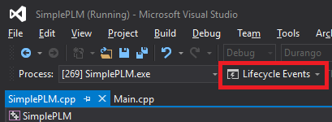

# SimplePLM 示例

*此示例兼容于 Microsoft 游戏开发工具包（2020 年 6 月）*

# 说明

此示例展示了 PLM 事件以及 PLM 相关事件的行为。 该示例将打印到屏幕，并调试输出与 PLM 相关的事件的时间戳、线程 ID、函数名称以及与该函数相关的任何其他数据。 此示例可用于了解 PLM 事件的行为。

该示例还可以执行导致 PLM 相关转换的操作，以演示哪些事件和状态受到影响。 其中包括启动全屏 SystemOS 体验（设置）和显示 AccountPicker TCUI。

# 使用示例

## 主屏幕

| 操作 | Xbox One 控制器 |
|---|---|
| 启动&ldquo;设置&rdquo;应用 | A |
| 显示 AccountPicker | X |
| 退出 | 查看 |

在 Visual Studio 中运行以测试挂起和恢复操作时，用户可以使用&ldquo;生命周期事件&rdquo;菜单导致应用挂起和恢复，如下所示。

如果未在 Visual Studio 调试器下运行，用户可能会使应用不可见，从而导致应用程序挂起（启动设置将执行此操作），应用将在 10 分钟后暂停。 若要恢复挂起的应用程序，用户只需使应用程序再次可见。 或者，用户可以使用 Xbox One 管理器执行挂起和恢复操作。

另一个选项是使用随 XDK 工具一起安装的 Xbapp.exe 工具，该工具允许你使用以下命令挂起和恢复应用：

Xbapp.exe suspend SimplePLM_1.0.0.0_x64\_\_zjr0dfhgjwvde

Xbapp.exe resume SimplePLM_1.0.0.0_x64\_\_zjr0dfhgjwvde

# 实现说明

事件日志记录发生在 Main.cpp 中的关联函数和事件处理程序中，而不是在 SimplePLM.cpp 中。 还提供了选择不同操作时的日志和用于提醒用户控件的初始日志。

# 隐私声明

在编译和运行示例时，将向 Microsoft 发送示例可执行文件的文件名以帮助跟踪示例使用情况。 若要选择退出此数据收集，你可以删除 Main.cpp 中标记为&ldquo;示例使用遥测&rdquo;的代码块。

有关 Microsoft 的一般隐私策略的详细信息，请参阅 [Microsoft 隐私声明](https://privacy.microsoft.com/en-us/privacystatement/)。

