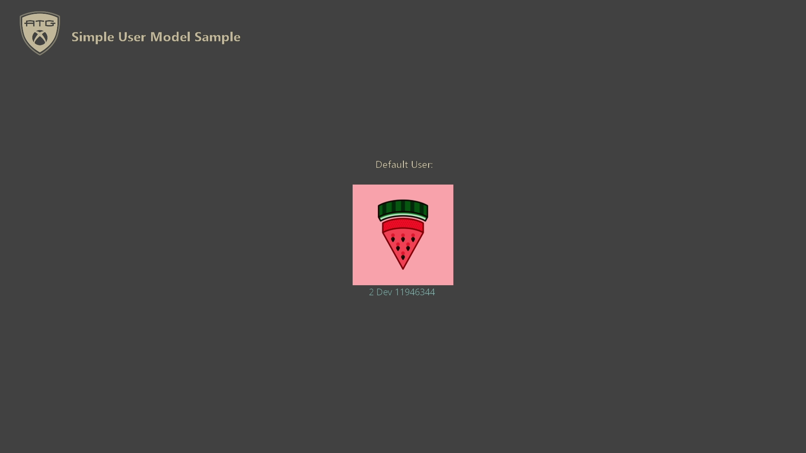

  

#   단순 사용자 모델 샘플

*이 샘플은 Microsoft 게임 개발 키트(2021년 4월)와 호환됩니다.*

# 

# 설명

이 샘플은 Microsoft 게임 개발 키트(2021년 4월)와 함께 도입된 새로운 단순
사용자 모델 사용 방법을 보여줍니다.

# 샘플 빌드

Xbox One 개발 키트를 사용하는 경우 활성 솔루션 플랫폼을
Gaming.Xbox.XboxOne.x64로 설정합니다.

Xbox Series X|S 개발 키트를 사용하는 경우 활성 솔루션 플랫폼을
Gaming.Xbox.Scarlett.x64로 설정합니다.

*자세한 내용은 GDK 설명서에서* 샘플 실행*을 참조하세요.*

# 샘플 사용

개발자 키트에서 단순 사용자 모델 샘플을 실행하려면 먼저 사용자를
로그인하고 기본 개발자 키트 사용자를 설정해야 합니다. 기본 사용자는
*Xbox One 관리자 GDK*를 사용하여 \"자동 로그인\"을 선택하면 됩니다. 또는
\"xbconfig DefaultUser\" 설정을 사용하여 설정할 수 있습니다. 자세한
내용은 단순 사용자 모델에 대한 설명서를 참조하세요.

샘플은 기본 사용자에 자동으로 로그인하고 게이머태그와 게이머 사진을
화면에 표시합니다. 사용자가 게이머태그 또는 게이머 사진을 변경하면
화면에서도 업데이트됩니다. \[보기\] 단추를 눌러 샘플을 종료합니다.



# 구현 노트

새로운 단순 사용자 모델은 제목에 기본 사용자가 한 명 있을 때 제목에
필요한 사용자 관리 코드를 크게 단순화합니다. 단일 플레이어 게임, 단일
사용자 상시 온라인 타이틀, RPG 등을 예로 들어 보겠습니다.

샘플 코드를 볼 때 \"\[단순 사용자 모델\]\" 메모를 검색하여 단순 사용자
모델 사용과 관련된 위치를 찾습니다.

타이틀에 단순 사용자 모델을 사용하도록 설정하려면 MicrosoftGame.config를
편집하고 다음 항목을 추가해야 합니다.

```
<!-- 시작 시 기본 사용자 요구 및 단순 사용자 모델 사용을 선택합니다. -->

<AdvancedUserModel>false</AdvancedUserModel>
```

기본값은 현재 2021년 4월 및 2021년 6월 GDK 릴리스로 빌드된 타이틀에 대해
*true*입니다. 이후 GDK 주 릴리스에서는 이 값이 기본값인 *false*로 변경될
수 있습니다. 2021년 4월 이전 버전의 GDK로 빌드된 타이틀에서는 이 설정이
존재하지 않으며 사용할 수 있는 사용자 모델은 고급 모델뿐입니다.

단순 사용자 모델 사용 시 사용자 로그인/로그아웃 동작, 사용자 이벤트,
PLM(프로세스 수명 관리) 이벤트 및 관련 기능이 변경되며 이전 고급 모델을
사용할 때보다 더 간단한 방법으로 처리할 수 있습니다. 변경 사항 및 처리
간소화 방법에 대한 내용은 다음 표를 참조하세요.

| 기능  |  단순 사용자 모델을 사용한 처리  |  고급 사용자 모델을 사용한 처리            |
|----------|---------------------------------|------------------------|
| 기본 사 용자/주 사용자  |  Xbox 홈 화면에서 타이틀을 시작하는 사용자는 타이틀 수명 동안 변경할 수 없는 기본 사용자로 설정됩니다.  |  타이틀은 타이틀의 주 사용자를 수동으로 설정하고 관리해야 합니다. 자세한 내용은 [XR-XR-112](https://developer.microsoft.com/en-us/games/xbox/partner/xr112)를 참조하세요.            |
| 로그인 및 로그아웃  |  *XUserAddAsync* 및 *AddDefaultUserSilently* 플래그를 사용하여 기본 사용자에 로그인하면 자동으로 성공합니다. 기본 사용자가 로그아웃되면 타이틀이 일시 중단됩니다. 기본 사용자 이외의 추가 사용자는 고급 사용자 모델과 동일하게 처리됩니다.  |  로그인 시도의 성공에 대해서는 어떠한 가정도 할 수 없습니다. 사용자가 로그아웃한 경우 타이틀이 자동으로 일시 중단되지 않습니다. 대신 타이틀은 [XR-115](https://developer.microsoft.com/en-us/games/xbox/partner/xr115)에 따라 로그인 및 로그아웃을 처리해야 합니다.                |
| PLM  |  Xbox 시스템은 Xbox 홈 화면에서 타이틀을 이전에 시작한 사용자와 다른 사용자로 시작하려고 하면 타이틀을 종료하고 다시 시작합니다. |  사용자 및/또는 디바이스의 변경/손실을 초래하는 모든 PLM 이벤트는 그에 따라 처리되어야 합니다.     |
| 사용자 이벤트  |  기본 사용자는 로그인/로그아웃 관련 사용자 이벤트를 받지 않습니다. 추가 사용자는 로그아웃/로그인 관련 이벤트를 받습니다. 모든 사용자는 게이머태그 및 게이머 사진 변경 이벤트와 같은 다른 사용자 변경 이벤트를 받습니다. |  모든 사용자는 모든 사용자 이벤트를 받을 수 있습니다. |

위의 표에 설명된 동작은 소매 콘솔에서 테스트하거나 Xbox 홈 화면을
사용하여 개발 키트에서 애플리케이션을 시작하고 테스트할 때의 동작입니다.
DevHome에서 개발자 키트를 사용하거나, 테스트 도구를 사용하여 PLM을
테스트하거나, 기타 개발자 키트 애플리케이션을 테스트할 때 고려해야 할 몇
가지 추가 사례가 있습니다.

-   기본 사용자를 로그아웃하고 새 사용자를 로그인한 다음 Xbox 관리자
    애플리케이션 또는 기타 PLM 테스트 도구를 사용하여 수동으로 제목을
    재개한 경우 기본 사용자에 대한 사용자 로그아웃/로그인 관련 이벤트를
    가져올 수 있습니다. 이 사례는 소매 사용에 대해 처리할 필요가
    없습니다.

-   Xbox 홈 화면을 사용하여 시작하지 않는 경우, 개발자 키트에서 제목을
    시작하는 기본 사용자를 설정해야 합니다. 이렇게 하려면 Xbox 관리자
    애플리케이션에서 \"자동 로그인\"을 선택하거나 \"xbconfig
    DefaultUser\" 설정을 사용하여 \"자동 로그인\"을 선택할 수 있습니다.

여러 사용자, 사용자 로그인/로그아웃 이벤트, 게임패드 페어링, XR 처리 및
기타 고급 사용자 항목을 처리하는 방법에 대한 자세한 내용은
UserManagement 샘플을 참조하세요.

# 업데이트 기록

**초기 릴리스:** Microsoft 게임 개발 키트(2021년 6월)

# 개인정보처리방침

샘플을 컴파일하고 실행하는 경우 샘플 사용량을 추적할 수 있도록 샘플 실행
파일의 파일 이름이 Microsoft에 전송됩니다. 이 데이터 수집을
옵트아웃하려면 \"샘플 사용량 원격 분석\"으로 레이블이 지정된
Main.cpp에서 코드 블록을 제거할 수 있습니다.

Microsoft의 개인정보 정책에 대한 자세한 내용은 [Microsoft
개인정보처리방침](https://privacy.microsoft.com/en-us/privacystatement/)을
참조하세요.
