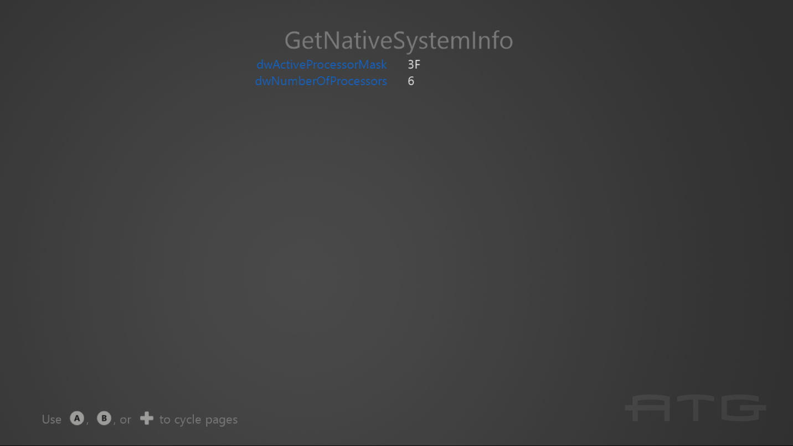

  

#   SystemInfo Sample

*This sample is compatible with the Microsoft Game Development Kit
Preview (June 2020)*

# Description

This sample demonstrates a number of APIs for querying system
information and hardware capabilities.

# Building the sample

If using an Xbox One devkit, set the active solution platform to `Gaming.Xbox.XboxOne.x64`.

If using an Xbox Series X|S devkit, set the active solution platform to `Gaming.Xbox.Scarlett.x64`.

If using PC with Windows 10 May 2019 Update (Version 1903; Build 18362)
release or later, set the active solution platform to Gaming.Deskop.x64.

*For more information, see* __Running samples__, *in the GDK documentation.*

# Using the sample

This sample displays a series of text pages with technical information.

To switch between pages with the gamepad controller, use A or DPad Right
/ B or DPad Left.

For keyboard, use Left or Enter / Right or BackSpace.

# Implementation notes

The important code is in the switch case within the **Render** function.

# Update history

October 2018: Initial GDK release

April 2020 -- Updated to support Gaming.Desktop.x64

June 2020 -- Added use of GetLogicalProcessorInformation / Get
LogicalProcessorInformationEx

October 2021 -- Update for Windows 11 DirectX 12 updates (22000).

September 2022 -- Update for Windows 11, Version 22H2 (22621)

# Privacy statement

When compiling and running a sample, the file name of the sample
executable will be sent to Microsoft to help track sample usage. To
opt-out of this data collection, you can remove the block of code in
Main.cpp labeled "Sample Usage Telemetry".

For more information about Microsoft's privacy policies in general, see
the [Microsoft Privacy
Statement](https://privacy.microsoft.com/en-us/privacystatement/).
