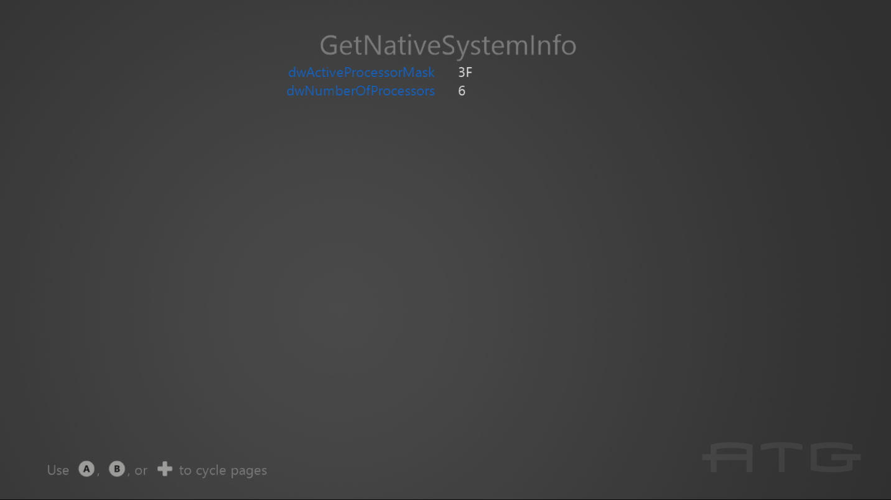

# SystemInfo 샘플

*이 샘플은 Microsoft 게임 개발 키트 미리 보기와 호환됩니다(2019년
11월).*

# 설명

이 샘플에서는 시스템 정보와 하드웨어 기능을 쿼리하는 데 사용할 수 있는
다양한 API를 보여 줍니다.

# 샘플 빌드

Xbox One 개발 키트를 사용하는 경우 활성 솔루션 플랫폼을
Gaming.Xbox.XboxOne.x64로 설정하세요.

Project Scarlett을 사용하는 경우 활성 솔루션 플랫폼을
Gaming.Xbox.Scarlett.x64로 설정하세요.

Windows 10 2019년 5월 업데이트(버전 1903, 빌드 18362) 릴리스 이상이
설치된 PC를 사용하는 경우 활성 솔루션 플랫폼을 Gaming.Deskop.x64로
설정하세요.

*자세한 내용은 GDK 문서에서* 샘플 실행하기*를 참조하세요.*

# 샘플 사용

이 샘플은 기술 정보가 포함된 일련의 텍스트 페이지를 표시합니다.

게임패드 컨트롤러를 사용하여 페이지 사이를 전환하려면 A 또는 D-패드
오른쪽/B 또는 D-패드 왼쪽을 사용합니다.

키보드를 사용하는 경우 왼쪽 또는 Enter 키/오른쪽 또는 백스페이스 키를
사용합니다.

# 구현 참고 사항

**Render** 함수의 switch case에 중요한 코드가 포함되어 있습니다.

# 업데이트 기록

2018년 10월: 초기 GDK 릴리스

2020년 4월 - Gaming.Desktop.x64를 지원하도록 업데이트됨

# 개인정보처리방침

샘플을 컴파일하고 실행할 때 샘플 사용을 추적하는 데 도움이 되도록 샘플
실행 파일의 파일 이름이 Microsoft에 전송됩니다. 이 데이터 수집을
옵트아웃하려면 Main.cpp에서 \"샘플 사용 원격 분석\"이라고 레이블이
지정된 코드 블록을 제거할 수 있습니다.

Microsoft의 일반 개인 정보 보호 정책에 대한 자세한 내용은 [Microsoft
개인정보처리방침](https://privacy.microsoft.com/en-us/privacystatement/)을
참조하세요.
