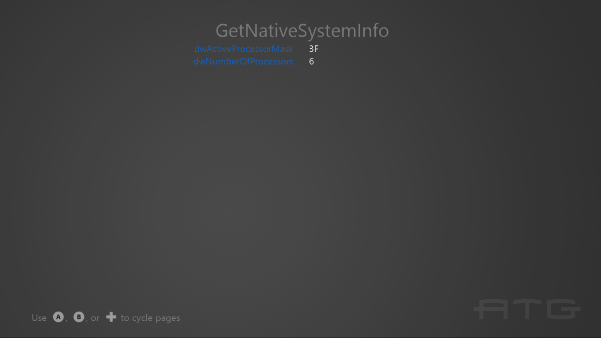

# SystemInfo 示例

*此示例与 Microsoft 游戏开发工具包预览版（2020 年 6 月）兼容*

# 说明

此示例演示了大量用于查询系统信息和硬件功能的 One API。

# 生成示例

如果使用 Xbox One 开发工具包，请将活动解决方案平台设置为 `Gaming.Xbox.XboxOne.x64`。

如果使用 Xbox Series X|S 开发工具，请将活动解决方案平台设置为 `Gaming.Xbox.Scarlett.x64`。

如果使用具有 Windows 10 2019 年 5 月更新（版本 1903；内部版本 18362）或更高版本的电脑，请将活动解决方案平台设置为 Gaming.Deskop.x64。

*有关详细信息，请参阅* __运行示例__，*在 GDK 文档中。*

# 使用示例

此示例显示一系列包含技术信息的文本页。

若要使用游戏手柄控制器在页面之间切换，请使用 A 或向右方向键 /B 或向左方向键。

对于键盘，请使用向左键或 Enter/向右键或 BackSpace。

# 实现说明

重要代码位于 **Render** 函数的切换案例中。

# 更新历史记录

2018 年 10 月: 初始 GDK 版本

2020 年 4 月 &ndash; 更新为支持 Gaming.Desktop.x64

2020 年 6 月 &ndash; 添加了 GetLogicalProcessorInformation / Get LogicalProcessorInformationEx 的使用

2021 年 10 月 - Windows 11 DirectX 12 更新更新 (22000)。

2022 年 9 月 -- Windows 11 版本 22H2 更新 (22621)

# 隐私声明

在编译和运行示例时，将向 Microsoft 发送示例可执行文件的文件名以帮助跟踪示例使用情况。 若要选择退出此数据收集，你可以删除 Main.cpp 中标记为&ldquo;示例使用遥测&rdquo;的代码块。

有关 Microsoft 的一般隐私策略的详细信息，请参阅 [Microsoft 隐私声明](https://privacy.microsoft.com/en-us/privacystatement/)。

