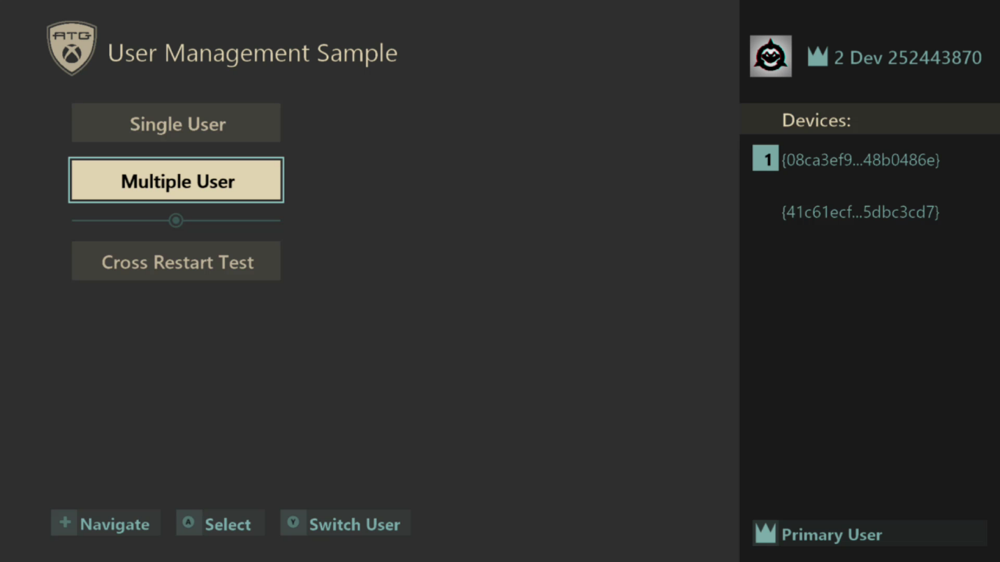
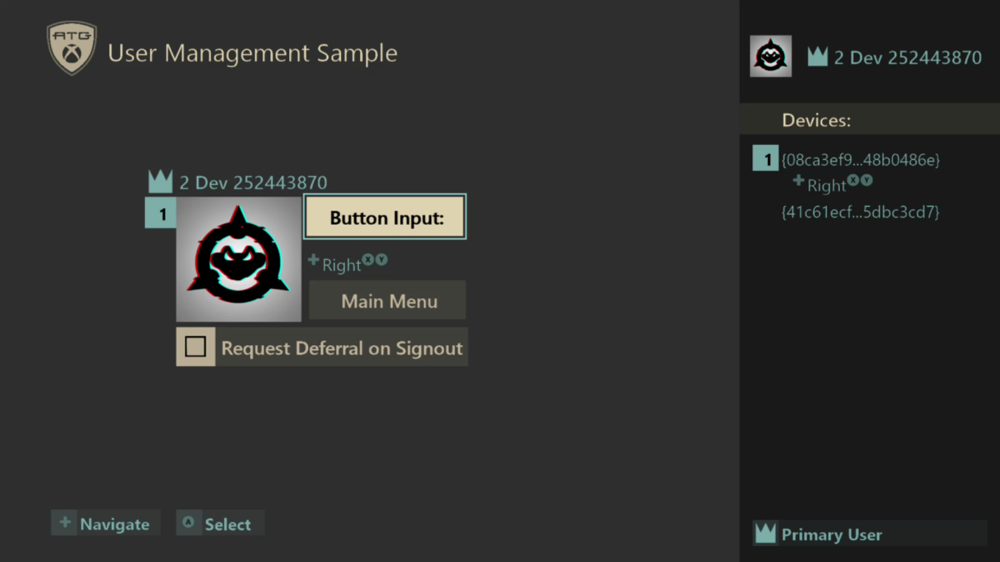
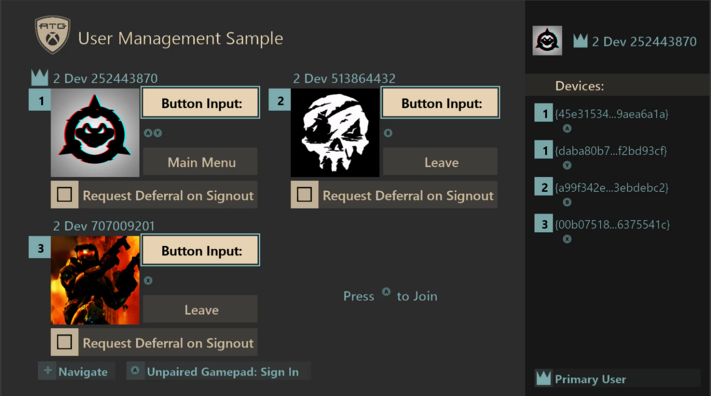

User Management Sample

*This sample is compatible with the Microsoft Game Development Kit (June
2020)*

# 

# Description

This sample demonstrates user management with gamepad association for
both single-user and multi-user scenarios. The management behavior is
also made to be XR compliant as an example for reference. Finally, it
also shows how a default user can be set by a launcher for a
cross-process case.

# Building the sample

If using an Xbox One devkit, set the active solution platform to `Gaming.Xbox.XboxOne.x64`.

If using an Xbox Series X|S devkit, set the active solution platform to `Gaming.Xbox.Scarlett.x64`.

*For more information, see* __Running samples__, *in the GDK documentation.*

# Using the Sample

The sample is split into three different screens which can be toggled
between using a gamepad. Inputs are displayed on the screen in the
sample and shown below.

### Title Screen

| Action                           |  Any Gamepad                       |
|----------------------------------|-----------------------------------|
| Navigate Menu                    |  DPad Up/Down                      |
| Sign-In / Select Menu Option     |  A Button                          |
| Switch User                      |  Y Button                          |

### Single User Screen

| Action  |  Any Gamepad  |  User's Associated Gamepad                 |
|----------------------|--------------------|-------------------------|
| Return to Title  |  (When prompted by dialogs) B button |  Select Main Menu |
| Toggle Sign Out Deferral |  N/A  |  Select Request Deferral on Signout              |
| Select / Sign In / Confirm Action (Dialogs) |  (When prompted by dialogs) A button  |  A Button |
| Cancel Action (Dialogs) |  B Button  |  N/A |
| Navigate             |  N/A                |  DPad Up/Down            |

### Multiple-User Screen

| Action  |  Unpaired Gamepad |  User's Associated Gamepad |
|----------------------|-----------------|----------------------------|
| Return to Title (Primary User) |  N/A  |  Select Main Menu |
| Sign In              |  A Button        |  N/A                        |
| Sign Out (Non-Primary Users) |  N/A  |  Select Leave |
| Toggle Sign Out Deferral |  N/A  |  Select Request Deferral on Signout                    |
| Navigate             |  N/A             |  DPad Up/Down               |

# Implementation Notes

The sample splits demonstration of user management features into
single-user and multiple-user scenarios. The single-user screen shows
how to manage a single primary user while handling user events in the
case of data changes or the user being lost. The multiple-user screen
allows up to 4 simultaneous users to be logged in.

On the title screen, the "*Cross-Restart Test*" option also demonstrates
the usage of **XLaunchNewGame()** which can be supplied with a user
parameter to set the default user in the new process. A common use-case
for this feature would be a game that has a launcher to launch separate
executables, such as a game with separate single-player and multi-player
versions. This sample uses it to demonstrate the how to sign-in to a
game directly with a default user instead of prompting for a user to be
chosen at start.

There are many features for user management that are demonstrated in the
different screens. Consult the following table for a list of features
and how they are used.

| Feature          |  Description                                       |
|------------------|---------------------------------------------------|
| Sign In  |  **XUserAddAsync()** is used in the title screen to sign in a primary user for the sample. For the multi-user screen, up to 3 additional users can be signed-in to the sample to demonstrate a multiplayer game.                                 |
| Sign Out  |  In the multi-user scenario, the extra users (non-primary) who are signed in can be manually signed-out from the sample. The primary user cannot be manually signed out by the sample but can be lost via a sign-out from other means such as the Xbox system UI.                            |
| Switch User  |  When in the title screen, the current primary user can be switched by signing in a new user with **XUserAddAsync()** and then removing the old user after a success. For the multi-user screen, non-primary users can be freely signed in and out.                      |
| No-User Play  |  When in the title screen without a primary user established, the sign-in UI can be canceled. If so, the sample will prompt for continuing without a user with a notification that no data will be saved. If proceeding, the single-user screen can be accessed without a user. The only actions available in this sample for "no user" play are viewing gamepad input in the devices panel and returning to the title screen.                    |
| Gamepad Pairing and Input  |  User device association events are tracked to keep up-to-date information about gamepads paired to all signed-in users. Input is shown on-screen for paired gamepads in the devices panel on the right of all screens. Gamepad pairings change from a number of sources such as the sign-in dialog, turning controllers on and off, and user actions in the Xbox system UI.                                               |
| Default User Sign In  |  The sample demonstrates a default user sign-in when using the menu option "Cross-Restart Test". The new process will use **XUserAddAsync()** with a special flag that causes the sign-in to happen without any system UI. If the sign-in succeeds, the sample automatically progresses from the title to the single-user screen.                  |
| Cross-Process Default Sign In with **XL aunchNewGame()**  |  Some games may have multiple executables or a single executable with multiple loading scenarios. To support setting a default user for a cross-process launch, **XLaunchNewGame()** is used. This sample demonstrates that by having the sample pick a user. Then, the newly spawned process will automatically sign that user in and process to the single user screen.                |
| User Data  |  Gamertags and Gamerpics are shown on-screen for all signed-in users.                              |
| Sign Out Deferral  |  If a user begins sign-out from the UI, a sign-out deferral can be obtained to demonstrate delaying the sign-out by a few seconds.                    |
| User Event Handling |  User events are handled for sign-out, gamertag change, and gamerpic change.                      |
| Suspend/Resume Handling  |  In-progress gamerpic requests are canceled when suspended and restarted when resumed. User events are handled post-resume to fixup user sign-in states. For XR considerations, see the XR section below.  |
| Guest Users  |  Guest users can be signed-in from **XUserAddAsync()** in the multi-user screen.     |

### A note on differences from ERA XDK

Game Core titles can only interact with users that the game has
requested by calling the **XUserAddAsync()** function. As a result, APIs
that return users will fail if user to be returned wasn't added to the
title. It also means that the system may have more users signed in than
the title. It is important to constantly and consistently track title
users and to watch the user device association callback for gamepad
pairing changes.

### Sample Files

The sample is split into three main code areas for demonstration.

*GameInputDevice.cpp/h*

Gamepad tracking and management is handled in the **GameInputDevice**
and **GameInputCollection** classes using the **GameInput** **API**. An
up-to-date list of connected games is kept, and input can be checked for
any of those devices.

*GameUser.cpp/h*

The **GameUser** and **GameUserManager** classes are implemented to
demonstrate user management functionality. These classes show how to
sign in users, update gamepad associations, handle user events, and
more.

The **GameUserManager** is implemented in a generic manner and can be
used to support single and multiple user scenarios.

*GameScreens.cpp/h*

The different screens in the title are implemented here. The screens
represent the sample UI and consume the **GameUserManager**
functionality to demonstrate the user management features. Users from
the **GameUserManager** are managed from **GameScreenManager**. This
allows for the game user state to be tracked across the different game
screens in a single location.

The **GameScreenSingleUser** class is the game analog to a single-user
scenario and the **GameScreenMultiUser** class is the multi-user version
for a game which would support multiple users. **GameScreenTitle** is
the class for the title screens.

# XRs for Game Core

XRs for User Identity and Management in Game Core are simplified from
their ERA counterparts. There are essentially three relevant
requirements that are followed and demonstrated by this sample for
compliance: "***XR-112**: Establishing a User and Controller During
Initial Activation and Resume*", "***XR-115***: *Addition and Removal of
Users or Controller During Gameplay*", and "***XR-046**: Display Name
and Gamerpic*". Each XR is summarized below and how they are followed by
the sample. The latest XR information is found at
<https://developer.microsoft.com/en-us/games/xbox/partner/certification-requirements>.

**XR-112**: Establishing a User and Controller During Initial
Activation and Resume

Requirements Summary:

-   Titles must establish one or more primary users in the title.

    -   If the user cancels sign-in, a warning must be displayed that no
        saving will occur if continuing without a user

-   The user must be indicated before taking any user-related actions.

-   Titles must provide an entry into the account picker to change the
    primary user.

-   When resuming from suspend or contained, the title must validate
    users and gamepad associations.

How it's handled by this sample:

-   An active user is established at the title screen when one isn't
    signed in.

-   The active user is identified for sample purposes in the UI.

-   A warning is displayed when canceling primary user selection.

    -   Multi-user is disabled when a primary user isn't signed in, but
        the single-user screen is accessible.

-   Gamepad pairing are always updated and respected from user device
    association callbacks.

-   If a user is signed in and has no associated gamepads, unpaired
    gamepads can be used to sign-in again to associate the new gamepad.

-   All events from resuming the application are always handled to fixup
    user state.

**XR-115**: Addition and Removal of Users or Controller During
Gameplay

Requirements Summary:

-   After a primary user and gamepad have been established, additional
    users and gamepads can be used for multi-player titles. Be sure to
    consider how the additional users are added to the title.

-   If a player's controller is removed, titles must allow
    reestablishment of a new controller using a device association
    callback or call to **XUserAddAsync()**.

-   If a player is removed during gameplay, the title must either remove
    the player, or reestablish a user and active controller.

How it's handled by this sample:

-   If the primary user is lost in the title screen or multi-user
    screen, then the sample returns to the title screen with a sign-in
    prompt.

-   If the primary user is lost in the single-user screen, then a prompt
    is shown to try to re-establish the user.

-   If a non-primary user is lost in the multi-user screen, that user is
    removed from the title.

-   An option to establish a gamepad is always presented if a user has 0
    associated gamepads.

-   The sample explicitly shows the cases where actions can be handled
    via any gamepad, unpaired gamepads, or paired gamepads.

**XR-046**: Display Name and Gamerpic

Requirements Summary:

-   Game titles that use Xbox Live must use the player's gamertag as the
    player's identity name in-game.

How it's handled by this sample:

-   While this title doesn't have online play, all signed-in users are
    always identified using their gamertag returned by calls to
    **XUserGetGamertag()**.

# Things to Try

Each of the following actions will help demonstrate several important
scenarios related to user management. Observe the changes on screen and
the output logs in a debugger.

1)  **Action**: On the title screen after launching, start a sign-in and
    cancel it.\
    **Observe**: The sample will display a warning that continuing will
    now allow saving. If continuing, the sample will allow proceeding to
    the single-user screen.

2)  **Action**: Sign in a user on the title screen. Try to switch users
    using the Y button.\
    **Observe**: The primary user can be changed from the title screen
    so that the user can always be changed.

3)  **Action**: Sign in a primary user and proceed to sign-out the user
    with the Xbox System UI on the different screens.\
    **Observe**: The different screens will have different behavior
    based. The title and multi-user screens will simply proceed with the
    sign-out. The single-user screen will prompt to allow a sign-in
    again.

4)  **Action**: Sign in a primary user and proceed to the single-user
    screen. Then, turn off the controller.\
    **Observe**: The gamepad pairing information displayed on screen
    will changed based on what controllers are turned on and their
    pairing states. If no gamepads are on, the screen will notify the
    user that no gamepads are connected. If only unpaired gamepads are
    on, then the sample will show the user has no paired gamepads and
    will have a legend prompt to sign-in with an unpaired gamepad.

5)  **Action**: Sign in one or more users to the sample on the
    multi-user screen. Use the Xbox system UI to change the user's
    gamertag or gamerpic.\
    **Observe**: The gamertag or gamerpic will be updated to display
    correctly in the sample.

6)  **Action**: Sign in one or more users to the sample. Suspend the
    application using Xbox One Manager, sign out one or more users from
    the Xbox system UI, and then resume the application.\
    **Observe**: Appropriate steps will be taken by the application to
    ensure it is in a good state with the proper users signed in if they
    are still signed in. If the primary user was removed, the sample
    will handle it as appropriate.

7)  **Action**: Sign in multiple users to the multi-user screen. Then,
    use the Xbox system UI to switch the current user on different
    gamepads.\
    **Observe**: Notice the gamepad associations will be updated to
    match on the screen for each signed-in user.

8)  **Action**: On the single-user or multi-user screens, turn on
    several gamepads and press buttons on the different gamepads.\
    **Observe**: Notice how the inputs will be attributed to the correct
    gamepads.

# FAQ

1)  Why are there two (or more) gamepads listed when I only have one
    plugged in to my console?\
    **Answer**: If you have Xbox One Manager running and connected to
    your devkit, it can show up in the list of Controllers as a gamepad.
    Try quitting Xbox One Manager and you should see a Controller
    Re­moved event.

2)  Why does the gamepad not get associated when signing in with the
    Xbox One Manager's gamepad?\
    **Answer**: The gamepad for Xbox One Manager can be associated to
    different users using a drop-down selection. That association is
    respected for that particular gamepad.

# Update history

**Initial Release:** Microsoft Game Development Kit (April 2020)

# Privacy Statement

When compiling and running a sample, the file name of the sample
executable will be sent to Microsoft to help track sample usage. To
opt-out of this data collection, you can remove the block of code in
Main.cpp labeled "Sample Usage Telemetry".

For more information about Microsoft's privacy policies in general, see
the [Microsoft Privacy
Statement](https://privacy.microsoft.com/en-us/privacystatement/).
