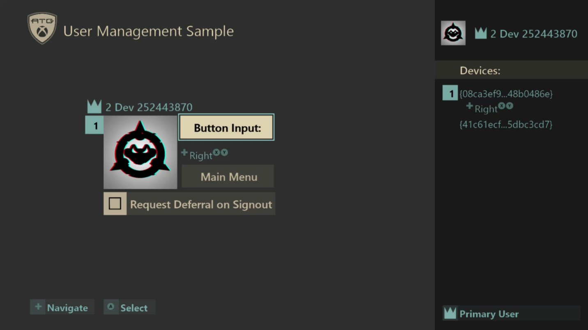
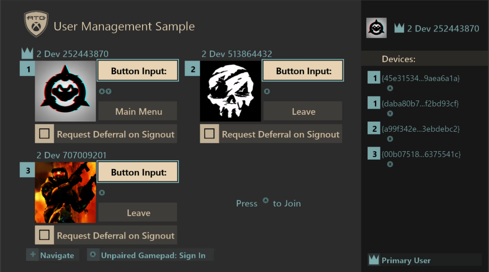

  

#   用户管理示例

此示例与 Microsoft 游戏开发工具包（2020 年 4 月）兼容

# 

# 说明

本示例演示了在单用户和多用户场景中使用游戏手柄关联进行用户管理。也可以将管理行为视为
XR
符合性，作为参考示例。最后，它还展示了启动器如何为跨进程案例设置默认用户。

# 构建示例

如果使用 Xbox One 开发工具包，请将活动解决方案平台设置为
Gaming.Xbox.XboxOne.x64。

如果使用 Project Scarlett，请将活动解决方案平台设置为
Gaming.Xbox.Scarlett.x64。

有关详细信息，请参阅 GDK 文档中的"运行示例"。

# 使用示例

示例分为三个不同屏幕，可在使用游戏手柄之间切换。输入显示在示例屏幕上，如下所示。

[标题屏幕]{.underline}

| 操作                             |  任何游戏手柄                      |
|----------------------------------|-----------------------------------|
| 导航菜单                         |  向上/向下方向键                   |
| 登录/选择菜单选项                |  A 按钮                            |
| 切换用户                         |  Y 按钮                            |

[\
]{.underline}

[单用户屏幕]{.underline}

| 操作                 |  任何游戏手柄       |  用户相关游戏手柄        |
|----------------------|--------------------|-------------------------|
| 返回到标题  |  （ 当对话框提示时）B 按钮 |  选择主菜单 |
| 切换注销延期         |  不适用             |  注销时选择"请求延期"    |
| 选择/登录 /确认操作（对话框）  |  （ 当对话框提示时）A 按钮 |  A 按钮 |
| 取消操作（对话框）   |  B 按钮             |  不适用                  |
| 导航                 |  不适用             |  向上/向下方向键         |

[\
]{.underline}

[多用户屏幕]{.underline}

| 操作                 |  未配对游戏手柄  |  用户相关游戏手柄           |
|----------------------|-----------------|----------------------------|
| 返 回到标题（主要用户） |  不适用  |  选择主菜单 |
| 登录                 |  A 按钮          |  不适用                     |
| 注销（非主要用户）   |  不适用          |  选择"离开"                 |
| 切换注销延期         |  不适用          |  注销时选择"请求延期"       |
| 导航                 |  不适用          |  向上/向下方向键            |

# 实现说明

本示例将用户管理功能的演示分为单用户和多用户场景。单用户屏幕显示，如何在数据发生更改或用户丢失的情况下处理用户事件时管理单个主要用户。多用户屏幕允许最多同时登录
4 个用户。

在标题屏幕上，"交叉重启测试"选项还演示 XLaunchNewGame()
的用法，可随用户参数一起提供，以便在新过程中设置默认用户。此功能的常见用例是具有启动器的游戏，可用于启动单独的可执行文件，例如具有单独的单人和多人版本的游戏。本示例使用它来演示如何直接使用默认用户登录游戏，而不是在开始时提示选择用户。

在不同的屏幕中，演示了许多用于用户管理的功能。请参阅下表以获取功能列表及其使用方式。

| 功能             |  说明                                              |
|------------------|---------------------------------------------------|
| 登录  |  XUserAddAsync() 用于标题屏幕，供示例中的主要用户登录。 对于多用户屏幕，最多可以有 3 个其他用户登录到示例来演示多人游戏。              |
| 注销  |  在多用户场景中，可从 此示例中手动注销已登录的额外用户（非主要用户）。 无法通过示例手动注销主要用户，但通过其他方法（如 Xbox 系统 UI）注销可能会丢失。                    |
| 切换用户  |  在标题屏幕中，可通过使用 XUserAddAsync() 登录新用户 ，然后在成功后删除旧用户，从而切换当前主要用户。 对于多用户屏幕，可自由登录和注销非主要用户。      |
| 无用户参与  |  在未建立主要用户的标题屏幕中，可取消登录 UI。在此场景中，示例将 在没有用户的情况下提示继续操作，同时告知不会保存 任何数据。如果继续，可以在没有用户的情况下访问单 用户屏幕。本示例中适用于"无用户"参与的唯一操作是 在设备面板中查看游戏手柄输入，并返回到标题屏幕。  |
| 游 戏手柄配对和输入  |  将跟踪用户设备关联事件，以了 解有关游戏手柄已配对到所有已登录用户的最新信息。 在所有屏幕右侧的 设备面板中，将在屏幕上显示已配对游戏手柄的输入。 游戏手柄配对从多个 源进行更改，如登录对话框、打开和关闭控制器，以及 Xbox 系统 UI 中的用户操作。                       |
| 默认用户登录  |  此示例演示了使用菜单 选项"交叉重启测试"时的默认用户登录。新进程将使用 XUserAddAs ync()，它带有一个特殊的标志，可以在不使用任何系统 UI 的情况下进行登录 。如果登录成功，示例将自动从标题转到单用户屏幕。  |
| 使用 XLaunchNewGame() 实 现跨进程默认登录  |  某些游戏可 能有多个可执行文件，或具有多个加载场景的单个可执 行文件。若要支持设置跨进程启动的默认用户，请使用 XLaunchNewGame()。 本示例通过让示例选择一个用户来演示这一点。然后， 新生成的进程将自动使该用户登录并进入单用户屏幕。  |
| 用户数据  |  玩家 代号和玩家图片显示在屏幕上，供所有登录用户使用。  |
| 注销延期  |  如果用户从 UI 开始注销，可获得注销延期，演示注销将推迟几秒。    |
| 用户事件处理  |  用 户事件处理针对注销、玩家代号更改和玩家图片更改。  |
| 暂停/恢复处理  |  正在进 行的玩家图片请求在暂停时取消，并在恢复时重新启动 。用户事件在恢复后进行处理，以修正用户登录状态。 有关 XR 注意事项，请参阅以下 XR 部分。            |
| 来宾用户         |  来宾用户可从多用户屏幕的 XUserAddAsync() 登录。   |

[有关与 ERA XDK 的差异的说明：]{.underline}

游戏核心标题只能与游戏已请求的用户交互，方法是调用 XUserAddAsync()
函数。因此，如果将返回的用户未被添加到标题中，则返回用户的 API
将失败。这也意味着系统可能拥有比标题更多的登录用户。请务必始终跟踪标题用户，并观察用户设备关联回调，以了解游戏手柄配对变化。

[示例文件：]{.underline}

本示例分为三个主要代码区域进行演示。

GameInputDevice.cpp/h

将使用 GameInput API 在 GameInputDevice 和 GameInputCollection
类中处理游戏手柄跟踪和管理。将保留已连接游戏的最新列表，并检查任何设备的输入。

GameUser.cpp/h

可通过实现 GameUser 和 GameUserManager
类来演示用户管理功能。这些类显示如何使用户登录、更新游戏手柄关联、处理用户事件等。

GameUserManager 以通用方式实现，可用于支持单个和多个用户场景。

GameScreens.cpp/h

标题中的不同屏幕将在此实现。这些屏幕表示示例 UI，并使用 GameUserManager
功能来展示用户管理功能。来自 GameUserManager 的用户从 GameScreenManager
进行管理。这样，就可以跨不同游戏屏幕在单个位置跟踪游戏用户状态。

GameScreenSingleUser 类是模拟单用户场景的游戏，而 GameScreenMultiUser
类是支持多个用户的游戏的多用户版本。GameScreenTitle 是标题屏幕类。

# 游戏核心 XR

与 ERA 相比，游戏核心中用于用户标识和管理的 XR
进行了简化。本示例基本上遵循并证明了以下三个相关要求："XR-112：在初始激活和恢复期间建立用户和控制器"，"XR-115：在游戏过程中添加和删除用户或控制器"以及"XR-046：显示名称和玩家图片"。下面将介绍每个
XR 及示例的遵循情况。可在
<https://developer.microsoft.com/en-us/games/xbox/partner/certification-requirements>
找到完整的 XR 信息。

[XR-112：在初始激活和恢复期间建立用户和控制器]{.underline}

要求总结：

-   标题必须在标题中建立一个或多个主要用户。

    -   如果用户取消登录，则必须显示警告，如果在没有用户的情况下继续操作，将不会保存任何数据

-   执行任何与用户相关的操作之前，必须指明用户。

-   标题必须向帐户选取器提供一个条目来更改主要用户。

-   从挂起或包含状态恢复时，标题必须验证用户和游戏手柄关联。

本示例处理方式如下：

-   如果用户未登录，将在标题屏幕上建立一个活动用户。

-   在 UI 中，出于示例目的确定活动用户。

-   取消主要用户选择时将显示警告。

    -   主要用户未登录时，将禁用多用户，但单用户屏幕可供访问。

-   游戏手柄配对始终通过用户设备关联回调进行更新和考虑。

-   如果用户已登录但没有关联的游戏手柄，可以使用未配对的游戏手柄再次登录以关联新的游戏手柄。

-   始终处理恢复应用程序后的所有事件，以便修正用户状态。

[XR-115：在游戏过程中添加和删除用户或控制器]{.underline}

要求总结：

-   建立主要用户和游戏手柄后，可将其他用户和游戏手柄用于多人游戏标题。务必要考虑将其他用户添加到标题的方式。

-   如果玩家的控制器被删除，则标题必须允许使用设备关联回调或调用
    XUserAddAsync() 重新建立新控制器。

-   如果在游戏过程中删除了玩家，则标题必须删除玩家，或者重新建立用户和活动控制器。

本示例处理方式如下：

-   如果主要用户在标题屏幕或多用户屏幕中丢失，则示例将返回到标题屏幕并显示登录提示。

-   如果主要用户在单用户屏幕中丢失，则会显示提示以尝试重新建立用户。

-   如果非主要用户在多用户屏幕中丢失，则会从标题中删除该用户。

-   如果用户拥有 0 个相关游戏手柄，则始终显示建立游戏手柄选项。

-   本示例显式显示了可通过任何游戏手柄、未配对游戏手柄或配对游戏手柄处理操作的情况。

[XR-046：显示名称和玩家图片]{.underline}

要求总结：

-   使用 Xbox Live 的游戏标题必须将玩家代号用作游戏中玩家的标识名称。

本示例处理方式如下：

-   虽然此标题没有联机体验，但将始终使用通过调用 XUserGetGamertag()
    返回的玩家代号来标识所有登录用户。

# 可尝试的操作

以下每个操作将有助于演示与用户管理相关的几个重要场景。在调试器中观察屏幕更改和输出日志。

1)  操作：启动后，在标题屏幕上启动登录然后取消。\
    观察：示例将显示一个警告，提醒继续操作现允许保存数据。如果继续，示例将允许转到单用户屏幕。

2)  操作：在标题屏幕上使用户登录。尝试使用 Y 按钮切换用户。\
    观察：可从标题屏幕更改主要用户，以便始终可以更改用户。

3)  操作：使主要用户登录，然后在不同屏幕上通过 Xbox 系统 UI 注销用户。\
    观察：不同的屏幕将基于不同的行为。标题和多用户屏幕将直接注销。单用户屏幕将再次提示允许登录。

4)  操作：使主要用户登录并转到单用户屏幕。然后，关闭控制器。\
    观察：屏幕上显示的游戏手柄配对信息将根据打开的控制器及其配对状态进行更改。如果未打开游戏手柄，屏幕将通知用户未连接任何游戏手柄。如果仅打开了未配对的游戏手柄，则示例将显示用户没有配对的游戏手柄，并且会有一个图例提示使用未配对的游戏手柄登录。

5)  操作：使一个或多个用户登录到多用户屏幕上的示例。使用 Xbox 系统 UI
    更改用户的玩家代号或玩家图片。\
    观察：玩家代号或玩家图片将更新以在示例中正确显示。

6)  操作：使一个或多个用户登录到示例。使用 Xbox One Manager
    暂停应用程序，从 Xbox 系统 UI
    中注销一个或多个用户，然后恢复该应用程序。\
    观察：应用程序将采取相应的步骤，以确保其处于良好状态，并确保正确的用户登录（如果他们仍处于登录状态）。如果删除了主要用户，示例将根据需要对其进行处理。

7)  操作：使多个用户登录到多用户屏幕。然后，使用 Xbox 系统 UI
    在不同游戏手柄上切换当前用户。\
    观察：请注意，游戏手柄关联将更新为与每个登录用户的屏幕匹配。

8)  操作：在单用户或多用户屏幕上，打开多个游戏手柄，然后按下不同游戏手柄上的按钮。\
    观察：请注意，这些输入将如何归属于正确的游戏手柄。

# FAQ

1)  当我仅将一个游戏手柄连接到控制台时，为什么会列出两个（或更多）个游戏手柄？\
    回答：如果你的 Xbox One Manager
    正在运行且已连接到开发工具包，它就会在控制器列表中显示为游戏手柄。尝试退出
    Xbox One Manager 时，你会看到"控制器已删除"事件。

2)  为什么使用 Xbox One Manager 的游戏手柄登录时，游戏手柄无法关联？\
    回答：可使用下拉选项将 Xbox One Manager
    的游戏手柄关联到不同用户。会为此特定游戏手柄考虑到这种关联。

# 更新历史记录

初始发布：Microsoft 游戏开发工具包（2020 年 4 月）

# 隐私声明

在编译和运行示例时，示例可执行文件的文件名将发送给
Microsoft，用于帮助跟踪示例使用情况。要选择退出此数据收集，你可以删除
Main.cpp 中标记为"示例使用遥测"的代码块。

有关 Microsoft 的一般隐私策略的详细信息，请参阅 [Microsoft
隐私声明](https://privacy.microsoft.com/en-us/privacystatement/)。
