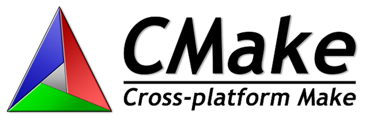
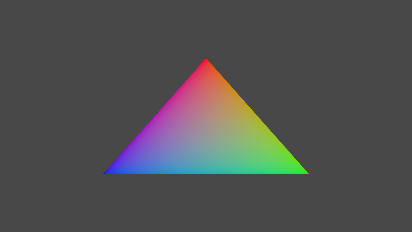

# CMake の例

*このサンプルは Microsoft Game Development Kit (2020 年 6 月)
と互換性があります。*

# 説明

これは、 [CMake](https://cmake.org/) クロスプラットフォーム ビルド
システムを使用して、Ninja ジェネレーターを介して Microsoft Game
Development Kit で実行可能ファイルをビルドする例です。

*このサンプルの主な目的は、Gaming.\*.x64
プラットフォームのビルドに必要なすべてのパスと設定を明確に文書化することです。これにより、GDK
によってインストールされる MSBuild
ルールに実装されている機能の多くがレプリケートされます。Visual Studio
ジェネレーターを介して CMake
を使用する別の方法については、**CMakeGDKExample** を参照してください*

# サンプルのビルド (Visual Studio)

Visual Studio 2019 または 2022 を使用して、\[新しいプロジェクト\]
ダイアログまたは \[ファイル\] -\> \[開く\]　-\> \[フォルダー...\]
メニュー コマンドから \[ローカル フォルダーを開く...\]
を選択し、\[デスクトップ\]、\[XboxOne\]、または \[Scarlett\]
フォルダーを開きます。

-   ここでは、"C++ CMake tools for Windows" コンポーネント
    (Microsoft.VisualStudio.Component.VC.CMake.Project)
    がインストールされている必要があります。

必要に応じて、 **XdkEditionTarget** 変数 (CMakePresets.json または
CMakeList.txt) を編集して、正しい GDK
エディションが参照されていることを確認します。

CMake
ツールは開くときに、自動的にキャッシュを生成する必要があります。さもなければ、CMakeList.txt
を選択し、右ボタン メニューから \[キャッシュの生成\]
を選択します。次に、\[ビルド\] -\> \[すべてリビルド\] メニュー
コマンドを使用します。ビルド製品は "**out**" サブフォルダーにあります。

Visual Studio の CMake の詳細については、「[Microsoft
Docs](https://docs.microsoft.com/en-us/cpp/build/cmake-projects-in-visual-studio)」を参照してください。

*このサンプルでは、 target_link_directories を使用するため、CMake 3.13
以降が必要です。Visual Studio 2017 (15.9 更新プログラム) にはバージョン
3.12 が含まれているため、この手順は、Visual Studio 2019
用です。もちろん、Visual Studio 統合に依存するのではなく、CMake
ツールを直接使用できます。Visual Studio 2017 を使用している場合は、VC
ランタイム DLL を検索するために XboxOne と Scarlett CMakeList.txt
のロジックを変更する必要があります。*

既定のセットアップには、代わりに clang/LLVM を使用するための
**x64-Debug**、 **x64-Release**、 **x64-Clang-Debug**、 **および
x64-Clang-Release** 構成が含まれます。

-   これには、"C++ Clang Compiler for Windows"
    コンポーネントがインストールされている必要があります。

*Xbox One または Xbox Series X|S プロジェクトに対して F5
キーを押すと、リモート コンソールではなく開発用 PC
で実行が試行されるため、失敗します。正常に実行するには、以下の手順に従ってプログラムを展開する必要があります。*

# サンプルのビルド (コマンド ライン)

*VS 2019 または 2022 開発者コマンド プロンプト*を使用して、コマンド
ラインから生成およびビルドすることもできます。

cd CMakeExample\\XboxOne\\

cmake . -B out -DXdkEditionTarget=220300

cmake \--build out

CMake プリセットもあります (CMake 3.19 で導入)。

cmake \--list-presets

cmake \--preset=x64-Debug

cmake \--build out\\build\\x64-Debug

# サンプルの使用方法

サンプルを展開するには、 *Xbox ゲーム コマンド プロンプト*
インスタンスを 開き、サンプル ディレクトリに変更します。

cd CMakeExample\\XboxOne\\out\\build\\\<config\>\\bin

### プッシュ配置

'ルース' レイアウトをプッシュ配置するには:

xbapp deploy Gaming.Xbox.XboxOne.x64

### PC から実行

PC から'ルース' レイアウトを実行するには:

xbapp launch Gaming.Xbox.XboxOne.x64\\CMakeExampleXboxOne.exe

### パッケージ化された展開

パッケージ ファイルを作成します。

makepkg genmap /f chunks.xml /d Gaming.Xbox.XboxOne.x64

makepkg pack /f chunks.xml /lt /d Gaming.Xbox.XboxOne.x64 /pd .

デスクトップ パッケージの場合は、2 番目のコマンド ラインにも /pc
を追加します。

その後、結果のパッケージを本体にインストールします (正確な .xvc
ファイル名は異なります)。

xbapp install CMakeExampleXboxOne_1.0.0.0_neutral\_\_zjr0dfhgjwvde.xvc

Desktop の場合、拡張子は ".msixvc" です (正確なファイル名は異なります)。

xbapp install
CMakeExampleXboxOne_1.0.0.0_neutral\_\_zjr0dfhgjwvde.msixvc

実行時のサンプルでは、デバイスとスワップチェーンが作成され、色付きの三角形が描画されます。コントロールやその他の動作はありません。

*他のバージョンをパッケージ化する場合は、使用する特定のコマンド ライン
オプションについて、各 CMakeLIst.txt
の末尾にあるコメントを参照してください。*

# 実装の詳細

さまざまな Visual C++
スイッチの詳細については、以下のリンクを参照してください。

| /GR  |  <https://docs.microsoft.com/en-us/cpp/build/reference/gr-enable-run-time-type-information> |
|-------------|--------------------------------------------------------|
| /GS RTC /sdl / DYNAMICBASE /NXCOMPAT | <https://aka.ms/msvcsecurity> |
| /DEB UG:fastlink |  <https://devblogs.microsoft.com/cppblog/faster-c-build-cycle-in-vs-15-with-debugfastlink/> |
| /EHsc  | <https://devblogs.microsoft.com/cppblog/making-cpp-exception-handling-smaller-x64/> |
| /fp  | <https://docs.microsoft.com/en-us/cpp/build/reference/fp-specify-floating-point-behavior> <https://devblogs.microsoft.com/cppblog/game-perform ance-improvements-in-visual-studio-2019-version-16-2/> |
| /FS  |  <https://docs.microsoft.com/en-us/cpp/build/reference/fs-force-synchronous-pdb-writes> |
| /GL /Gw /LTCG | <https://devblogs.microsoft.com/cppblog/tag/link-time-code-generation/> <https://devblogs. microsoft.com/cppblog/introducing-gw-compiler-switch/> |
| /Gy  |  <https://docs.microsoft.com/en-us/cpp/build/reference/gy-enable-function-level-linking> |
| /JMC  | <https://devblogs.microsoft.com/cppblog/announcing-jmc-stepping-in-visual-studio/> |
| / permissive- | <https://devblogs.microsoft.com/cppblog/permissive-switch/> |
| /std:c++14  | <https://devblogs.microsoft.com/cppblog/standards-version-switches-in-the-compiler/> |

| /Yc /Yu /Fp /FI |  <https://docs.microsoft.com/en-us/cpp/build/creating-precompiled-header-files> <https://devblogs.microsoft.c om/cppblog/shared-pch-usage-sample-in-visual-studio/> |
|--------------|-------------------------------------------------------|
| /Zc:\ _\_cplusplus |  <https://devblogs.microsoft.com/cppblog/msvc-now-correctly-reports-__cplusplus/> |
| /Zc: preprocessor  | <https://devblogs.microsoft.com/cppblog/announcing-full-support-for-a-c-c-conformant-preprocessor-in-msvc/> |
| /Z7, /Zi, /ZI | <https://docs.microsoft.com/en-us/cpp/build/reference/z7-zi-zi-debug-information-format> |

[/Gm](https://docs.microsoft.com/en-us/cpp/build/reference/gm-enable-minimal-rebuild)
(最小リビルド)
は非推奨であり、まだ使用しているプロジェクトからは削除する必要があることに注意してください。

## 

## サイド バイ サイド ツールセット

[Visual C++
ブログ](https://devblogs.microsoft.com/cppblog/side-by-side-minor-version-msvc-toolsets-in-visual-studio-2019/)では、旧バージョンのコンパイラ
ツールセットを新しいバージョンの Visual Studio IDE
と共に使用できます。CMake の場合は、 **CMakePresets.json**
を使用してこれを行います。たとえば、VS 2019 (16.0)
バージョンのコンパイラを使用する場合は、次を追加します。

\"environment\":

\[

{

\"ClearDevCommandPromptEnvVars\": \"false\",

\"VCToolsVersion\":\"14.20.27508\"

}

\],

# 追加情報

このサンプルの CMake プロジェクトでは、Build With/Out Installing (BWOI)
を使用するためのオプトイン ビルド
オプションがサポートされています。有効にすると、*BWOIExamples の*
extractgdk.cmd スクリプトによって作成された抽出済みの Microsoft GDK
を指す ExtractedFolder 環境変数が必要になります。必要に応じて、2020 年
5月以降の GDK 用に抽出された Windows 10 SDK (19041)
を使用することもできます。CMake プロジェクトは、Gaming.\*.x64 MSBuild
プラットフォームを使用しないため、vctargets.cmd
スクリプトの結果を必要としません。

このビルド オプションを有効にするには、 BUILD_USING_BWOI を True
に設定します。または、コマンド
ラインを使用してビルドする場合は、生成ステップ に
-DBUILD_USING_BWOI=True を追加します。

詳細については、**BWOIExample** を参照してください。

# バージョン履歴

