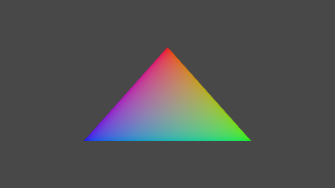

# CMake 예제

*이 샘플은 Microsoft 게임 개발 키트(2022년 3월)와 호환됩니다.*

# 설명

[CMake](https://cmake.org/) 플랫폼 간 빌드 시스템을 사용하여 Ninja 생성기를 통해 Microsoft 게임 개발 키트로 실행 파일을 빌드하는 예제입니다.


*이 샘플의 주요 목적은 Gaming.\*.x64 플랫폼용으로 빌드하는 데 필요한 모든 경로와 설정을 명확하게 문서화하는 것입니다. 이렇게 하면 GDK에 의해 설치된 MSBuild 규칙에서 구현되는 대부분의 기능이 복제됩니다. Visual Studio 생성기를 통해 CMake를 활용하는 다른 방법은 **CMakeGDKExample**을 참조하세요.*.

# 샘플 빌드(Visual Studio)

Visual Studio 2019(16.11) 또는 Visual Studio 2022를 사용하여 "로컬 폴더 열기..."를 선택합니다. 새 프로젝트 대화 상자 또는 "파일 -\> 열기 -\> 폴더..."에서 메뉴 명령을 실행하고 Desktop, XboxOne 또는 Scarlett 폴더를 엽니다.

> 이렇게 하려면 "Windows용 C++ CMake 도구" 구성 요소(`Microsoft.VisualStudio.Component.VC.CMake.Project`)가 설치되어 있어야 합니다.

필요한 경우 **XdkEditionTarget** 변수(CMakePresets.json 또는 CMakeList.txt)를 편집하여 참조된 올바른 GDK 버전이 있는지 확인합니다.

CMake 도구를 열면 캐시가 자동으로 생성되어야 합니다. 그렇지 않으면 CMakeList.txt를 선택하고 오른쪽 단추 메뉴에서 "캐시 생성"을 선택합니다. 그런 다음, "빌드 -\> 모두 다시 빌드" 메뉴 명령을 사용합니다. 빌드 제품은 "**out**" 하위 폴더에 있습니다.

Visual Studio의 CMake에 대한 자세한 내용은 [Microsoft Docs](https://docs.microsoft.com/en-us/cpp/build/cmake-projects-in-visual-studio)를 참조하세요.

기본 설정에는 clang/LLVM을 대신 사용하기 위한 **x64-Debug**, **x64-Release**, **x64-Clang-Debug**, **x64-Clang-Release** 구성이 포함됩니다.

> 이렇게 하려면 "Windows용 C++ Clang 컴파일러"()`Microsoft.VisualStudio.ComponentGroup.NativeDesktop.Llvm.Clang`) 구성 요소가 설치되어 있어야 합니다.

원격 콘솔이 아닌 개발 PC에서 실행하려고 하면 실패합니다. 성공적으로 실행하려면 아래 지침에 따라 프로그램을 배포해야 합니다.*
| | |
|---|---|
|*Xbox One 또는 Xbox Series X|S 프로젝트에서 F5 키를 누르면|

# 샘플 빌드(명령줄)

*VS 2019 또는 2022 개발자 명령 프롬프트*를 사용하여 명령줄에서 생성하고 빌드할 수도 있습니다. 사용 가능한 사전 설정의 전체 목록을 보려면 다음을 사용합니다.

```
cd CMakeExample\Desktop
cmake --list-presets

cd CMakeExample\Scarlett
cmake --list-presets

cd CMakeExample\XboxOne
cmake --list-presets
```


각각의 경우에 적절한 대상 플랫폼을 변경하고 다음을 사용합니다.

```
cmake --preset=x64-Debug
cmake --build out\build\x64-Debug
```


## 문제 해결

*GDK 버전과 일치하도록 CMakePresets.json을 편집해야 할 수 있습니다.*

*다음을 사용하여 CMake 3.20 이상을 사용하고 있는지 확인합니다.*

```
cmake --version
```


# 샘플 사용

샘플을 배포하려면 *Xbox 게임 명령 프롬프트* 인스턴스를 열고 대상의 샘플 디렉터리로 변경합니다.

```
cd CMakeExample\Desktop\out\build\x64-Debug\bin

cd CMakeExample\Scarlett\out\build\x64-Debug\bin

cd CMakeExample\XboxOne\out\build\x64-Debug\bin
```


## 데스크톱 대상 지정

'느슨한 레이아웃'을 실행하려면 다음을 사용합니다.

```
cd bin\x64
CMakeExampleDesktop.exe
```


## Xbox One 또는 Xbox Series X|S 대상 지정

### 푸시 배포

푸시를 수행하려면 '느슨한' 레이아웃을 배포합니다.

```
xbapp deploy Gaming.Xbox.Scarlett.x64
```


-또는-

```
xbapp deploy Gaming.Xbox.XboxOne.x64
```


### Run-from-PC

PC에서 '느슨한' 레이아웃을 실행하려면 다음을 수행합니다.

```
xbapp launch Gaming.Xbox.Scarlett.x64\CMakeExampleScarlett.exe
```


-또는-

```
xbapp launch Gaming.Xbox.XboxOne.x64\CMakeExampleXboxOne.exe
```


## 패키지된 배포

패키지를 만들려면 다음을 수행합니다.

```
makepkg genmap /f chunks.xml /d x64
makepkg pack /f chunks.xml /lt /d x64 /pd . /pc
```


-또는-

```
makepkg genmap /f chunks.xml /d Gaming.Xbox.Scarlett.x64
makepkg pack /f chunks.xml /lt /d Gaming.Xbox.Scarlett.x64 /pd .
```


-또는-

```
makepkg genmap /f chunks.xml /d Gaming.Xbox.XboxOne.x64
makepkg pack /f chunks.xml /lt /d Gaming.Xbox.XboxOne.x64 /pd .
```


그런 다음, 결과 패키지를 콘솔에 설치합니다(정확한 .xvc 파일 이름은 다를 수 있음).

```
xbapp install CMakeExampleXboxOne_1.0.0.0_neutral__zjr0dfhgjwvde.xvc
```


데스크톱의 경우 확장명은 ".msixvc"입니다(정확한 파일 이름은 다를 수 있음).

```
xbapp install CMakeExampleDesktop_1.0.0.0_x64__8wekyb3d8bbwe.msixvc
```


샘플을 실행하면 디바이스 및 swapchain이 만들어지고 색이 지정된 삼각형이 그려집니다. 컨트롤이나 다른 동작은 없습니다.



*다른 버전을 패키징하려면 각 CMakeLIst.txt의 끝에 있는 주석에서 사용할 특정 명령줄 옵션을 참조하세요.*

# 구현 세부 정보

다양한 Visual C++ 스위치에 대한 자세한 내용은 아래 링크를 참조하세요.

| /GR | <https://docs.microsoft.com/en-us/cpp/build/reference/gr-enable-run-time-type-information> |
|---|---|
| /GS<br /> /RTC<br /> /sdl<br /> /DYNAMICBASE<br /> /NXCOMPAT | <https://aka.ms/msvcsecurity> |
| /DEBUG:fastlink | <https://devblogs.microsoft.com/cppblog/faster-c-build-cycle-in-vs-15-with-debugfastlink/> |
| /EHsc | <https://devblogs.microsoft.com/cppblog/making-cpp-exception-handling-smaller-x64/> |
| /fp | <https://docs.microsoft.com/en-us/cpp/build/reference/fp-specify-floating-point-behavior><br /> <https://devblogs.microsoft.com/cppblog/game-performance-improvements-in-visual-studio-2019-version-16-2/> |
| /FS | <https://docs.microsoft.com/en-us/cpp/build/reference/fs-force-synchronous-pdb-writes> |
| /GL<br /> /Gw<br /> /LTCG | <https://devblogs.microsoft.com/cppblog/tag/link-time-code-generation/><br /> <https://devblogs.microsoft.com/cppblog/introducing-gw-compiler-switch/> |
| /Gy | <https://docs.microsoft.com/en-us/cpp/build/reference/gy-enable-function-level-linking> |
| /JMC | <https://devblogs.microsoft.com/cppblog/announcing-jmc-stepping-in-visual-studio/> |
| / permissive- | <https://devblogs.microsoft.com/cppblog/permissive-switch/> |
| /std:c++14 | <https://devblogs.microsoft.com/cppblog/standards-version-switches-in-the-compiler/> |
| /Yc<br /> /Yu<br /> /Fp<br /> /FI | <https://docs.microsoft.com/en-us/cpp/build/creating-precompiled-header-files> <https://devblogs.microsoft.com/cppblog/shared-pch-usage-sample-in-visual-studio/> |
| /Zc:\ _\_cplusplus | <https://devblogs.microsoft.com/cppblog/msvc-now-correctly-reports-__cplusplus/> |
| /Zc: preprocessor | <https://devblogs.microsoft.com/cppblog/announcing-full-support-for-a-c-c-conformant-preprocessor-in-msvc/> |
| /Z7<br /> /Zi<br /> /ZI | <https://docs.microsoft.com/en-us/cpp/build/reference/z7-zi-zi-debug-information-format> |
| /ZH:SHA_256 | <https://learn.microsoft.com/en-us/cpp/build/reference/zh> |
| /guard:cf<br /> /guard:ehcont<br /> /CETCOMPAT | <https://learn.microsoft.com/en-us/cpp/build/reference/guard-enable-control-flow-guard><br /> <https://learn.microsoft.com/en-us/cpp/build/reference/guard-enable-eh-continuation-metadata><br /> <https://learn.microsoft.com/en-us/cpp/build/reference/cetcompat> |

다음 사항에 유의하세요.
[/Gm](https://docs.microsoft.com/en-us/cpp/build/reference/gm-enable-minimal-rebuild)
(최소 다시 빌드)는 더 이상 사용되지 않으며 사용되는 프로젝트에서 제거되어야 합니다.

# 추가 정보

이 샘플의 CMake 프로젝트는 BWOI(Build With/Out 설치)를 사용하는 옵트인 빌드 옵션을 지원합니다. 사용하도록 설정하려면 *BWOIExample*의 extractgdk.cmd 스크립트에서 만든 추출된 Microsoft GDK를 가리키는 ExtractedFolder 환경 변수가 필요합니다. 필요에 따라 추출된 Windows SDK가 있을 수도 있습니다. CMake 프로젝트는 Gaming.\*.x64 MSBuild 플랫폼을 사용하지 않으므로 vctargets.cmd 스크립트의 결과가 필요하지 않습니다.

이 빌드 옵션을 사용하도록 설정하려면 `BUILD_USING_BWOI`을(를) True로 설정합니다. 또는 명령줄을 사용하여 빌드하는 경우 생성 단계에 `-DBUILD_USING_BWOI=ON`을(를) 추가합니다.

자세한 내용은 **BWOIExample**을 참조하세요.

# 버전 기록

| 2023년 2월 | CMake 3.9의 표준 `CMAKE_INTERPROCEDURAL_OPTIMIZATION`.<br />을(를) 위해 사용자 지정 빌드 옵션 BUILD_FOR_LTCG가 제거되었습니다. 새 VS 2022 17.5 스위치용으로 업데이트되었습니다. |
| 날짜 | 참고 |
|---|---|
| 2019년 11월 | 초기 버전. |
| 2020년 2월 | 예제에 HLSL 셰이더 사용을 추가했습니다.<br /> 필요에 따라 BWOI를 지원하도록 업데이트되었습니다. |
| 2020년 4월 | CMake 3.16 이상을 사용할 경우 pch 지원으로 업데이트되었습니다. |
| 2020년 5월 | 2020년 5월 GDK를 지원하도록 업데이트되었습니다. |
| 2020년 6월 | 2020년 6월 GDK FAL 릴리스에 대해 업데이트되었습니다. |
| 2020년 8월 | 병렬 세부 정보로 업데이트되었습니다. |
| 2020년 11월 | Xbox 대상에 대해 xmem.lib 및 xg_*.lib가 추가되었습니다.<br /> CMake 파일을 정리했습니다. |
| 2021년 2월 | CMake 주석에 대한 사소한 업데이트입니다. |
| 2021년 4월 | appnotify.lib를 추가하여 데스크톱 대상의 링크 문제를 해결합니다.<br />LargeLogo.png를 추가합니다. |
| 2021년 6월 | 일반 코드를 정리했습니다. |
| 2021년 8월 | 도구 체인 파일을 개선했습니다. |
| 2021년 10월 | BWOI에 대한 업데이트입니다. |
| 2022년 1월 | VS 2022 지원이 추가되었습니다.<br /> CMake 정리 및 사전 설정 파일이 추가되었습니다. |
| 2022년 10월 | VS 2017 지원이 제거되었습니다.<br />XSAPI에는 XCurl이 필요합니다. PC용 GDK와 호환되는 모든 기타 확장 라이브러리<br />Made Desktop Cmake에 대한 주석 처리된 지원이 추가되었습니다. |
| 2022년 11월 | 2022년 3월 GDK 이상이 필요합니다.<br /> VS 2019 16.10 이하 버전의 지원 수명 주기가 종료되었으므로 이제 CMake 3.20을 요청하도록 업데이트되었습니다. |
| 2022년 12월 | 간단한 데스크톱 시나리오는 사용자 지정 &lsquo;Gaming.Desktop.x64&rsquo;<br />가 아닌 &lsquo;x64&rsquo; 플랫폼 스타일을 사용하여 .cmake 파일을 자체 하위 폴더로 재구성합니다. |
| 2023년 3월 | Playfab.Services.C 확장 라이브러리의 새 대상을 추가하도록 업데이트되었습니다. |
| 2023년 6월 | 기본 동작이 VS 2019에서 바뀌었기 때문에 Xbox One 타이틀은 VS 2022 이상에서 `/d2vzeroupper-`을(를) 사용해야 합니다. |
| 2023년 10월 | 이제 Microsoft GDK에는 Windows 11 SDK(22000) 이상 버전이 필요합니다. |


