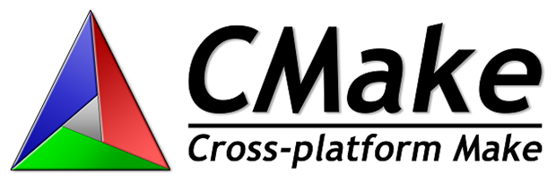
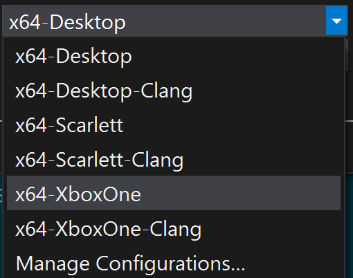
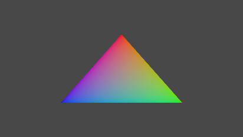

# CMake GDK Example

*This sample is compatible with the Microsoft Game Development Kit (March 2022)*

# Description

This is an example of using the [CMake](https://cmake.org/)
cross-platform build system to build an executable with the Microsoft
Game Development Kit via the Visual Studio generator.



*This sample demonstrates how to use CMake to generate Gaming.\*.x64
platform VC++ project files that use the Microsoft GDK to build.* *For
an alternative method of utilizing CMake via the Ninja generator, see
**CMakeExample**.*

# Building the sample (Visual Studio)

Using Visual Studio 2022 select "Open a local folder..." from
the New Project Dialog or the "File -\> Open -\> Folder..." menu command
and open the sample folder.

> This requires that you have the "C++ CMake tools for Windows" component (`Microsoft.VisualStudio.Component.VC.CMake.Project`) installed.

If needed, edit the **XdkEditionTarget** variable (either in the
CMakePresets.json or gxdk_toolchain.cmake / gxdk_xs_toolchain.cmake) to
ensure you have the correct GDK edition referenced.

The CMake tool should generate the cache automatically upon opening.
Otherwise select the CMakeList.txt and select "Generate Cache" from the
right-button menu. Then use the "Build -\> Rebuild All" menu command.

Choose which platform to build for in the combo box which will be
populated as follows using VS 2022 [CMake Preset
integration](https://devblogs.microsoft.com/cppblog/cmake-presets-integration-in-visual-studio-and-visual-studio-code/):



See [Microsoft
Docs](https://docs.microsoft.com/en-us/cpp/build/cmake-projects-in-visual-studio)
for more information on CMake in Visual Studio.

> If using Visual Studio 2022, edit CMakePresets.json to change this line from:

```
"generator": "Visual Studio 17 2022",
```

to:

```
"generator": "Visual Studio 17 2022",
```

# Building the sample (command-line)

You can also generate and build from the command line using a *VS x64
Native Developer Command Prompt*. For a complete list of available
presets, use:

```
cd CMakeGDKExample
cmake --list-presets
```

##

## Targeting Desktop

```
cmake --preset=x64-Desktop
cmake --build out\build\x64-Desktop
```

## Targeting Xbox Series X|S

```
cmake --preset=x64-Scarlett
cmake --build out\build\x64-Scarlett
```

## Targeting Xbox One

```
cmake --preset=x64-XboxOne
cmake --build out\build\x64-XboxOne
```

## Troubleshooting

*You may need to edit the CMakePresets.json to match your GDK edition.*

*For VS 2022, change the generator to "Visual Studio 17 2022".*

*Verify you are using CMake 3.20 or later with:*

```
cmake --version
```

# Using the sample (Visual Studio)

Open the generated SLN/VCXPROJ for your desired target from another
instance of Visual Studio:

```
CMakeGDKExample\out\build\x64-Desktop\CMakeGDKExample.sln
```

```
CMakeGDKExample\out\build\x64-Scarlett\CMakeGDKExample.sln
```

```
CMakeGDKExample\out\build\x64-XboxOne\CMakeGDKExample.sln
```

Then use F5 to deploy/run.

*If you press F5 from the original CMakeLists.txt context, then it will
fail to start because the loose layout is not placed inside the 'bin'
directory. For Gaming.Xbox.\*.x64 configurations, it also is attempting
to run on the development PC and not the remote console.*

# Using the sample (command-line)

To deploy the sample, open an *Xbox Gaming Command Prompt* instance and
change to the sample directory:

## Targeting Desktop

To run the 'loose' build, go to:

```
cd CMakeGDKExample\out\build\x64-Desktop\bin\x64\Debug
```

For Desktop packaging:

```
cd CMakeGDKExample\out\build\x64-Desktop
```

Edit ``bin\x64\Debug\MicrosoftGame.config`` to add the
``TargetDeviceFamily``.

```
<ExecutableList>
  <Executable Name="CMakeGDKExample.exe" TargetDeviceFamily="PC" Id="Game" />
</ExecutableList>
```

```
makepkg genmap /f chunks.xml /d bin\x64\Debug
makepkg pack /pc /f chunks.xml /lt /d bin\x64\Debug /pd .
```

## Targeting Xbox One or Xbox Series X|S

```
cd CMakeGDKExample\out\build\x64-Scarlett\Gaming.Xbox.Scarlett.x64
```

```
cd CMakeGDKExample\out\build\x64-XboxOne\Gaming.Xbox.XboxOne.x64
```

### Push deploy

To do push deploy the 'loose' layout:

```
xbapp deploy Layout\Image\Loose
```

### Run-from-PC

To run the 'loose' layout from the PC:

```
xbapp launch Layout\Image\Loose\CMakeGDKExample.exe
```

### Packaged deployment

Edit the ``Layout\Image\Loose\Microsoft.Config` to add a TargetDeviceFamily element:

```
<ExecutableList\>
  <Executable Name="CMakeGDKExample.exe" TargetDeviceFamily="Scarlett" Id="Game" />
</ExecutableList>
```

-or-

```
<ExecutableList>
  <Executable Name="CMakeGDKExample.exe" TargetDeviceFamily="XboxOne" Id="Game" />
</ExecutableList\>
```

To create a package:

```
makepkg genmap /f chunks.xml /d Layout\Image\Loose
makepkg pack /f chunks.xml /lt /d Layout\Image\Loose /pd .
```

Then install the resulting package to your console (the exact .xvc
filename may vary)

```
xbapp install CMakeGDKExample_1.0.0.0_neutral__8wekyb3d8bbwe_x.xvc
```

The sample when run creates a device and swapchain, and draws a colored
triangle. It has no controls or other behavior.



# Implementation Details

The **CMakeExample** uses the "Ninja" generator so does not make use of
the Microsoft GDK MSBuild rules. This version uses the "Visual Studio 17 2022 Win64"
generator instead which makes use of the Microsoft GDK MSBuild instructions.

The CMake generation makes use of a toolchain file passed as a
command-line:

| Platform | CMake Toolchain |
|-----------------------|----------------------------------------------|
| x64  |  `-DCMAKE_TOOLCHAIN_FILE="grdk_toolchain.cmake"` |
| Gaming.Xbox.XboxOne.x64 |  `-DCMAKE_TOOLCHAIN_FILE="gxdk_toolchain.cmake"` |
| Gaming.Xbox.Scarlett.x64 |  `-DCMAKE_TOOLCHAIN_FILE="gxdk_xs_toolchain.cmake"` |

All three of these also make use of a custom MSBuild property file
gdk_build.props.

The use of the Gaming.\*.x64 MSBuild rules with the GDK handles the
MicrosoftGame.Config localization, placing the CRT files into the
layout, etc.

CMake can't leverage the `FXCCompile` MSBuild target for shaders, so
CMakeLists.txt runs DXC as a custom target. The toolchain is responsible
for finding the correct version of the shader compile, which is why the
gxdk_toolchain.cmake and gxdk_xs_toolchain.cmake need the
**XdkTargetEdition** variable.

In order to support *Build Without Install* (BWOI) with the resulting
CMake, you need (a) to explicitly set **GDK_DXCTool** to point to the
proper DXC.EXE for the platform you are building, and (b) to make use of
the Directory.Build.props solution detailed in the **BWOIExample**
sample since the CMake-generated vcxproj uses the MSBuild rules for the
Microsoft GDK. The Directory.Build.props file needs to be present and
the environment properly setup when *generating* the CMake as well as
building the resulting SLN/VCXPROJ.

When generating from the command line using BWOI, you can specify
**GDK_DXCTool** by adding -DGDK_DXCTool=\<path\>, where \<path\> takes
the form ``<path to GDK>\<edition number>\GXDK\bin\<console>\dxc.exe``. For example:

```
-DGDK_DXCTool="d:\xtrctd.sdks\BWOIExample\Microsoft GDK\210600\GXDK\bin\XboxOne\dxc.exe".
```

## Side-by-side toolsets

Per the [Visual C++
blog](https://devblogs.microsoft.com/cppblog/side-by-side-minor-version-msvc-toolsets-in-visual-studio-2019/),
you can use older versions of the compiler toolset with the newer
version of the Visual Studio IDE. In CMakeLists.txt, you can also
specify this via **set_property**.

```
set_property(TARGET ${PROJECT_NAME} PROPERTYb VS_GLOBAL_ClearDevCommandPromptEnvVars "false")

set_property(TARGET ${PROJECT_NAME} PROPERTY VS_GLOBAL_VCToolsVersion "14.20.27508")
```

# Version History

|Date|Notes|
|---|---|
|April 2020|Initial release of this version of CMake sample.|
|June 2020|Updated for the 2006 GDK FAL release.|
|August 2020|Add explicitly set VS startup project.<br /> Updated with side-by-side details.|
|November 2020|Extension libraries require explicitly references to .lib files.<br /> Add xmem.lib and xg_*.lib to link for Gaming.Xbox.*.x64.|
|February 2021|Fix for x64 deployment.|
|April 2021|Add appnotify.lib to resolve link issues with x64.<br />Add LargeLogo.png.|
|June 2021|Fixed bug to explicitly set edition number in generated vcxproj for side-by-side scenarios.<br />General code cleanup.|
|August 2021|Improvements for toolchain files.<br />Additional notes for BWOI scenarios.|
|October 2021|Further notes for BWOI scenarios.|
|January 2022|Added VS 2022 support.<br />CMake cleanup and added Presets file.|
|October 2022|Removed VS 2017 support.<br />Fixed bugs with the CmakePresets.json|
|November 2022|Requires March 2022 GDK or later as it’s now using the .mgc file extension.<br /> Updated to require CMake 3.20 now that VS 2019 16.10 and earlier are out of their support lifecycle.|
|March 2023|Updated to add new target for Playfab.Services.C extension library.|
|January 2024|Fixed issue with non-Debug configurations using /RTC1.|
|June 2024|Update Whole Program Optimization support.|
|October 2024|Updated for changes to Extension Libraries directory layout.<br /> CMake 3.30 fixed the generation of UseDebugLibraries which is more robust than my workaround.|
|February 2025|Updated to use `XBOX_CONSOLE_TARGET` variable with 'xboxone' or 'scarlett' to match VCPKG.|
|April 2025|Updated for CMake 3.31 add_custom_command warning.|
|October 2025|Updated for 2510 GDK and new layout, replacing `Gaming.Desktop.x64` with `x64`|
