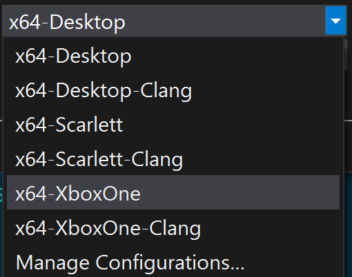

# CMake GDK の例

*このサンプルは Microsoft Game Development Kit (2020 年 6 月)
と互換性があります。*

# 説明

これは、 [CMake](https://cmake.org/) クロスプラットフォーム ビルド
システムを使用して、Visual Studio ジェネレーターを介して Microsoft Game
Development Kit で実行可能ファイルをビルドする例です。

*このサンプルでは、CMake を使用して、Microsoft GDK を使用してビルドする
Gaming.\*.x64 プラットフォーム VC++ プロジェクト
ファイルを生成する方法を示します。**Ninja ジェネレーターを介して CMake
を使用する別の方法については、*「***CMakeExample***」*を参照してください*。

# サンプルのビルド (Visual Studio)

Visual Studio 2019 または 2022 を使用して、\[新しいプロジェクト\]
ダイアログまたは \[ファイル\] -\> \[開く\]　-\> \[フォルダー...\]
メニュー コマンドから \[ローカル フォルダーを開く...\]
を選択し、\[サンプル\] フォルダーを開きます。

-   これには、"C++ CMake tools for Windows" コンポーネント
    (Microsoft.VisualStudio.Component.VC.CMake.Project)
    がインストールされている必要があります。

必要に応じて、 **XdkEditionTarget** 変数 (CMakePresets.json
またはgxdk_toolchain.cmake / gxdk_xs_toolchain.cmake) を編集して、正しい
GDK エディションが参照されていることを確認します。

CMake
ツールは開くと、自動的にキャッシュを生成されます。それ以外の場合は、CMakeList.txt
を選択し、右ボタン メニューから \[キャッシュの生成\]
を選択します。次に、\[ビルド\] -\> \[すべてリビルド\] メニュー
コマンドを使用します。

コンボ ボックスでビルドするプラットフォームを選択します ( [CMake
プリセット統合](https://devblogs.microsoft.com/cppblog/cmake-presets-integration-in-visual-studio-and-visual-studio-code/)をサポートする
VS 2019 (16.10) 以降を使用している場合は、次のように設定されます)。

Visual Studio の CMake の詳細については、「[Microsoft
Docs](https://docs.microsoft.com/en-us/cpp/build/cmake-projects-in-visual-studio)」を参照してください。

-   Visual Studio 2022 を使用している場合は、 CMakePresets.json
    を編集して次の行を変更します。

> \"generator\":\"Visual Studio 16 2019\",
>
> 変更後:
>
> \"generator\":\"Visual Studio 17 2022\",

# サンプルのビルド (コマンド ライン)

*VS x64 Native 開発者コマンド プロンプト*を使用して、コマンド
ラインから生成およびビルドすることもできます。

cd CMakeGDKExample

cmake . -B out -DXdkEditionTarget=220300
-DCMAKE_TOOLCHAIN_FILE=.\\gxdk_toolchain.cmake

cmake \--build out

CMake プリセットも提供されます (CMake 3.19 以降が必要です)。

cmake \--list-presets

cmake \--preset=x64-XboxOne

cmake \--build out\\build\\x64-XboxOne

# サンプルの使用 (Visual Studio)

Visual Studioの別のインスタンスから生成された SLN/VCXPROJ を開きます。

CMakeGDKExample\\out\\build\\x64-XboxOne\\CMakeGDKExample.sln

CMake 3.17
以前を使用している場合は、まず構成マネージャーを使用して、*CMakeGDKExample*
プロジェクトの \[配置\] チェック ボックスをオンにします。

次に、F5 キーを使用してデプロイ/実行します。

*元の CMakeLists.txt コンテキストから F5 キーを押すと、緩いレイアウトが
'bin'
ディレクトリ内に配置されないため、開始に失敗します。Gaming.Xbox.\*.x64
構成の場合は、リモート 本体ではなく開発用 PC
でも実行しようとしています。*

# サンプルの使用 (コマンド ライン)

サンプルを展開するには、 *Xbox ゲーム コマンド プロンプト*
インスタンスを 開き、次のサンプル ディレクトリに変更します。

cd
CMakeGDKExample\\out\\build\\x64-XboxOne\\bin\\Gaming.Xbox.XboxOne.x64

デスクトップの場合、緩いレイアウトは bin\\Gaming.Desktop.x64\\Debug
にあります

### プッシュ配置

'ルース' レイアウトをプッシュ配置するには:

xbapp deploy Layout\\Image\\Loose

### PC から実行

PC から'ルース' レイアウトを実行するには:

xbapp launch Layout\\Image\\Loose\\CMakeGDKExample.exe

### パッケージ化された展開

Layout\\Image\\Loose\\Microsoft.Config を編集して TargetDeviceFamily
要素 ("PC"、Scarlett"、"XboxOne"") を追加します。

\<ExecutableList\>

\<Executable Name=\"CMakeGDKExample.exe\"

**TargetDeviceFamily=\"XboxOne\"**

Id=\"Game\" /\>

\</ExecutableList\>

パッケージ ファイルを作成します。

makepkg genmap /f chunks.xml /d Layout\\Image\\Loose

makepkg pack /f chunks.xml /lt /d Layout\\Image\\Loose /pd .

その後、結果のパッケージを本体にインストールします (正確な .xvc
ファイル名は異なる場合があります)。

xbapp install CMakeGDKExample_1.0.0.0_neutral\_\_8wekyb3d8bbwe_x.xvc

デスクトップ パッケージの場合:

makepkg genmap /f chunks.xml /d bin\\Gaming.Desktop.x64\\Debug

makepkg pack /pc /f chunks.xml /lt /d bin\\Gaming.Desktop.x64\\Debug /pd
.

実行時のサンプルでは、デバイスとスワップチェーンが作成され、色付きの三角形が描画されます。コントロールやその他の動作はありません。

*Xbox Series X|S または Xbox Release
のバージョンをパッケージ化するには、プラットフォームと構成の正しいディレクトリに変更します。*

# 実装の詳細

**CMakeExample は** "Ninja" ジェネレーターを使用するため、Microsoft GDK
MSBuild ルールを使用しません。このバージョンでは、 "Microsoft GDK
MSBuild 命令を使用する代わりに、Visual Studio 16 2019 Win64"
ジェネレーターを使用します。

CMake 生成では、コマンド ラインとして渡されるツールチェーン
ファイルが使用されます。

| Gaming.Desktop.x64  |  -DC MAKE_TOOLCHAIN_FILE=\"grdk_toolchain.cmake\" |
|-----------------------|----------------------------------------------|
| Ga ming.Xbox.XboxOne.x64 |  -DC MAKE_TOOLCHAIN_FILE=\"gxdk_toolchain.cmake\" |
| Gam ing.Xbox.Scarlett.x64 |  -DCMAK E_TOOLCHAIN_FILE=\"gxdk_xs_toolchain.cmake\" |

これら 3 つはすべて、カスタム MSBuild プロパティ ファイル
gdk_build.props も使用します。

GDK で Gaming.\*.x64 MSBuild ルールを使用すると、MicrosoftGame.Config
のローカライズ、CRT ファイルのレイアウトへの配置などが処理されます。

CMake ではシェーダーに FXCCompile MSBuild ターゲットを利用できないため、
CMakeLists.txt はカスタム ターゲットとして DXC
を実行します。ツールチェーンはシェーダー
コンパイルの正しいバージョンを見つける役割を担います。そのため、
gxdk_toolchain.cmake と gxdk_xs_toolchain.cmake には **XdkTargetEdition
変数が** 必要です。

結果の CMake で *Build Without Install* (BWOI) をサポートするには、(a)
ビルドするプラットフォームに適切な DXC.EXE を指すように明示的に
**GDK_DXCTool** を設定し、(b) **BWOIExample**
サンプルで詳しく説明されている Directory.Build.props
ソリューションを使用する必要があります。これは、CMake で生成された
vcxproj が Microsoft GDK の MSBuild
規則を使用するためです。Directory.Build.props ファイルが存在し、CMake
の*生成*時に環境が適切にセットアップされ、結果の SLN/VCXPROJ
がビルドされている必要があります。

BWOI を使用してコマンド ラインから生成する場合は、-DGDK_DXCTool=\<path\>
を追加することで **GDK_DXCTool** を指定できます。ここで、\<path\>
は、\<path to GDK\>\\\<edition number\>\\GXDK\\bin\\\<XboxOne or
Scarlett\>\\dxc.exe の形式になります。例:

-DGDK_DXCTool=\"d:\\xtrctd.sdks\\BWOIExample\\Microsoft
GDK\\210600\\GXDK\\bin\\XboxOne\\dxc.exe\".

## サイド バイ サイド ツールセット

[Visual C++
ブログ](https://devblogs.microsoft.com/cppblog/side-by-side-minor-version-msvc-toolsets-in-visual-studio-2019/)では、旧バージョンのコンパイラ
ツールセットを新しいバージョンの Visual Studio IDE
と共に使用できます。CMake の場合は、 **CMakeSettings.json**
を使用してこれを行います。たとえば、VS 2019 (16.0)
バージョンのコンパイラを使用する場合は、次を追加します。

\"environment\":

\[

{

\"ClearDevCommandPromptEnvVars\": \"false\",

\"VCToolsVersion\":\"14.20.27508\"

}

\],

Visual Studio統合を使用していない間に CMake と VS Generator
を直接使用する場合は、
**set_property**を使用してこれを指定することもできます。

set_property(TARGET \${PROJECT_NAME} PROPERTY
VS_GLOBAL_ClearDevCommandPromptEnvVars \"false\")

set_property(TARGET \${PROJECT_NAME} PROPERTY VS_GLOBAL_VCToolsVersion
\"14.20.27508\")

# バージョン履歴

