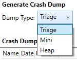

  

#   DumpTool Sample

*This sample is compatible with the Microsoft Game Development Kit (March 2022)*

# Description

DumpTool runs in the same OS partition as the Xbox One Title and
generates a crash dump for another process that you specify by name as
an argument to the tool. You can compile the tool for immediate use, or
you can borrow from the source code to add crash dump capabilities to
your own tool(s) or your title.

# Building the sample

If using Xbox Series X|S, you need to add Gaming.Xbox.Scarlett.x64
platform configurations to the project. You can do this via the
*Configuration Manager*: Select under \"Active solution platform\" the
option \"Configuration Manager\" and then select \"New\...\". Set \"Type
or select the new platform\" to Gaming.Xbox.Scarlett.x64 and \"Copy
settings from\" to Gaming.Xbox.XboxOne.x64. Then select OK.

*For more information, see* __Running samples__, *in the GDK documentation.*

# Using the sample

DumpTool compiles as a Title Mode Console Application (See also on [MSDN
Whitepapers](https://developer.xboxlive.com/en-us/platform/development/education/Documents/Title%20Mode%20Console%20Applications.aspx).)
Deploying .exe to the console using Visual Studio will shut down any
running application, so you will have to build the .exe and then copy to
the console and then run it, in multiple steps:

1.  Build the tool in Visual Studio to produce DumpTool.exe

2.  Launch your title (or e.g. the SimpleTriangle sample)

3.  Copy DumpTool.exe to the game OS partition

```
xbcp /x/title Gaming.Xbox.x64\Layout\Image\Loose\*.exe xd:\DumpTool\
xbcp /x/title Gaming.Xbox.x64\Layout\Image\Loose\*.dll xd:\DumpTool\
```

4.  Run the tool to collect a triage dump for SimpleTriangle.exe

```
xbrun /x/title /O d:\DumpTool\DumpTool.exe -pdt:triage SimpleTriangle.exe
```

5.  Copy the .dmp file back to the development PC for debugging

```
xbcp /x/title xd:\SimpleTriangle.dmp
```

The DumpTool project includes a simple batch file, runCommand.bat, which
automates the first four steps and makes it easy to test code changes.

## DumpTool Command Line

DumpTool also supports a rich set of command line options:

```
Usage: DumpTool [-mdt:<minidump type> ...] [-pdt:<predefined type>] <executable name>

  <minidump type>: Normal WithDataSegs WithFullMemory WithHandleData
        FilterMemory ScanMemory WithUnloadedModules
        WithIndirectlyReferencedMemory FilterModulePaths
        WithProcessThreadData WithPrivateReadWriteMemory
        WithoutOptionalData WithFullMemoryInfo WithThreadInfo
        WithCodeSegs WithoutAuxiliaryState
        WithFullAuxiliaryState WithPrivateWriteCopyMemory
        IgnoreInaccessibleMemory WithTokenInformation
        WithModuleHeaders FilterTriage

<predefined type>: heap mini micro triage native
```

\<minidump type\>s correspond to the values of the MINIDUMP_TYPE
enumeration that you find documented on
[GDNP](https://developer.xboxlive.com/en-us/platform/development/documentation/software/Pages/MINIDUMP_TYPE_typedef___dbghelp_Xbox_Microsoft_T_may17.aspx)
and
[MSDN](https://msdn.microsoft.com/en-us/library/windows/desktop/ms680519(v=vs.85).aspx).
Combine different values of MINIDUMP_TYPE by specifying multiple
instances of --mdt: on the command line. Notice that there are a lot of
possibilities! To make things simpler, the tool also provides the --pdt
option.

The "predefined type" (-pdt) options exist to simplify the MINIDUMP_TYPE
flags that you would normally have to supply individually using the -mdt
option. The predefined types correspond to the crash dump types that are
supported by xbWatson.exe:



Examples:

```
xbrun /x/title /O d:\\DumpTool\\DumpTool.exe -pdt:triage SimpleTriangle.exe
```

```
xbrun /x/title /O d:\DumpTool\DumpTool.exe -pdt:Mini SimpleTriangle.exe
```

```
xbrun /x/title /O d:\DumpTool\DumpTool.exe -pdt:Heap SimpleTriangle.exe
```

Notice that the tool also provides "micro" and "native". Please see the
source code for the exact combination of flags that correspond to those
values. If you are not familiar with **MiniDumpWriteDump()** then start with
the predefined dump flags and then experiment with additional flags as
needed. The tool should easily facilitate this experimentation as it
will allow both `--pdt` and `--mdt` at the same time and will combine the
flags:

```
xbrun /x/title /O d:\\DumpTool\\DumpTool.exe --pdt:micro --mdt:WithHandleData --mdt:WithUnloadedModules SimpleTriangle.exe
```

## Deploying your Tool

If you plan to use DumpTool (or some variation) with your title, then
consider adding the tool to your game's deployment so that you don't
have to copy it to the game OS. The tool then provides a convenient way
to generate a crash dump without disrupting the running title in any
other way.

# Implementation notes

-   It is also possible to call **MiniDumpWriteDump()** directly from your
    executable's code. For example, many developers add this
    functionality to their unhandled exception filter. Here is a very
    simple example call to MiniDumpWriteDump.

```
MiniDumpWriteDump(
  GetCurrentProcess(),
  GetProcessId(GetCurrentProcess()), hDumpFile, mdt, nullptr, nullptr,
  nullptr);
```

-   The GSDK also ships with a lightweight tool, called
    [xbWatson](https://developer.xboxlive.com/en-us/platform/development/documentation/software/Pages/xbwatson_may17.aspx),
    which can be used to capture a crashdump. The functionality in
    DumpTool is equivalent to the Crash Dumps feature in xbWatson. Note
    that you don't need to perform any additional deployment step to use
    xbWatson.

-   You can use Visual Studio to capture a crash dump as well. Look for
    the "Save dump as..." option in the Debug menu. Note that this
    option appears once you have attached to the process and will become
    active when you pause ("break all".)

# Known issues

Make sure to open your file with both `GENERIC_WRITE` and `GENERIC_READ`
before calling **MiniDumpWriteDump**, otherwise the resulting .dmp file may
be corrupt.

# Update history

Initial release April 2019.
