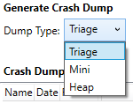

# DumpTool 示例

*此示例可用于 Microsoft 游戏开发工具包 (2022 年 3 月)*

# 说明

DumpTool 在与 Xbox One 游戏相同的操作系统分区中运行，并为按名称指定的另一个进程生成故障转储，作为工具的参数。 可以编译该工具以供立即使用，也可以从源代码中借用，以便将崩溃转储功能添加到你自己的工具或你的游戏中。

# 生成示例

项目的平台配置。 可以通过*配置服务器*执行此操作：在\&ldquo;活动解决方案平台\&rdquo;下选择选项\&ldquo;配置服务器\&rdquo;，然后选择\&ldquo;新建\...\&rdquo;。 将\&ldquo;键入或选择新平台\&rdquo;设置为 Gaming.Xbox.Scarlett.x64，将\&ldquo;将设置从\&rdquo;设置为 Gaming.Xbox.XboxOne.x64。 然后选择&ldquo;确定&rdquo;。 *有关详细信息，请参阅*__运行示例__，详见*GDK 文档。*
| | |
|---|---|
|如果使用 Xbox Series X|S，则需要添加 Gaming.Xbox.Scarlett.x64|


# 使用示例

DumpTool 编译为游戏模式控制台应用程序（另请参阅 [MSDN 白皮书](https://developer.xboxlive.com/en-us/platform/development/education/Documents/Title%20Mode%20Console%20Applications.aspx)。） 使用 Visual Studio 将 .exe 部署到控制台将关闭任何正在运行的应用程序，因此必须生成 .exe，然后复制到控制台，然后在多个步骤中运行它：

1. 在 Visual Studio 中生成工具以生成 DumpTool.exe

2. 启动游戏（或 SimpleTriangle 示例）

3. 将 DumpTool.exe 复制到游戏 OS 分区

```
xbcp /x/title Gaming.Xbox.x64\Layout\Image\Loose\*.exe xd:\DumpTool\
xbcp /x/title Gaming.Xbox.x64\Layout\Image\Loose\*.dll xd:\DumpTool\
```


4. 运行该工具以收集 SimpleTriangle.exe 的会审转储

```
xbrun /x/title /O d:\DumpTool\DumpTool.exe -pdt:triage SimpleTriangle.exe
```


5. 将 .dmp 文件复制回开发电脑进行调试

```
xbcp /x/title xd:\SimpleTriangle.dmp
```


DumpTool 项目包括一个简单的批处理文件 runCommand.bat，它将自动执行前四个步骤，并使测试代码更改变得容易。

## DumpTool 命令行

DumpTool 还支持一组丰富的命令行选项：

```
Usage: DumpTool [-mdt:<minidump type> ...] [-pdt:<predefined type>] <executable name>

  <minidump type>: Normal WithDataSegs WithFullMemory WithHandleData
        FilterMemory ScanMemory WithUnloadedModules
        WithIndirectlyReferencedMemory FilterModulePaths
        WithProcessThreadData WithPrivateReadWriteMemory
        WithoutOptionalData WithFullMemoryInfo WithThreadInfo
        WithCodeSegs WithoutAuxiliaryState
        WithFullAuxiliaryState WithPrivateWriteCopyMemory
        IgnoreInaccessibleMemory WithTokenInformation
        WithModuleHeaders FilterTriage

<predefined type>: heap mini micro triage native
```


\<minidump 类型\> 对应于你在以下内容上找到的 MINIDUMP_TYPE 枚举的值
[GDNP](https://developer.xboxlive.com/en-us/platform/development/documentation/software/Pages/MINIDUMP_TYPE_typedef___dbghelp_Xbox_Microsoft_T_may17.aspx)
和 [MSDN](https://msdn.microsoft.com/en-us/library/windows/desktop/ms680519(v=vs.85).aspx)。 通过在命令行上指定 --mdt: 的多个实例，合并 MINIDUMP_TYPE 的不同值。 请注意，有很多可能性！ 为了简化操作，该工具还提供了 --pdt 选项。

存在&ldquo;预定义类型&rdquo;(-pdt) 选项以简化通常必须使用 -mdt 选项单独提供MINIDUMP_TYPE标志。 预定义类型对应于 xbWatson.exe 支持的故障转储类型：



示例：

```
xbrun /x/title /O d:\\DumpTool\\DumpTool.exe -pdt:triage SimpleTriangle.exe
```


```
xbrun /x/title /O d:\DumpTool\DumpTool.exe -pdt:Mini SimpleTriangle.exe
```


```
xbrun /x/title /O d:\DumpTool\DumpTool.exe -pdt:Heap SimpleTriangle.exe
```


请注意，该工具还提供&ldquo;micro&rdquo;和&ldquo;native&rdquo;。 有关与这些值对应的标志的精确组合，请参阅源代码。 如果不熟悉 **MiniDumpWriteDump()**，请先使用预定义的转储标志，然后根据需要尝试其他标志。 该工具应轻松地促进此试验，因为它将允许 `--pdt` 和 `--mdt` 同时使用，并将合并标志：

```
xbrun /x/title /O d:\\DumpTool\\DumpTool.exe --pdt:micro --mdt:WithHandleData --mdt:WithUnloadedModules SimpleTriangle.exe
```


## 部署工具

如果计划对游戏使用 DumpTool（或某种变体），请考虑将该工具添加到游戏的部署中，这样就不必将其复制到游戏操作系统。 然后，该工具提供了一种在不以任何其他方式中断正在运行的游戏的情况下生成故障转储的便捷方法。

# 实现说明

- 也可以直接从可执行文件的代码调用 **MiniDumpWriteDump()**。 例如，许多开发人员将此功能添加到其未经处理的异常筛选器。 下面是一个非常简单的 MiniDumpWriteDump 示例调用。

```
MiniDumpWriteDump(
  GetCurrentProcess(),
  GetProcessId(GetCurrentProcess()), hDumpFile, mdt, nullptr, nullptr,
  nullptr);
```


- GSDK 还附带了一个名为 [xbWatson](https://developer.xboxlive.com/en-us/platform/development/documentation/software/Pages/xbwatson_may17.aspx) 的轻型工具，可用于捕获故障转储。 DumpTool 中的功能等效于 xbWatson 中的故障转储功能。 请注意，无需执行任何其他部署步骤即可使用 xbWatson。

- 也可以使用 Visual Studio 捕获故障转储。 查找&ldquo;将转储另存为...&rdquo;&ldquo;调试&rdquo;菜单中的选项。 请注意，此选项在附加到进程后显示，并且在暂停时将变为活动状态（&ldquo;全部中断&rdquo;。）

# 已知问题

请确保在调用 **MiniDumpWriteDump** 之前`GENERIC_WRITE`和`GENERIC_READ`同时打开文件，否则生成的 .dmp 文件可能已损坏。

# 更新历史记录

2019 年 4 月初始版本。


