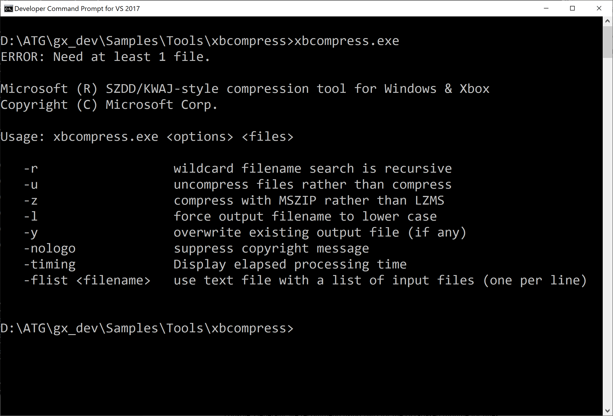

# xbcompress 샘플

*이 샘플은 Microsoft 게임 개발 키트(2020년 11월)와 호환됩니다.*

# 설명

이 샘플에서는 모든 Gaming.\*.x64 플랫폼에서 지원되는 Windows 8과 함께
도입된 [압축
API](https://docs.microsoft.com/en-us/windows/win32/cmpapi/-compression-portal)를
보여 줍니다.

매개 변수 없이 도구를 실행하면 다음과 같이 도움말 화면이 표시됩니다.

# 샘플 빌드

단순 명령줄 도구로, *게임 명령 프롬프트*를 사용하여 바로 빌드할 수
있습니다.

cl /EHsc /D_WIN32_WINNT=0x0A00 /Ox /MT compresstool.cpp
/Fexbcompress.exe xgameplatform.lib

CMake 3.15 이상을 사용할 수 있습니다.

cmake -B out .

cmake --build out

CMake 사전 설정도 있습니다(CMake 3.19에서 도입됨).

cmake \--list-presets

cmake \--preset=x64-Debug

cmake \--build out\\build\\x64-Debug

또는 VS IDE에서 CMakeLists.txt를 열 수 있습니다(CMake 3.15 통합에는 VS
2019 16.3 이상이 필요함).

-   정적 Visual C++ 런타임으로 빌드하여 도구가 콘솔에 대한 "xbcp 배포"에
    사소하게 만듭니다. 일반적으로 타이틀의 DLL 기반 런타임에는 /MD를
    사용하는 것이 좋습니다.

-   이 명령줄 도구에서 사용하는 API는 onecore_apiset.lib,
    xgameplatform.lib, WindowsApp.lib에 있습니다. 이 경우 PC와 Xbox
    모두에 onecore_apiset.lib 우산 라이브러리를 안전하게 사용할 수
    있습니다(CMake가 구성된 방식). 타이틀에는 다른 우산 라이브러리 또는
    kernel32.lib 대신 xgameplatform.lib를 사용하는 것이 좋습니다.

-   onecore_apiset.lib 대신 cabinet.lib와 연결하는
    \_WIN32_WINNT=0x0602(Windows 8) 또는 \_WIN32_WINNT=0x0603(Windows
    8.1)을 사용하여 이 도구를 빌드할 수 있습니다. Windows 7 이전
    버전에서는 압축 API를 지원하지 않습니다.

# 사용

*이 도구는 테스트 자동화, 샘플, 시연, 초고속 프로토타입 등 최소한의
종속성을 갖춘 필요한 빠르고 간단한 CPU 기반 압축 솔루션 개발
시나리오용입니다. **소매 콘텐츠 시나리오의 경우 DirectStorage, BCPack,
타사 라이브러리, 기존 'file-system-in-a-file' 솔루션 등 훨씬 더 적합한
다양한 옵션이 있습니다.***

이 샘플은 Windows 10 호스트 PC, Xbox 시스템 운영 체제, Xbox Game 운영
체제와 호환되는 간단한 명령줄 도구입니다. 파일을 압축하거나 압축
해제하는 데 사용할 수 있습니다.

xbcompress.exe mylargefile.bin

-또는-

xbcp /x/title xbcompress.exe xd:\\

xbrun /x/title /O d:\\xbcompress.exe d:\\mylargefile.bin

이렇게 하면 'mylargefile.bi\_'가 현재 디렉터리 또는 D:\\ 디렉터리에
기록됩니다. 기본적으로 이 파일은 LZMS 압축을 사용하여 압축됩니다.

파일을 확장하려면 **/u** 스위치를 사용합니다.

xbcompress /u mylargefile.bi\_

-또는-

xbrun /x/title /O d:\\xbcompress.exe /u d:\\mylargefile.bi\_

이렇게 하면 'mylargefile.bin'이 현재 디렉터리 또는 D:\\에 기록됩니다.

LZMS 압축 체계는 크기가 2MB를 초과하는 파일에 적합합니다. 조금 더 적은
압축 크기로 조금 더 빠른 압축 속도를 원하는 경우 **/z** 스위치를
사용하여 MSZIP로 대신 압축할 수 있습니다.

# 구현

이 샘플은 클래식 MS-DOS 유틸리티 COMPRESS.EXE 및 EXPAND.EXE에서 영감을
얻었습니다. 이 도구에서 생성한 '\_' 파일이 EXPAND.EXE 운영 체제 도구와
호환되지 않거나 인식되지 않습니다. 압축된 파일은 항상 '\_'로 끝납니다.
파일 확장자가 3자 이상인 경우 마지막 문자는 '\_'로 바뀝니다. 그 외
경우에는 '.\_' 가 확장명으로 추가됩니다.

코드를 매우 단순하게 유지하기 위해 도구는 압축 API '버퍼' 모드를
사용합니다. API는 데이터를 블록으로 분할하고, 압축된 데이터 블록에서
압축을 푸는 데 필요한 메타데이터를 인코딩합니다.

압축된 파일은 다음과 같은 단순한 헤더로 시작합니다.

| 파일 오프셋 |  필드 길이 |  설명 |
|--------|---------|--------------------------------------------------|
| 0  |  8  |  파일 형식을 고유하게 식별하는 매직 바이트 시퀀스입니다. 0x41, 0x46, 0x43, 0x57, 0x47, 0x50, 0x53, 0x4d   |
| 9  |  1  |  압축 모드입니다. 현재는 다음 모드만 지원됩니다. -   COMPRESS_ALGORITHM_LZMS (5) -   COMPRESS_ALGORITHM_MSZIP (2)                 |
| 10  |  1  |  파일 형식 버전입니다. 현재 0x41 (\'A\')                                |
| 11  |  2  |  압축된 이름을 확인할 때 \'\_\'로 변경된 마지막 문자(UTF-16LE)입니다. \'.\_\'가 대신 추가된 경우 이 값은 0입니다.                                 |
| 13  |  4  |  원래 압축되지 않은 데이터 블록의 크기(바이트)입니다. *코드를 단순하게 유지하기 위해 이 파일 형식은 최대 4GB 파일 크기만 지원합니다.*                |

XBCOMPRESS.EXE에서 생성한 파일을 압축 해제하는 런타임 코드 예제는
ATGTK\\ReadCompressedData.h / .cpp에서 찾을 수 있습니다.

# 업데이트 기록

