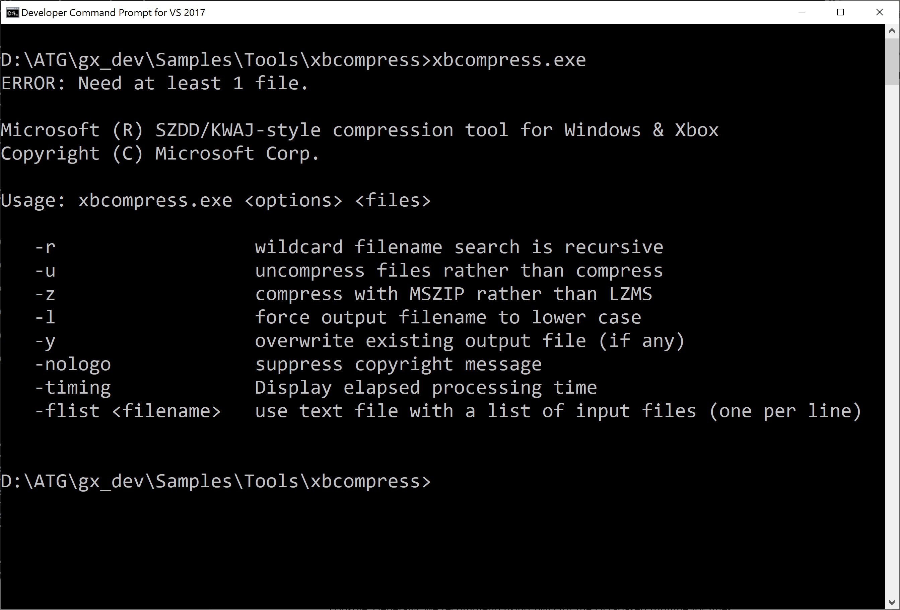

# xbcompress 示例

*此示例兼容于 Microsoft 游戏开发工具包（2020 年 11 月）*

# 说明

此示例演示了通过所有 Gaming.\*.x64 平台支持的 Windows 8 引入的
[Compression
API](https://docs.microsoft.com/en-us/windows/win32/cmpapi/-compression-portal)。

运行不带任何参数的工具将显示帮助屏幕，如下所示：

# 生成示例

作为一个简单的命令行工具，可以使用 *Gaming 命令提示符*直接生成：

cl /EHsc /D_WIN32_WINNT=0x0A00 /Ox /MT compresstool.cpp
/Fexbcompress.exe xgameplatform.lib

可以使用 CMake 3.15 或更高版本：

cmake -B out。

cmake --build out

还有 CMake 预设（在 CMake 3.19 中引入）：

cmake \--list-presets

cmake \--preset=x64-Debug

cmake \--build out\\build\\x64-Debug

或者可以从 VS IDE 打开CMakeLists.txt（CMake 3.15 集成需要 VS 2019 16.3
或更高版本）。

-   我们使用静态 Visual C++ 运行时进行构建，以使该工具简单到足以"xbcp
    部署"到控制台。通常，我们建议将 /MD 用于面向游戏的基于 DLL
    的运行时。

-   此命令行工具使用的 API 位于 onecore_apiset.lib、xgameplatform.lib 和
    WindowsApp.lib 中。在这种情况下，可以为电脑和 Xbox 安全地使用
    onecore_apiset.lib 保护程序库（这是 CMake
    的配置方式）。同样，我们建议对游戏使用 xgameplatform.lib
    而不是任何其他保护程序库或 kernel32.lib。

-   可以使用 \_WIN32_WINNT=0x0602 (Windows 8) 或与 cabinet.lib 链接的
    \_WIN32_WINNT=0x0603 (Windows 8.1)来生成此工具，而不是
    onecore_apiset.lib。Windows 7 或更早版本不支持压缩 API。

# 用法

*此工具旨在用于开发方案，其中需要具有最少依赖项且基于"快速且修改过的"CPU
的压缩解决方案: 测试自动化、示例、演示、快速原型等。
**对于零售内容方案，还有许多其他选项，包括 DirectStorage、BCPack、第
3^rd^ 方库，以及更为适合的传统"文件内文件系统"解决方案。***

此示例是一个简单的命令行工具，与 Windows 10 主机电脑、Xbox 系统 OS 和
Xbox Game OS 兼容。可以使用它来压缩或解压缩文件。

xbcompress.exe mylargefile.bin

-或者-

xbcp /x/title xbcompress.exe xd:\\

xbrun /x/title /O d:\\xbcompress.exe d:\\mylargefile.bin

这会导致"mylargefile.bi\_"写入当前目录或 D:\\ 目录。默认情况下，使用
LZMS 压缩来压缩此文件。

要展开文件，请使用 **/u** 开关

xbcompress /u mylargefile.bi\_

-或者-

xbrun /x/title /O d:\\xbcompress.exe /u d:\\mylargefile.bi\_

这将导致"mylargefile.bin"写入当前目录或 D:\\。

对于大小超过 2 MB 的文件，LZMS
压缩方案被认为是一个不错的选择。如果希望压缩速度稍微快一些，同时压缩大小略小一些，可以使用
**/z** 开关来改用 MSZIP 进行压缩。

# 实现

此示例的灵感来自经典 MS-DOS 实用工具 COMPRESS.EXE 和
EXPAND.EXE。此工具生成的"\_"文件不是兼容的，或者无法由 OS 工具
EXPAND.EXE 识别。压缩的文件始终以"\_"结尾。如果文件扩展名长度为 3
个或更多字符，则最后一个字符将替换为"\_"。否则将追加"\_"作为扩展名。

为了获得极为简单的代码，该工具使用压缩 API"buffer"模式。API
管理将数据分解为块，并对压缩数据块中需要解压缩的元数据进行编码。

压缩文件以以下简单标头开头：

| 文 件偏移 |  字 段长度 |  说明 |
|--------|---------|--------------------------------------------------|
| 0  |  8  |  用于唯一标识文件格式的魔法字节序列。 0x41、0x46、0x43、0x57、0x47、0x50、0x53、0x4d   |
| 9  |  1  |  压缩模式。 目前仅支持以下模式： -   COMPRESS_ALGORITHM_LZMS (5) -   COMPRESS_ALGORITHM_MSZIP (2)                 |
| 10  |  1  |  文件格式版本。 当前 0x41 (\'A\')                                |
| 11  |  2  |  确定压缩名称时更改为"\_"的最后一个字符 (UTF-16LE)。如果改为添加了"\_"，则此值为 0。     |
| 13  |  4  |  原始未压缩数据块的大小（以字节为单位）。 *为了使代码保持简单，此文件格式最多仅支持 4 GB 文件大小。*                                      |

并且可在 ATGTK\\ReadCompressedData.h / .cpp 中找到对 XBCOMPRESS.EXE
生成的文件进行解压缩的运行时代码示例。

# 更新历史记录

