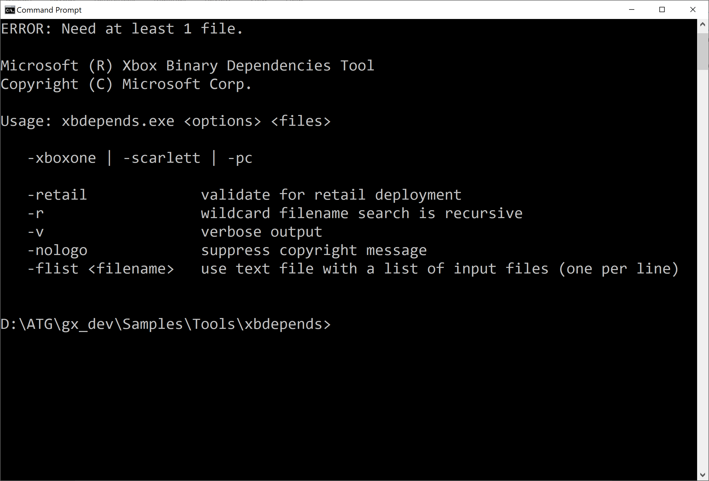

# xbdepends 示例

*此示例可用于 Microsoft 游戏开发工具包 （2022 年 3 月）*

# 说明

这是用于 Windows 10/Windows 11 计算机的命令行，旨在帮助诊断 GDK 游戏的生成和启动问题。 具体而言，它分析 EXE 和 DLL 的导入模块，对其进行分类，并提供诊断输出。 对于 Xbox One 和 Scarlett 二进制文件，它还输出 xgameplatform.lib umbrella 库中使用但不包括的任何 OS API 的列表。

不带任何命令行选项运行将生成以下输出：



# 生成示例

作为一个简单的命令行工具，可以使用*游戏命令提示符*直接生成：

```
cl /EHsc /D_WIN32_WINNT=0x0A00 /Ox /MT xbdepends.cpp onecore.lib
```


可以使用 CMake 3.20 或更高版本：

```
cmake -B out .
cmake --build out
```


还有 CMake 预设：

```
cmake --list-presets
cmake --preset=x64-Debug
cmake --build out\build\x64-Debug
```


或者，可以从 VS IDE 打开 CMakeLists.txt（需要 VS 2019 16.11 或 VS 2022）。

- 我们使用静态 Visual C++ Runtime 进行生成，以使该工具易于部署。 通常，我们建议将 /MD 用于面向游戏的基于 DLL 的运行时。

# 用法

对于简单的测试，我们将使用 Microsoft GDK 中的基本模板。 创建 **Direct3D 12 Xbox Game** 项目并生成它。 然后运行指向布局目录的 **xbdepends**：

```
xbdepends Direct3DGame1\Gaming.Xbox.Scarlett.x64\Layout\Image\Loose\Direct3DGame1.exe
```


这将生成以下输出：

```
Microsoft (R) Xbox Binary Dependencies Tool
Copyright (C) Microsoft Corp.

reading 'Direct3DGame1.exe' [EXE]
INFO: Found 27 import modules
INFO: Use of Direct3D 12.X_S implies Scarlett target
INFO: Dependencies require 'VS 2019 (16.0)' or later C/C++ Runtime
```


-v 开关会触发更详细的输出：

```
xbdepends -v Direct3DGame1\Gaming.Xbox.Scarlett.x64\Layout\Image\Loose\Direct3DGame1.exe
```


这将生成以下输出：

```
reading 'Direct3DGame1.exe' [EXE]
        Linker: 14.00
        OS: 6.00
        Subsystem: 2 (6.00)
INFO: Found 27 import modules
INFO: Use of Direct3D 12.X_S implies Scarlett target
INFO: Dependencies require 'VS 2019 (16.0)' or later C/C++ Runtime
  DLL 'api-ms-win-core-debug-l1-1-0.dll' (OS)
  DLL 'api-ms-win-core-errorhandling-l1-1-0.dll' (OS)
  DLL 'api-ms-win-core-handle-l1-1-0.dll' (OS)
  DLL 'api-ms-win-core-heap-l1-1-0.dll' (OS)
  DLL 'api-ms-win-core-interlocked-l1-1-0.dll' (OS)
  DLL 'api-ms-win-core-libraryloader-l1-2-0.dll' (OS)
  DLL 'api-ms-win-core-localization-l1-2-0.dll' (OS)
  DLL 'api-ms-win-core-memory-l1-1-0.dll' (OS)
  DLL 'api-ms-win-core-processthreads-l1-1-0.dll' (OS)
  DLL 'api-ms-win-core-processthreads-l1-1-1.dll' (OS)
  DLL 'api-ms-win-core-profile-l1-1-0.dll' (OS)
  DLL 'api-ms-win-core-psm-appnotify-l1-1-0.dll' (OS)
  DLL 'api-ms-win-core-psm-appnotify-l1-1-1.dll' (OS)
  DLL 'api-ms-win-core-registry-l1-1-0.dll' (OS)
  DLL 'api-ms-win-core-registry-l2-1-0.dll' (OS)
  DLL 'api-ms-win-core-rtlsupport-l1-1-0.dll' (OS)
  DLL 'api-ms-win-core-string-l1-1-0.dll' (OS)
  DLL 'api-ms-win-core-synch-l1-1-0.dll' (OS)
  DLL 'api-ms-win-core-sysinfo-l1-1-0.dll' (OS)
  DLL 'd3d12_xs.dll' (D3D)
  DLL 'ext-ms-win-rtcore-ntuser-message-l1-1-0.dll' (OS)
  DLL 'ext-ms-win-rtcore-ntuser-window-ansi-l1-1-0.dll' (OS)
  DLL 'ext-ms-win-rtcore-ntuser-window-l1-1-0.dll' (OS)
  DLL 'PIXEvt.dll' (GameOS)
  DLL 'ucrtbased.dll' (CRT)
  DLL 'VCRUNTIME140_1D.dll' (CRT)
  DLL 'VCRUNTIME140D.dll' (CRT)
```


还可以使用 /retail 开关运行，它会警告你此生成正在使用调试 CRT 项：

```
xbdepends -retail Direct3DGame1\Gaming.Xbox.Scarlett.x64\Layout\Image\Loose\Direct3DGame1.exe
```


这将生成以下输出：

```
reading 'Direct3DGame1.exe' [EXE]
INFO: Found 27 import modules
INFO: Use of Direct3D 12.X_S implies Scarlett target
ERROR: Using development only DLLs not for use in retail:
        ucrtbased.dll
        VCRUNTIME140_1D.dll
        VCRUNTIME140D.dll
INFO: Dependencies require 'VS 2019 (16.0)' or later C/C++ Runtime
```


该工具还接受通配符，并且可以通过递归方式执行：

```
xbdepends -r Direct3DGame1\Gaming.Xbox.Scarlett.x64\Layout\Image\Loose\*.dll
```


# 实现

实际上，在扫描 PE 导入表方面，此工具执行的操作类型与 Microsoft DUMPBIN 工具相同。 主要区别在于，此工具采用有关 GDK 游戏的一些基本规则和知识来生成诊断输出。

有关 PE 导入表的详细信息，请参阅：

&ldquo;*在 Windows 内部：深入了解 Win32 可移植可执行文件格式，第 2 部分*&rdquo;。 MSDN 杂志（2002 年 3 月）

<https://docs.microsoft.com/en-us/archive/msdn-magazine/2002/march/inside-windows-an-in-depth-look-into-the-win32-portable-executable-file-format-part-2>

# 更新历史记录

| 日期 | 说明 |
|---|---|
| 2021 年 5 月 | 使用 2021 年 4 月 GDK 版本中的 xgameplatform.lib 的初始版本。 |
| 2022 年 1 月 | CMake 清理并添加了预设文件 |
| 2022 年 11 月 | 已更新到 CMake 3.20 |


