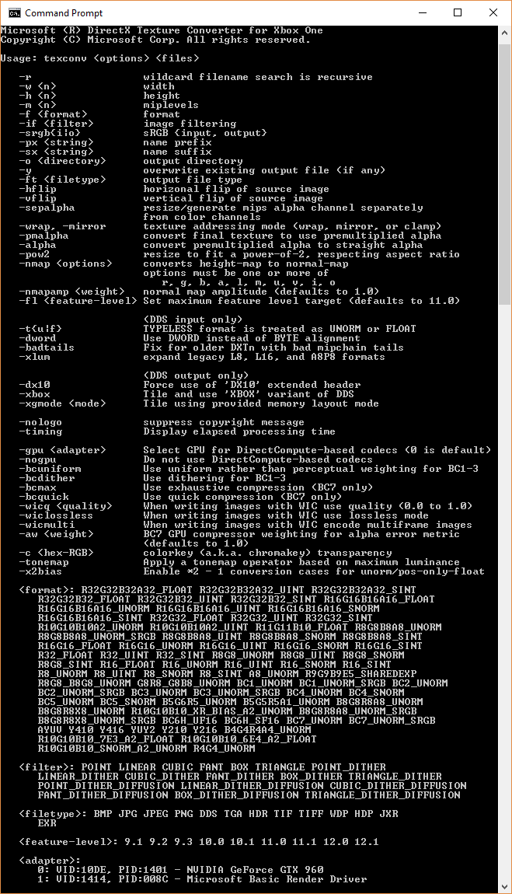

# xtexconv Sample

*This sample is compatible with the Microsoft Game Development Kit (March 2022)*

# Description

This sample is a PC side command-line tool which extends the standard
TexConv command-line tool for texture conversion and preparation to
support Xbox One offline texture tiling for use with the
**CreatePlacedResourceX** APIs.

This tool accepts a wide range of image formats\--such as Windows
Imaging Component supported codecs .jpg, .png, .tiff, .bmp, and HD
Photo/JPEG XR plus Targa Truevision .tga files, RGBE .hdr, and OpenEXR
.exr files\--as well as .dds\--as an input texture format. It supports
full mip chain generation using a user specified filter, as well as
supporting texture arrays, cube maps, cube map arrays, and volume maps.

Running the tool without any parameters shows the help screen, as
follows:



# Usage

The XTexConv tool supports the same set of command-line parameters and
syntax as the standard TexConv tool. Detailed documentation is available
on [GitHub](https://github.com/Microsoft/DirectXTex/wiki/Texconv).

It includes an additional switch `-xbox` which causes the output DDS
file to contain Xbox One tiled texture data and the 'XBOX' DDS file
variant. The tile mode used is determined by XGComputeOptimalTileMode.
These offline prepared Xbox One textures are assumed to be used with
XG_BIND_SHADER_RESOURCE.

If a 'XBOX' DDS file variant is used as an input file, it is
automatically Detiled before further processing, allowing the tool to be
used to convert an 'XBOX' DDS file to a standard DDS file.

The tool also supports a switch `-xgmode` to select the hardware
version for tiling.

Use `-xgmode:xboxonex` to set the preferring tiling for Xbox One X.
Otherwise it defaults to Xbox One / Xbox One S.

## Xbox Series X|S

As there are two distinct versions of XG for Xbox Series X|S vs. Xbox
One, there are two versions of xtexconv. xteconv_xs is the Xbox Series
X|S version, which does not support the **-xgmode** switch.

# DDS files for Xbox One

The standard DDS file format is described on [Microsoft
Docs](https://docs.microsoft.com/en-us/windows/desktop/direct3ddds/dx-graphics-dds-pguide).
The 'XBOX' DDS file variant is similar to the 'DX10' header extension.
The 'XBOX' DDS files are laid out as:

```
DWORD dwMagic
DDS_HEADER header
DDS_HEADER_XBOX
{
   DXGI_FORMAT dxgiFormat;
   uint32_t resourceDimension;
   uint32_t miscFlag; // see DDS_RESOURCE_MISC_FLAG
   uint32_t arraySize;
   uint32_t miscFlags2; // see DDS_MISC_FLAGS2
   uint32_t tileMode; // see XG_TILE_MODE / XG_SWIZZLE_MODE
   uint32_t baseAlignment;
   uint32_t dataSize;
   uint32_t xdkVer; // matching \_XDK_VER
} headerXbox
<Remainder of file is a tiled texture binary layout suitable for use with CreatePlacement APIs\>
```

Example code for loading and creating textures from 'XBOX' variant DDS
files is available in the *DirectX Tool Kit*
([DX11](https://github.com/Microsoft/DirectXTK) / [DX
12](https://github.com/Microsoft/DirectXTK12)) in the
XboxDDSTextureLoader
([DX11](https://github.com/Microsoft/DirectXTK/wiki/XboxDDSTextureLoader)
/ [DX
12](https://github.com/Microsoft/DirectXTK12/wiki/XboxDDSTextureLoader))
module.

# DirectXTex for Xbox One

> XTexConv is a slightly modified version of TexConv, with additional capabilities added to the [DirectXTex](https://github.com/Microsoft/DirectXTex/) library. The standard version of [TexConv](https://github.com/Microsoft/DirectXTex/wiki/Texconv) and DirectXTex are available on GitHub.

The Xbox One auxiliary functionality for DirectXTex (in DirectXTexXbox.h in the Xbox C++ namespace) includes:

-   XboxImage: a container for tiled texture data

-   Functions for storing and loading the XBOX variant of DDS files

    -   GetMetadataFromDDSMemory

    -   GetMetadataFromDDSFile

    -   LoadFromDDSMemory

    -   LoadFromDDSFile

    -   SaveToDDSMemory

    -   SaveToDDSFile

-   Functions for performing tiling of standard linear data to Xbox One
    tiled textures, as well as the reverse operation:

    -   Tile

    -   Detile

-   Functions for creating texture resources from tiled Xbox One tiled
    images with Direct3D 12 extensions

    -   CreateTexture

    -   FreeTextureMemory

# Dependencies

This tool and the DirectXTex for Xbox One auxiliary Tile/Detile
functions require the XG.DLL (located in the Microsoft GDK under the
bin\\XboxOne folder) or XG_XS.DLL (located in the Microsoft GDK under
the bin\\Scarlett folder) to be located in the standard DLL search
paths.

# OpenEXR support

The xtexconv tool uses the [OpenEXR](http://www.openexr.com/) library,
making use of the NuGet Packages for
[openexr](https://www.nuget.org/packages/openexr-msvc14-x64/) and
[zlib](https://www.nuget.org/packages/zlib/) which are subject to their
own licensing terms. This support can be disabled by undefining
USE_OPENEXR, deleting DirectXTexEXR.\*, and removing the packages via
the NuGet manager.

Note that OpenEXR is subject to its own
[license](https://github.com/openexr/openexr/blob/develop/OpenEXR/LICENSE)
as is [zlib](http://zlib.net/zlib_license.html).

See [Adding
OpenEXR](https://github.com/Microsoft/DirectXTex/wiki/Adding-OpenEXR)
for additional details.

# Update history

|Date|Notes|
|---|---|
|February 2019|Initial release.|
|November 2019|Xbox Series X|S support.|
|February 2020|Updates for XG library changes.|
|February 2024|Reworked XG implementation to use CopyFromSubresource and CopyToSubresource to optimize performance and handle complex swizzling cases.|
